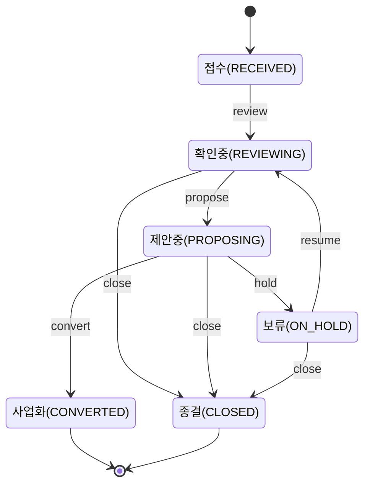

# 프로젝트 구조 (Next.js)

ADR-0001에서 결정한 대로 Next.js(App Router) + TypeScript 단일 모놀리스로 구성한다.
인증(ADR-0002)·이메일 발송(ADR-0003)이 추가되며 `(protected)` 라우트 그룹이 생겼다.

## 디렉터리

```
src/
  app/
    layout.tsx            루트 레이아웃 — 모바일 뷰포트, 전역 CSS만 (내비게이션 없음)
    globals.css
    login/                비로그인 사용자용 — (protected) 밖에 있다
      page.tsx             이메일 입력 → 매직링크 요청
      check-email/page.tsx "메일을 확인하세요"
      totp/page.tsx         2단계 인증 코드(또는 복구코드) 입력
      totp/setup/page.tsx   TOTP 최초 등록(QR·비밀키·복구코드 발급)
    (protected)/          로그인(및 필요 시 TOTP)이 끝나야 들어오는 화면 — layout.tsx가 막는다
      layout.tsx            세션 확인 + 리다이렉트 + BottomNav
      page.tsx               내 홈
      activities/
        page.tsx              활동 목록 (FR-04) — 활동 운영 역할이면 등록 링크 노출
        new/page.tsx          활동 등록 (FR-04) — 활동 운영 역할만 접근
        [activityId]/page.tsx 활동 상세 (FR-04/05) — 참여 신청 폼 + 책임자용 수락·거절·종료
        [activityId]/edit/page.tsx 활동 수정 (FR-04) — 책임자만, 종료·취소 활동은 잠김
      my/
        participation/page.tsx  내 참여 (FR-05) — 신청 목록, 철회, 기록하기 진입
        contributions/page.tsx  내 기여 (FR-07) — 실제 목록, 이어 작성·정정 요청 링크
        contributions/new/page.tsx  기여 작성 = "기록하기" (FR-06) — 새로 작성/이어 작성/정정 + 증빙 첨부(이어 작성 시)
        profile/page.tsx   내 정보 (FR-03) — 로그인 이메일·로그아웃, 연락처·관심 분야 수정
      needs/
        page.tsx              상담·수요 목록 (FR-08) — 로그인한 누구나 조회
        new/page.tsx          상담·수요 접수 (FR-08) — 활동 운영 역할만 접근
        [needId]/page.tsx     상담·수요 상세 — 상태 관리는 담당자만
      review/page.tsx      담당자 확인함 (FR-07) — 실제 확인·보완요청 동작
      admin/
        page.tsx              관리자 설정 허브 — 하위 도구로 이동하는 링크 모음
        invitations/page.tsx  초대 관리(SECRETARIAT/SYSTEM_ADMIN 전용) — 발급·재발송·취소
        roles/page.tsx        역할 관리(SECRETARIAT/SYSTEM_ADMIN 전용) — 역할 부여·종료
      forbidden/page.tsx    로그인은 됐지만 역할·담당 범위가 안 맞을 때
    api/
      health/route.ts      헬스체크 (DB 연결 확인)
      profile/
        update/route.ts            POST: 내 정보(Subject) 수정 — 이름·지역·연락처 등
      auth/
        login/route.ts             POST: 매직링크 요청
        verify/route.ts            GET: 매직링크 소비 → 세션 발급
        logout/route.ts            POST: 세션 폐기
        accept-invitation/route.ts GET: 초대 수락 → 계정(+필요 시 주체) 생성 → 세션 발급
        totp/setup/route.ts        POST: TOTP 등록 확인·활성화
        totp/verify/route.ts       POST: TOTP 코드 또는 복구코드 확인
      contributions/
        save/route.ts               POST: 임시저장/제출 (BR-01, BR-06 멱등성)
        [id]/confirm/route.ts       POST: 담당자 확인 (BR-04/05 버전 대체 처리)
        [id]/request-revision/route.ts  POST: 보완 요청
        [id]/attachments/route.ts   POST: 증빙 첨부(DRAFT/NEEDS_REVISION일 때만)
      attachments/
        [id]/download/route.ts      GET: 첨부파일 다운로드(업로더·담당자만)
        [id]/delete/route.ts        POST: 첨부파일 소프트 삭제(업로더 본인만)
      activities/
        create/route.ts             POST: 활동 등록(항상 PLANNING 상태로 시작)
        [activityId]/
          transition/route.ts       POST: 활동 상태 전이(승인·반려·보류·재개·종료·취소)
          update/route.ts           POST: 활동 정보 수정(등록과 같은 필드·검증)
      activity-assignments/
        apply/route.ts              POST: 참여 신청(PROPOSED 생성, 중복 신청 방지)
        [id]/accept/route.ts        POST: 책임자가 수락 → ACCEPTED
        [id]/reject/route.ts        POST: 책임자가 거절 → CANCELLED
        [id]/end/route.ts           POST: 책임자가 종료 처리 → ENDED
        [id]/withdraw/route.ts      POST: 본인이 철회(PROPOSED일 때만) → CANCELLED
        [id]/start/route.ts         POST: 본인이 진행 시작(ACCEPTED일 때만) → IN_PROGRESS
      needs/
        create/route.ts             POST: 상담·수요 접수(항상 RECEIVED 상태로 시작)
        [needId]/
          transition/route.ts       POST: 상담·수요 상태 전이(확인·제안·사업화·보류·재개·종결)
      admin/
        roles/
          grant/route.ts             POST: 역할 부여
          [id]/revoke/route.ts       POST: 역할 종료(endDate 채움, 삭제 아님)
        invitations/
          create/route.ts            POST: 초대 발급 + 이메일 발송
          [id]/resend/route.ts       POST: 새 토큰 발급 후 재발송(같은 레코드 재사용)
          [id]/revoke/route.ts       POST: 초대 취소
  components/
    BottomNav.tsx        모바일 기본 메뉴 (v0.2 §2.1): 홈/참여할 일/기록하기/우리 조합/내 정보
    ScreenPlaceholder.tsx  아직 구현되지 않은 화면의 공통 자리표시자
  lib/
    prisma.ts            PrismaClient 싱글턴
    display-id.ts        ACT-0001 등 표시번호를 원자적으로 채번(DisplaySequence upsert)
    contribution-labels.ts  기여 유형·유무급·상태·증거수준 enum의 한글 라벨(화면 3곳 이상 공유)
    attachment-storage.ts   첨부파일 저장 추상화(ADR-0004) — 저장·읽기, 허용 타입·용량 제한
    subject-labels.ts     SubjectStatus(활성/휴면/종료/확인필요) 한글 라벨
    activity-labels.ts   ActivityManagementType·Mission·Visibility·ActivityStatus 한글 라벨
    activity-status.ts   활동 상태 전이표(ACTIVITY_TRANSITIONS), 전이 동작 한글 라벨
    need-labels.ts       NeedChannel·NeedStatus·NeedCloseType 한글 라벨
    need-status.ts       상담·수요 상태 전이표(NEED_TRANSITIONS), 전이 동작 한글 라벨
    role-labels.ts       PermissionRole·ScopeType enum의 한글 라벨
    assignment-labels.ts AssignmentStatus 한글 라벨, 역할 선택지, 재신청 가능 상태 목록
    auth/
      crypto.ts            토큰 생성·해시, TOTP 비밀키 암호화(AES-256-GCM), 복구코드 생성
      config.ts            토큰 TTL·세션 기간·TOTP 강제 대상 역할·getBaseUrl() 등
      session.ts           세션 생성·조회·폐기 (DB 기반, 계정 상태 실시간 확인)
      roles.ts             역할 조회(getActiveRoles/hasAnyRole), 페이지 가드(requireRole),
                            담당자 확인함 접근 판정(canAccessReviewInbox)
      login.ts             매직링크 요청·소비
      totp.ts              TOTP 등록·검증, 복구코드 소비
    email/
      resend.ts            ADR-0003: Resend 발송 래퍼(로그인·초대 공용). API 키 없으면
                            콘솔에 링크 출력
prisma/
  schema.prisma          R1 데이터 모델 (별도 설계 문서: docs/design/r1-schema.md)
  bootstrap-admin.ts     최초 관리자 초대장을 만드는 1회성 스크립트 — 이제 정식 화면
                         (/admin/invitations)이 있지만, 첫 관리자는 그 화면에 들어갈
                         계정 자체가 없어 여전히 스크립트로 부트스트랩해야 한다.
```

## 인증 흐름 (ADR-0002 구현)

```
[초대 수락]                    [로그인]
accept-invitation?token=…      login (이메일 입력)
   ↓ 계정 생성 + 세션 발급          ↓ POST /api/auth/login
   ↓                              check-email
   ├─ TOTP 불필요 → 홈             ↓ 메일의 링크 클릭
   └─ TOTP 필요 → totp/setup      GET /api/auth/verify?token=…
                                    ├─ TOTP 불필요 → 홈
                                    ├─ 미등록인데 필요 → totp/setup
                                    └─ 등록됨 → totp (코드 또는 복구코드)
```

- 세션은 `Session` 테이블에 저장되고, 쿠키에는 원문 대신 해시 대조용 랜덤 토큰만 있다.
- `(protected)/layout.tsx`가 매 요청마다 `getActiveSession()`으로 계정 상태·세션 만료·
  2단계 인증 완료 여부를 확인한다. 계정을 정지하면 그 다음 요청부터 바로 막힌다(FR-01).
- 인가(authorization)는 `src/lib/auth/roles.ts`에 있다 — 아래 "역할 기반 접근 제어" 참고.
- CSRF는 세션 쿠키의 `SameSite=Lax`에 기대고 있다 — 별도 CSRF 토큰은 아직 없다.
- 로그인 요청(`/api/auth/login`)에 속도 제한이 없다 — Redis 등 배경작업 인프라가
  아직 없어서다(ADR-0001). 대량 스팸 발송 위험은 남아 있는 과제로 남겨둔다.

## 내 정보 화면 (`/my/profile`, FR-03 구현)

v0.1 P01(주체) 필드 중, 조직이 관리해야 하는 항목(활동 상태·책임 담당자)을 뺀
나머지 — 이름·지역·전문영역/관심·연락처·수신 동의 — 를 본인이 직접 고치는
화면이다. 이전까지는 로그인 이메일 표시·로그아웃만 실제 동작이었고 나머지는
`ScreenPlaceholder`였다.

- **이름을 바꾸면 이전 이름이 자동으로 남는다**: v0.1 P01의 "별칭·이전 이름:
  검색용, 변경 이력 보존"을 그대로 구현했다 — `name`을 직접 덮어쓰지 않고, 바뀌기
  전 이름을 `previousNames` 배열에 추가한다(중복 방지). 별도의 "이전 이름 수정"
  UI는 없다 — 이 배열은 이름을 바꿀 때만 자동으로 쌓인다.
- **"확인일"은 저장하는 순간 자체**: v0.1 P01은 "확인일: 오래된 정보를 현재
  사실로 오인하지 않음"을 요구한다. 별도의 "확인" 버튼을 만드는 대신, 본인이 이
  화면에서 저장할 때마다 `confirmedAt`을 지금 시각으로 찍는다 — 그 자체가 본인이
  최신 정보임을 확인한 것이기 때문이다.
- **최초 확인 대기 상태는 이 화면에서 풀린다**: 초대를 수락할 때 사무국이 미리
  연결해둔 사람이 없으면 `Subject.status`가 `NEEDS_CONFIRMATION`으로 자동
  생성된다("인증 흐름" 참고). 본인이 이 화면에서 처음 저장하면 그 순간
  `ACTIVE`로 바뀐다 — 그 외 상태(휴면·종료)는 조직이 관리하는 값이라 이 화면은
  건드리지 않는다.
- **연락처·수신 동의는 구조화된 JSON으로 저장한다**: `contactInfo`는
  `{ value: "..." }`, `contactConsent`는 `{ promotionalOptIn: boolean, updatedAt }`
  형태로 저장한다 — v0.1이 "연락처: 외부 공개 금지"라고 명시하므로, 다른 조합원이
  볼 수 있는 화면 어디에도 이 값을 노출하지 않는다(지금은 노출할 화면 자체가 없다).
  체크박스를 해제하고 저장해도 `promotionalOptIn: false`로 명시적으로 남는다 —
  "동의한 적 없음"과 "거부함"을 구분하려는 것이다.
- **전문영역·관심은 쉼표 구분 자유 입력**: 스키마는 `String[]`이라 태그 목록을
  받을 수 있지만, 분류 체계(`Classification` 모델)를 아직 아무 화면도 안 써서
  선택형으로 만들 근거가 없다 — 입력을 쉼표로 나누고 trim·중복 제거만 한다.
  활동의 `role`처럼 이 프로젝트에서 반복되는, "정식 분류가 생기기 전엔 자유
  텍스트로 시작한다"는 패턴을 따랐다.
- **수정 이력도 감사기록을 남긴다**: 활동 상태 전이·수정과 같은 `AuditLog`(action
  `UPDATE`)에 이름·지역·연락처·전문영역·수신동의의 변경 전·후 값을 남긴다.
- **정직하게 남겨둔 것**: 지역·전문영역은 자유 텍스트/쉼표 목록일 뿐 정식
  분류표에 연결돼 있지 않다 — 분류 관리 화면이 생기면 선택형으로 바꿀 대상이다.

## 활동 등록 화면 (FR-04 구현)

`/activities/new`에서 활동을 만든다. 여태 `prisma/seed-sample-data.ts` 스크립트나 DB
직접 조작으로만 생기던 활동을, 이제 화면에서 만들 수 있다.

- **접근 권한**: `ACTIVITY_OPERATIONS_ROLES`(ACTIVITY_MANAGER/DOMAIN_OPERATOR/
  SECRETARIAT/BOARD/SYSTEM_ADMIN)를 가진 계정만 들어올 수 있다 — `/review` 접근 판정에
  쓰던 역할 목록을 그대로 재사용했다(같은 역할이 "활동을 운영·확인할 자격"이라는
  동일한 의미이기 때문에, 별도 상수를 새로 만들지 않고 `canAccessReviewInbox`가 쓰던
  비공개 상수를 `ACTIVITY_OPERATIONS_ROLES`라는 이름으로 내보내는 것으로 바꿨다).
  화면(`requireRole`)과 API(`/api/activities/create`, `hasAnyRole` 직접 확인) 양쪽에서
  같은 역할을 다시 확인한다 — 폼을 거치지 않고 바로 POST가 올 수 있어서다.
- **필수 입력(v0.1 A01)**: 활동명·목적·유형(사업/조직활동)·미션(1개 이상)·책임자 계정을
  모두 채워야 한다. 하나라도 비었거나 미션을 하나도 안 고르면 `error=invalid`로
  되돌아간다. 책임자로 고른 계정이 실존하지 않으면(레이스 등) `error=invalid_manager`.
  종료 예정일이 시작 예정일보다 빠르면 `error=invalid_dates` — 둘 다 선택 입력이라
  하나만 채워도 저장은 되고, 둘 다 있을 때만 순서를 검사한다.
- **상태는 폼 입력이 아니다**: 새 활동은 항상 `PLANNING`(기획)으로 시작한다 — 승인
  절차를 건너뛰고 곧바로 진행·완료 상태로 등록하는 것을 막기 위한 의도적 제약이라,
  상태 선택 UI 자체를 만들지 않았다. 등록 이후 상태를 바꾸는 방법은 바로 다음 절
  "활동 상태 전이"에서 다룬다.
- 표시번호는 `ACT-0001`처럼 `nextDisplayId`로 채번한다(기여의 `CTB-`, 배정과 같은 방식).
- 공개 범위(visibility)는 기본값 `TEAM`(담당팀만)이며 화면에서 바꿀 수 있다.
- `/activities` 목록 화면은 `ACTIVITY_OPERATIONS_ROLES`를 가진 계정에게만 "+ 새 활동
  등록" 링크를 보여준다 — 일반 조합원 화면에는 링크 자체가 없다.

## 활동 상태 전이 (`src/lib/activity-status.ts`, FR-04 구현)

v0.1 §3.2의 활동 상태표를 그대로 코드화했다: 기획→승인대기→준비→진행→수행완료→종료가
정상 경로이고, 보류·취소는 "진행 중"인 상태에서 빠지는 곁가지다.

```
기획 ──승인 요청──▶ 승인대기 ──승인──▶ 준비 ──진행 시작──▶ 진행 ──수행완료 처리──▶ 수행완료 ──종료──▶ 종료
        ▲               │(반려)                                                              (종료는 상태전이의
        └───────────────┘                                                                      종점, 그 이후는
                                                                                                 정정 이력으로만 수정)
[기획·승인대기·준비·진행] ──보류──▶ 보류 ──재개──▶ (보류 진입 직전 상태로 복귀)
[기획·승인대기·준비·진행·보류] ──취소──▶ 취소 (종점)
```

- **전이표는 한 곳에 있다**: `activity-status.ts`의 `ACTIVITY_TRANSITIONS`가 각 동작마다
  "어느 상태에서 가능한지"·"사유 입력이 필수인지"를 선언한다. 화면(어떤 버튼을 보여줄지)과
  API(`/api/activities/[activityId]/transition`, 실제 검증)가 같은 표를 참조해서 둘이
  어긋날 일이 없다.
- **권한**: 참여 신청 수락·거절·종료와 같은 원칙 — 그 활동의 `managerAccountId`만 상태를
  바꿀 수 있다. `ACTIVITY_OPERATIONS_ROLES`를 가졌어도 자기 담당이 아닌 활동은 못
  건드린다(활동을 등록한 사람과 상태를 운영하는 사람이 다를 수 있다는 걸 인정한 것 —
  실제로 다른 계정이 만들고 제3의 계정을 책임자로 지정한 활동에서, 책임자 계정만
  전이에 성공하고 나머지는 `forbidden`으로 막히는 것을 확인했다).
- **승인 요청 전 필수 필드 확인**: v0.1 §3.2는 승인대기로 넘어가려면 "책임자·목적·미션·
  예정기간"이 있어야 한다고 명시한다. 책임자·목적·미션은 등록 시 이미 필수였으니,
  전이 시점에는 `plannedStartDate`/`plannedEndDate`(둘 다 등록 화면에서는 선택 입력이다)
  만 추가로 확인한다 — 비어 있으면 `error=missing_planned_dates`.
- **보류는 "이전 상태로 복귀"를 실제로 구현했다**: 보류로 들어갈 때 상태를 저장하는 별도
  컬럼을 추가하지 않고, 모든 전이를 `AuditLog`(entityType `"Activity"`, action
  `STATUS_CHANGE`)에 `beforeData`/`afterData`로 남긴 뒤, 재개할 때 그 활동의 가장 최근
  전이 기록에서 "보류 진입 직전 상태(`beforeData.status`)"를 읽어 그 상태로 되돌린다.
  진행 중이던 활동을 보류했다가 재개하면 정확히 `IN_PROGRESS`로 돌아오는 것을
  확인했다. `AuditLog`는 스키마에는 있었지만 이번이 첫 실제 사용이다 — 부수 효과로
  모든 상태 전이 이력이 공짜로 남는다(조회 화면은 아직 없음, "아직 없는 것" 참고).
- **사유가 필수인 전이**: 반려(승인대기→기획)·보류·취소·종료 네 가지는 사유 없이 제출하면
  `error=reason_required`로 막는다. 종료의 사유는 `AuditLog.reason`뿐 아니라
  `Activity.closeEvaluationNote`에도 그대로 저장된다 — v0.1이 요구하는 "종료 시 평가"를
  담는 필드가 스키마에 이미 있었는데 지금까지 채워진 적이 없었다. 종료할 때
  `closedAt`·`actualEndDate`(비어 있었다면)도 함께 채운다. 보류는 사유에 더해 선택 항목인
  재검토일을 받아 `AuditLog.afterData`에 같이 남긴다(전용 컬럼 대신 JSON에 둔 것은, 이
  값이 화면에 다시 노출되는 별도 조회 기능이 아직 없기 때문).
- **종료·취소는 종점이다**: 종료된 활동은 상태 관리 UI 자체가 사라지고 "수정은 정정
  이력으로 남겨야 합니다" 안내만 보인다(v0.1: "종료: 수정은 정정 이력, 새 일은 후속
  활동"). 취소도 마찬가지로 더 이상 전이할 수 없다 — 취소된 활동을 되살리는 기능은
  의도적으로 만들지 않았다.
- **정직하게 남겨둔 것**: v0.1이 요구하는 "종료 체크"(열린 청구·지급 처리, 후속 과업
  담당·날짜 확인 등)는 계약·지급(F01/F02) 테이블이 R1에 아직 없어 검증하지 않는다 —
  지금의 종료 평가는 자유 텍스트 한 줄로만 남는다. '준비 승인'의 결재 권한자를
  책임자와 분리하는 위임 규정도 아직 없어, 지금은 책임자 본인이 스스로 승인까지
  처리한다.

## 활동 수정 화면 (`/activities/[activityId]/edit`, FR-04 구현)

등록 후 오탈자를 고치거나 계획을 바꿀 방법이 없던 것을 채운다. 등록 화면과 같은
필드(활동명·유형·목적·미션·책임자·공개범위·예정기간)를 그대로 다시 보여주고,
같은 검증 규칙(제목·목적·미션 1개 이상·책임자 필수, 종료일<시작일 거부)을 쓴다.

- **권한**: 상태 전이와 같은 원칙 — 그 활동의 `managerAccountId`만 수정할 수 있다.
  `ACTIVITY_OPERATIONS_ROLES`를 가졌어도 자기 담당이 아니면 `error=forbidden`으로
  막힌다. 화면(리다이렉트)과 API 양쪽에서 같은 검사를 반복한다.
- **종료·취소된 활동은 잠긴다**: v0.1 §3.2가 "종료 후 수정은 정정 이력으로"라고
  명시하므로, `CLOSED`·`CANCELLED` 상태에서는 수정 화면 진입 자체가
  `error=locked`로 막힌다 — 그런 정정 이력 절차(기여의 `revisionOfId`와 비슷한 것)는
  아직 만들지 않았다. 활동 상세 화면의 "활동 정보 수정" 링크도 이 두 상태에서는
  아예 보이지 않는다.
- **책임자를 바꾸면 그 순간 권한도 넘어간다**: 별도의 "담당자 이관" 절차 없이 이
  화면에서 바로 책임자를 바꿀 수 있다. 바꾸고 나면 이전 책임자는 그 즉시 이
  화면·상태 전이·신청 수락 모두에 접근할 수 없고, 새 책임자만 할 수 있다 — 실제로
  책임자를 바꾼 뒤 이전 계정이 수정·전이 양쪽에서 `forbidden`으로 막히고 새 계정은
  둘 다 성공하는 것을 확인했다.
- **수정도 감사기록을 남긴다**: 상태 전이와 같은 `AuditLog`(action `UPDATE`)에
  바뀌기 전·후 값을 통째로 남긴다 — 나중에 "누가 언제 무엇을 바꿨는지" 조회 화면을
  붙일 때 데이터가 이미 쌓여 있게 하려는 것이다.
- **정직하게 남겨둔 것**: 종료된 활동을 고치는 정정 이력 절차는 아직 없다 — 지금은
  잠그기만 한다.

## 참여 신청·배치 흐름 (FR-05 구현)

```
[조합원]                                [활동 책임자]
/activities/[id]                        /activities/[id]
  └ 참여 신청(PROPOSED) ─────────────────→  ├ 수락 → ACCEPTED (startDate 채움)
                                           └ 거절 → CANCELLED
/my/participation
  ├ 신청 철회(PROPOSED일 때만) → CANCELLED   활동 책임자만 종료 처리 가능:
  └ 진행 시작(ACCEPTED일 때만) → IN_PROGRESS  ACCEPTED/IN_PROGRESS → ENDED (endDate 채움)
```

- **배치는 실적이 아니다(BR-02)**: `ActivityAssignment`는 "누가 참여하기로 했는가"만
  기록한다. 실제 기여는 별도로 `/my/contributions/new`에서 작성해야 한다 — 수락됐다고
  자동으로 기여가 생기지 않는다. `/my/participation`과 활동 상세 화면 모두 수락된
  참여 옆에 "이 활동으로 기록하기" 링크만 둔다.
- **ACCEPTED → IN_PROGRESS 전환은 본인이 한다**: 실제로 일을 시작했는지는 책임자보다
  본인이 더 정확히 알기 때문에, 수락·거절·종료(책임자 권한)와 달리 이 전환은
  신청 철회와 같은 원칙으로 본인만 할 수 있다(`POST
  /api/activity-assignments/[id]/start`). `ACCEPTED` 상태가 아니면(아직 `PROPOSED`거나
  이미 `IN_PROGRESS`/`ENDED`/`CANCELLED`면) 조용히 무시하고, 배정 본인이 아니면
  `forbidden`으로 막는다. 별도의 시작 시각 필드는 없다 — `startDate`는 이미 수락
  시점에 채워져 있으므로 상태만 바뀐다.
- **중복 신청 방지**: 이미 PROPOSED·ACCEPTED·IN_PROGRESS 상태의 신청이 있으면 같은
  활동에 다시 신청할 수 없다. 거절(CANCELLED)되거나 종료(ENDED)된 뒤에는 다시 신청할
  수 있다 — 실제로 거절 후 재신청, 재신청 철회까지 확인했다.
  이 로직은 최신 배정 하나가 아니라 "현재 열려 있는 상태"가 있는지로 판단하므로,
  과거 이력이 몇 건이든 관계없이 동작한다.
- **권한**: 수락·거절·종료는 그 활동의 `managerAccountId`만 할 수 있다(다른 관리자
  계정으로 시도하면 거부됨을 확인). 철회는 신청 본인만, 그리고 아직 PROPOSED일
  때만 가능하다 — 수락된 뒤에는 본인이 스스로 빠질 수 없고 책임자가 종료 처리해야
  한다(활동을 무단이탈처럼 보이지 않게 하기 위한 의도적 제약).
- 역할(`role`)은 자유 문자열이지만 v0.1 A05의 예시(책임/개발/강의/보조/운영/기록/자문)를
  선택지로 제공한다(`src/lib/assignment-labels.ts`).

## 기여 작성·확인 흐름 (FR-06/07 구현)

```
[조합원]                              [담당자]
/my/contributions/new                 /review
  ├ 임시저장(DRAFT) ──┐                  ├ 확인 → CONFIRMED
  │  (활동/필요 없어도 됨, BR-01)          │   (자기 자신의 기여는 거부: self_confirm)
  └ 제출(SUBMITTED) ──┼─────────────────┤
     (활동 또는 필요 필수)                 └ 보완 요청 → NEEDS_REVISION ──┐
                                                                        │
     ┌────────── 이어 작성(같은 submissionKey로 업데이트) ◄─────────────┘
     │
     └ 확인된 기여를 "정정 요청"하면 새 행(revisionOfId 연결)을 만들고,
       그 새 행이 확인되면 원본을 SUPERSEDED로 바꾼다(BR-03~05).
```

- **멱등성(BR-06/AT-04)**: 페이지를 새로 열 때마다 서버가 `submissionKey`를 새로 발급해
  숨은 필드에 넣는다. 같은 페이지에서 제출 버튼을 여러 번 눌러도 같은 키로 upsert되어
  한 건만 생긴다. 두 요청이 진짜로 동시에 도착해 둘 다 "아직 없음"으로 보고 생성을
  시도하는 경우에도, DB 유일 제약(P2002) 위반을 잡아 조용히 넘어가도록 처리했다 —
  실제로 3개 동시 요청을 보내 한 건만 생성됨을 확인했다(§검증 이력).
- **담당 범위(FR-07의 "담당 범위별 확인 대기 목록")**: "이 항목을 확인해도 되는가"는
  역할이 아니라 소유권(`Activity.managerAccountId`, `Need.assigneeAccountId`)으로 계속
  판단한다 — 역할이 있어도 남의 활동 제출물은 볼 수 없어야 하므로. 아래 "역할 기반
  접근 제어"가 추가한 것은 "이 화면 자체에 들어올 수 있는가"라는 한 단계 위의 문제다.
- **자가확인 제한(v1.0 §3)**: 확인(`/confirm`)은 작성자 본인이면 거부한다. 보완 요청은
  막지 않는다 — 스스로에게 더 해달라고 요청하는 것은 위험한 자가승인이 아니기 때문이다.
  "소규모 조직의 자가확인 예외"는 정책이 아직 없어(ADR-0001) 구현하지 않았다.
- **주체 연결**: 초대를 수락할 때 사무국이 미리 사람을 연결해두지 않았으면, 계정에 최소
  정보의 `Subject`(상태 `NEEDS_CONFIRMATION`)를 자동으로 만들어 연결한다 — 기여를
  남기려면 반드시 주체가 있어야 하기 때문이다(원본 구상인 "사무국이 나중에 확인 후
  연결"의 단순화 버전).

## 기여 증빙 첨부파일 (ADR-0004, v0.1 A06 구현)

기여 증빙은 스키마(`Attachment`)에는 R1 설계 때부터 있었지만, 어디에 저장할지(S3/
MinIO 등)가 조합 결정 사항으로 남아 있어(ADR-0001) 업로드 화면 자체가 없었다.
**ADR-0004**로 "R1은 로컬 디스크에 저장하고, 다운로드는 인증 라우트로만 제공한다"고
임시 결정해 막힌 것을 풀었다 — 나중에 S3/MinIO로 옮길 때도 `src/lib/
attachment-storage.ts` 두 함수(저장·읽기)만 바꾸면 되도록 감싸 뒀다.

```
/my/contributions/new?id=…            [담당자] /review
  (임시저장·보완요청 상태에서만)              증빙 링크로 다운로드
  ├ 파일 첨부 → Attachment 생성            (활동 책임자·수요 담당자만)
  │  (SELF_REPORTED였다면 DOCUMENTED로 자동 승격)
  └ 첨부 삭제(소프트) → 남은 첨부가 0건이면 DOCUMENTED를 SELF_REPORTED로 되돌림
```

- **어디서 첨부하는가**: 새로 작성하는 화면(`/my/contributions/new`, `id` 없음)에는
  첨부 UI가 없다 — `Attachment.contributionId`가 실제 레코드를 가리켜야 하는데,
  아직 저장되지 않은 기여에는 붙일 대상이 없기 때문이다. 먼저 임시저장한 뒤
  "이어 작성"(`?id=...`)으로 들어와야 첨부 영역이 나타난다.
- **잠금 조건**: 첨부 추가·삭제는 그 기여가 `DRAFT`/`NEEDS_REVISION`일 때만 된다 —
  `?id=`로 들어오는 화면 자체가 이미 이 두 상태만 통과시키므로(그 외 상태는 목록으로
  리다이렉트) 화면에서는 항상 열려 있지만, API(`/api/contributions/[id]/attachments`,
  `/api/attachments/[id]/delete`)도 독립적으로 같은 조건을 다시 확인한다 — 제출·확인된
  기여에 몰래 증거를 끼워 넣거나 빼는 것을 막기 위해서다.
- **업로드 제한**: 이미지(JPEG/PNG/WEBP/GIF) 또는 PDF만, 파일당 10MB까지
  (`src/lib/attachment-storage.ts`). 그 외 형식이나 용량 초과는 각각
  `error=attachment_type`/`attachment_too_large`로 거부한다. 원본 파일명은
  화면에 보여줄 때만 쓰고, 실제 저장 키(`fileKey`)는 서버가 무작위로 만든다 —
  경로 조작이나 파일명 충돌을 막기 위해서다.
- **증거 수준 자동 승격/강등**: v0.1 A06은 "증거 없는 자가신고도 허용하되 등급
  표시"라고 요구한다. 스키마에 있던 `Contribution.evidenceLevel`을 이번에 처음
  실제로 움직인다 — 자가신고(`SELF_REPORTED`) 상태에서 첫 증빙을 첨부하면
  자동으로 증빙 첨부됨(`DOCUMENTED`)으로 올라가고, 마지막 남은 첨부를 지우면
  다시 `SELF_REPORTED`로 되돌아간다. 참여자 확인(`PARTICIPANT_CONFIRMED`)처럼
  더 높은 등급이 이미 있으면(아직 그 등급을 매기는 화면은 없지만) 건드리지 않는다.
- **다운로드 권한**: 업로더 본인이거나, 그 기여가 딸린 활동의 책임자·상담의
  담당자(=`/review`에서 그 항목을 볼 수 있는 사람)만 내려받을 수 있다. `public/`
  폴더에 두지 않고 `/api/attachments/[id]/download`를 거치게 해 URL만 안다고
  아무나 못 받게 막았다.
- **삭제는 소프트 삭제, 파일은 남긴다**: 지운 첨부는 `deletedAt`만 채우고 실제
  파일은 디스크에 그대로 둔다 — 실수로 지운 파일을 되살릴 여지를 남기려는
  것이며(수동 복구는 아직 DB 조작으로만 가능), 다운로드 라우트는 `deletedAt`이
  있으면 무조건 거부한다.
- **정직하게 남겨둔 것**: ADR-0004가 명시하듯 이 저장 방식은 서버를 한 대만
  운영한다고 전제한다(수평 확장 불가), 백업 계획이 없다, 바이러스 검사를 하지
  않는다. 활동·상담·수요(NEED/ACTIVITY entityType)에 대한 첨부는 스키마에는
  있지만 화면은 아직 기여(CONTRIBUTION) 하나만 만들었다.

## 우리 조합 = 상담·수요 화면 (`/needs`, FR-08 구현)

v0.1 §3.1 "필요·기회" 상태전이 다이어그램을 활동 상태 전이와 같은 방식으로
코드화했다(`src/lib/need-status.ts`). 이전까지 `ScreenPlaceholder`였던 화면을
실제 접수·목록·상태 관리로 채운다.



- **접근 권한**: 목록(`/needs`)은 활동 목록과 같은 원칙 — 로그인한 누구나 볼 수 있고,
  "+ 새 상담·수요 접수" 링크와 `/needs/new`는 `ACTIVITY_OPERATIONS_ROLES`를 가진
  계정만 볼 수 있다. 상세 화면은 누구나 볼 수 있지만, 상태 전이(`상태 관리` 절)는
  그 상담·수요의 `assigneeAccountId`(담당자)만 할 수 있다 — 활동 상태 전이와 똑같은
  원칙("이 화면에 들어올 수 있는가"와 "이 항목을 처리할 수 있는가"를 분리)이다.
- **전이별 필수 조건을 v0.1 표 그대로 구현**: `NEED_TRANSITIONS`(`need-status.ts`)에
  전이마다 "어느 상태에서 가능한지"·"사유가 필수인지"를 선언하고, 전이 고유의
  추가 조건은 API에서 직접 확인한다.
  - **접수→확인중(`review`)**: "담당·다음 행동일"이 조건이다. 담당자는 접수 시 이미
    필수 입력이므로, 다음 행동일(`nextActionDate`)만 레코드에 없으면 이 전이에서
    같이 받는다.
  - **확인중→제안중(`propose`)**: "문제·대상·대안"이 조건이다. 문제(`content`)는
    접수 시 이미 필수이므로, 대상(`beneficiarySubjectId`)·대안(`nextAction`)만 레코드에
    없으면 이 전이에서 같이 받는다. 한 번 채워지면 다음에 이 상태를 다시 거쳐도
    다시 물어보지 않는다(보류→재개 후 재상신에서 확인).
  - **제안중→사업화(`convert`)**: "실행 합의·활동ID"가 조건이다. 활동을 선택하면
    `NeedActivityLink`(linkType `PRIMARY`)를 만든다. v0.1의 "동일 필요·활동·연결유형은
    유일하다; 중복 생성 방지" 규칙은 스키마의 `@@unique([needId, activityId, linkType])`
    제약과 P2002 캐치(기여 제출 멱등성과 같은 패턴)로 이중 보장한다.
  - **제안중→보류(`hold`)**: "사유·재검토일"이 조건이다. 활동의 보류와 같은 방식으로
    사유는 필수, 재검토일은 선택이며 둘 다 `AuditLog`에 남는다. 다이어그램상
    보류는 제안중에서만 빠질 수 있다(확인중→보류는 없음) — 표의 "진행→보류"를
    다이어그램 기준으로 해석한 것이다.
  - **보류→확인중(`resume`)**: 활동의 재개(직전 상태로 복귀)와 달리, 여기는 다이어그램이
    복귀 지점을 확인중 하나로 고정해뒀으므로 별도의 이력 조회 없이 바로
    `REVIEWING`으로 되돌린다.
  - **확인중·제안중·보류→종결(`close`)**: "종결유형·사유"가 조건이다. 스키마에 이미
    있던 `closeType`(자체 해결/타 기관 연계/진행 안 됨/철회/사업화됨)·`closeReason`
    필드를 이 시점에 처음 채운다.
- **"사업 책임자"를 담당자로 단순화**: v0.1 표는 사업화(`convert`) 전이의 수행자를
  "사업 책임자"라고 다르게 부르지만, 이 프로젝트에는 상담·수요 담당자와 활동
  책임자를 자동으로 연결할 권한 이양 규칙이 없다. 다른 모든 전이와 마찬가지로
  상담·수요의 `assigneeAccountId` 본인만 사업화 전이도 처리하도록 단순화했다.
- **관련 기여·연결된 활동 표시**: 상세 화면은 이 상담·수요로 남겨진 기여 건수와,
  사업화로 만들어진 `NeedActivityLink`(연결된 활동 링크)를 보여준다.
- **정직하게 남겨둔 것**: 종결 후 "새 요청은 원본을 참조하는 새 필요로 만든다"는
  v0.1의 요구를 아직 구현하지 않았다 — 원본을 가리키는 필드가 스키마에 없어서다.
  지금은 종결된 상담을 참고해 완전히 새로운 상담을 접수해야 한다. 접수 후 내용
  수정 화면도 없다(활동 수정 화면과 달리 아직 안 만듦).

## 역할 기반 접근 제어 (`src/lib/auth/roles.ts`)

`PermissionGrant`(사람별 역할·기간)를 근거로 두 가지를 제공한다.

- `hasAnyRole(accountId, roles)` / `getActiveRoles(accountId)`: 시작·종료일이 지금 유효한
  부여만 센다 — 임기가 끝난 임원이 계속 권한을 갖지 않는다. 실제로 만료된 부여로는
  막히고, 유효한 부여로는 통과하는 것을 확인했다(§검증 이력).
- `requireRole(roles)`: Server Component에서 "이 역할이 없으면 못 들어온다"를 강제한다.
  실패하면 `/login`이 아니라 `/forbidden`으로 보낸다 — 이미 로그인은 되어 있으니
  "다시 로그인하라"는 안내는 틀린 안내이기 때문이다. 지금 `/admin`(SECRETARIAT,
  SYSTEM_ADMIN)에 적용했다.

`/review`는 순수 역할 게이트를 쓰지 않고 `canAccessReviewInbox`라는 별도 함수를 쓴다 —
역할이 있거나(ACTIVITY_MANAGER 등) **또는** 실제로 어떤 활동·수요의 담당자로 지정되어
있으면 통과한다. 활동 등록 화면(`/activities/new`)이 생긴 지금도 책임자는 "활동 운영
역할을 가진 계정 중에서" 고르는 게 아니라 아무 ACTIVE 계정이나 지정할 수 있다 — 순수
역할 게이트를 썼다면 이런 "역할은 없지만 실제로 담당자로 지정된" 계정이 자기 활동의
제출물조차 확인할 수 없는 상황이 생겼을 것이다. 실제로 이 세 조합(역할 없음+담당 없음 → 차단,
역할 없음+담당 있음 → 통과, 담당 있어도 역할 없으면 `/admin`은 여전히 차단)을 모두
확인했다(§검증 이력).

### 역할 관리 화면 (`/admin/roles`)

`PermissionGrant`를 만들고 종료하는 화면이다. SECRETARIAT·SYSTEM_ADMIN만 들어올 수
있고, API(`/api/admin/roles/grant`, `/api/admin/roles/[id]/revoke`)도 화면과 별개로
같은 역할을 다시 확인한다 — 폼 렌더링을 거치지 않고 바로 POST가 올 수 있어서다.

- **범위 지정은 이제 선택형이다**: 역할을 전체(GLOBAL) 또는 특정 활동·기구
  (ACTIVITY/ORG_UNIT)로 좁힐 수 있다. "활동" 필드는 실제 활동 목록에서 고르는
  드롭다운이고("선택 안 함"이면 전체 범위), "기구" 필드는 `Subject`(type=ORG_UNIT)
  레코드가 하나라도 있으면 드롭다운으로, 없으면(지금은 항상 없음 — 기구 등록 화면
  자체가 없다) ID를 직접 입력하는 텍스트 입력으로 자동 전환된다. 두 필드는 화면에서
  분리돼 있지만 실제로는 "범위 하나"를 고르는 것이라, 둘 다 채워서 제출하면
  `scope_ambiguous`로 거부한다. `scopeType`이라는 별도 선택지는 없앴다 — 어느 필드가
  채워졌는지로 자동 결정된다.
- **범위 대상의 존재도 검증한다**: 예전에는 활동·기구 ID가 순수 자유 텍스트라
  존재하지 않는 ID를 넣어도 그대로 저장됐다. 지금은 활동 ID는 `Activity` 테이블에서,
  기구 ID는 `Subject`(type이 정확히 ORG_UNIT인지까지) 테이블에서 실존을 확인하고,
  없으면 `invalid_scope`로 거부한다.
- **목록에도 사람이 읽는 이름이 보인다**: 부여된 역할 목록은 원래 범위를 `scopeId`
  원문(UUID)으로 그대로 보여줬다. 이제 활동/기구 이름을 조회해 "특정 활동:
  ACT-0001 · 신규 테스트 활동"처럼 보여준다(조회에 실패하면 ID로 안전하게 대체).
- **종료는 삭제가 아니다**: "종료" 버튼은 `endDate`를 오늘로 채운다. 누가 언제까지 그
  역할을 가지고 있었는지 이력이 남는다(v0.1 §2.1 "삭제 대신 보관").
- **자기 잠금 방지**: 자신의 마지막 SECRETARIAT/SYSTEM_ADMIN 부여를 스스로 종료하려
  하면 막는다 — 그렇지 않으면 소규모 조직에서 관리자가 한 명뿐일 때 실수로 자기 자신을
  관리 화면에서 내쫓는 상황이 생긴다.
- 계정 목록에는 이메일·연결된 주체 이름·상태와 현재 유효한 역할만 보여준다(만료된
  과거 부여는 이 화면에서 숨긴다 — 이력 조회는 아직 없음).

### 초대 관리 화면 (`/admin/invitations`)

지금까지 초대장은 `prisma/bootstrap-admin.ts` 스크립트로만 만들 수 있었다. 이제
SECRETARIAT·SYSTEM_ADMIN이 화면에서 이메일과(선택적으로) 역할을 입력해 초대를 보낼
수 있다. 역할을 함께 지정하면 그 역할이 가입과 동시에 `PermissionGrant`로 부여되고,
그 역할이 TOTP 대상(BOARD/FINANCE/SECRETARIAT/SYSTEM_ADMIN)이면 가입 직후 TOTP 등록이
강제된다 — 이 흐름은 이미 accept-invitation route에 있던 로직 그대로다.

- **중복 방지**: 이미 가입된 이메일은 거부하고("역할 관리에서 부여하라"고 안내), 이미
  PENDING 상태인 초대가 있으면 새로 만들지 않고 재발송을 쓰라고 안내한다.
- **재발송은 같은 레코드를 재사용**: 새 토큰을 발급하고 만료일을 늘려 다시 보낸다.
  이전 토큰은 그 순간 무효가 된다(같은 Invitation 행의 tokenHash가 바뀌므로). 실제로
  이전 토큰으로 접속하면 거부되는 것을 확인했다.
- **취소는 상태만 REVOKED로 바꾼다** — 레코드를 지우지 않으므로 "누가 언제 초대를
  취소했는가"가 남는다(다만 "누가"는 아직 감사기록에 남기지 않는다).
- 주체(Subject) 미리 연결하기는 아직 없다 — 주체를 검색해 고르는 화면이 없어서다.
  지금은 가입 시 자동으로 최소 정보의 주체가 만들어진다(§"인증 흐름" 참고).

## 화면과 요구사항 번호의 연결

`src/app` 폴더 구조는 v1.0 §6(화면 구성)의 R1 화면과 §5(FR 번호)에 맞춰 배치했다.
아직 로직이 없는 화면은 `ScreenPlaceholder` 컴포넌트로 표시해, 어떤 화면이 "존재하지만
비어 있는지"와 "아직 라우트조차 없는지"를 구분할 수 있게 했다. `activities/`와 인증
흐름 전체는 실제로 DB에 붙여 스택이 동작하는지 확인했고, 나머지 화면의 데이터 연동은
이후 작업이다.

## 아직 없는 것 (의도적으로 비워둠)

- **역할별 화면 커스터마이징**: 지금은 "들어올 수 있는가/없는가"만 있고, 역할에 따라
  메뉴나 화면 내용 자체를 다르게 보여주는 것은 없다(v1.0 §8의 역할별 홈 화면 등).
- **기구(Subject type=ORG_UNIT) 등록·관리 화면**: 역할 관리 화면의 "기구" 필드는
  이미 있는 기구 중에서 고르는 선택형으로 바뀌었지만, 기구 자체를 만들거나 이름을
  고치는 화면은 없다 — 지금은 DB에 직접 넣는 방법뿐이라, 기구가 하나도 없으면 그
  필드는 자동으로 ID 직접 입력 텍스트 상자로 대체된다.
- **역할 부여 이력 조회**: 종료된(과거) 역할 부여를 보는 화면이 없다 — DB에는 남아있다.
- **주체 검색·연결 UI**: 초대 시 기존 주체를 찾아 미리 연결하는 화면이 없다 — 지금은
  항상 새 주체를 자동 생성한다. 동명이인·중복 주체 정리 화면도 없다.
- **활동 상위 구조·예산**: 활동 등록 화면에 상위 활동(parentActivityId) 지정이나
  예산(budgetBaseline) 입력이 없다 — 등록 자체가 이번에 처음 생겨 R1 FR-04 최소
  검수 기준(담당자·유형·기간·공개범위·상태)만 우선 채웠다.
- **활동 정정 이력 절차**: 종료·취소된 활동은 수정 화면 진입 자체가 막힌다(v0.1의
  "종료 후 수정은 정정 이력으로"). 그런데 그 정정 이력 절차 자체는 아직 없다 —
  기여(Contribution)의 `revisionOfId`처럼 새 버전을 만들고 원본을 대체하는 방식이
  후보이지만 아직 구현하지 않았다. 지금은 "막기만" 한다.
- **상태 전이·수정 감사 이력 조회 화면**: 활동 상태 전이·정보 수정, 상담·수요 상태
  전이, 내 정보(Subject) 수정 모두 `AuditLog`에 남지만, 그 이력을 사람이 보는 화면은
  아직 없다(DB에는 남아 있음). '준비 승인'의 결재 권한자를 책임자와 분리하는 위임
  규정도 없어, 지금은 책임자 본인이 승인까지 처리한다. 종료 시 v0.1이 요구하는
  "열린 청구·지급 확인"도 계약·지급 테이블이 없어 검증하지 않는다.
- **상담·수요 수정·종결 후 후속 필요 생성**: 접수 후 제목·내용 등을 고치는 화면이
  없다(활동은 수정 화면이 있지만 상담·수요는 아직 없음). 종결 후 "새 요청은 원본을
  참조하는 새 필요로 만든다"(v0.1)는 요구도 원본 참조 필드가 스키마에 없어 구현하지
  않았다 — 지금은 완전히 새로운 상담으로 접수해야 한다.
- **지역·전문영역 분류 체계**: `Classification` 모델은 스키마에 있지만 아직 아무
  화면도 쓰지 않는다 — 내 정보 화면의 지역·전문영역/관심은 정식 분류표 없이 자유
  텍스트(쉼표 목록)로 받는다. 분류 관리 화면이 생기면 선택형으로 바꿀 대상이다.
- **첨부파일의 실제 객체 스토리지 이전**: ADR-0004가 명시한 대로, 지금은 로컬
  디스크 임시 저장이다 — 조합이 S3/MinIO 등을 정하면 `attachment-storage.ts`만
  바꿔 이전해야 한다. 활동·상담·수요에 대한 첨부(entityType NEED/ACTIVITY) 화면도
  아직 없다(기여 증빙만 구현).
- **알림 발송(BullMQ/Redis), 로그인 요청 속도 제한**: 백그라운드 작업 큐가 아직 없다.
- **Docker Compose 배포 설정**: 로컬 검증은 이 컨테이너에 설치된 PostgreSQL로 직접 진행했다.

## 로컬 실행

```bash
npm install
cp .env.example .env        # DATABASE_URL, APP_BASE_URL, TOTP_ENCRYPTION_KEY 등을 채운다
                             # TOTP_ENCRYPTION_KEY 생성: openssl rand -base64 32
npx prisma migrate dev
npx tsx prisma/bootstrap-admin.ts you@example.org   # 최초 관리자 초대
npm run dev                  # http://localhost:3000
```

`RESEND_API_KEY`를 비워두면 실제 발송 없이 콘솔에 로그인·초대 링크가 출력된다.

## 검증 이력

- `npm run build`, `npm run lint` 통과
- 로컬 PostgreSQL 16을 대상으로 `next start` 실행 후 다음을 실제로 확인:
  - 비로그인 상태로 `/` 접근 시 `/login`으로 리다이렉트
  - 초대 수락 → 계정 생성 → TOTP 강제 등록 → 복구코드 발급까지 전체 플로우
  - 재로그인(매직링크) 시 이미 등록된 TOTP는 코드 입력 화면으로 감
  - 잘못된 TOTP 코드 거부, 올바른 코드 통과
  - 매직링크 토큰 재사용 거부(1회용)
  - 복구코드로 로그인 성공 후 같은 코드 재사용 시 거부(1회용)
  - 로그아웃 후 보호된 화면 재접근 시 `/login`으로 리다이렉트
  - **계정을 정지(SUSPENDED)로 바꾸면, 만료되지 않은 기존 세션 쿠키로도 즉시 접근이
    막힘**(FR-01의 핵심 요건)
  - 서로 다른 두 계정(조합원 1명·활동 책임자 1명 — 후자는 SYSTEM_ADMIN 역할이라 TOTP도
    함께 확인)으로 다음을 실제로 확인:
    - 활동/필요 모두 선택하지 않은 임시저장 성공(BR-01), 그 상태로 제출 시도하면 거부
    - 활동 연결 후 제출 → 상태가 SUBMITTED로 바뀜
    - 작성자 본인이 자신의 기여를 확인하려 하면 거부(self_confirm), 담당 범위 밖의
      기여를 확인하려 하면 거부(forbidden)
    - 담당자가 보완을 요청하면 NEEDS_REVISION으로 바뀌고, 같은 화면에서 고쳐 재제출하면
      같은 레코드(같은 displayId)가 다시 SUBMITTED로 바뀜 — 중복 레코드 생성 없음
    - 확인된 기여에 "정정 요청"을 하면 새 레코드(revisionOfId로 연결)가 생기고, 원본은
      확인 전까지 그대로 유지됨(BR-04). 새 레코드가 확인되면 원본이 SUPERSEDED로 바뀌고
      새 레코드를 가리킴(BR-05)
    - 같은 제출 키로 요청을 3개 동시에 보내도 레코드가 1건만 생성됨(BR-06/AT-04) —
      DB 유일 제약 위반을 잡아 조용히 넘어가도록 처리해 검증함
  - 역할 기반 접근 제어: SYSTEM_ADMIN 계정은 `/admin`·`/review` 모두 접근 가능; 역할도
    없고 담당 활동·수요도 없는 일반 계정은 둘 다 `/forbidden`으로 밀려남; 그 계정을
    역할 없이 어떤 활동의 담당자로만 지정하면 `/review`는 통과하되 `/admin`은 여전히
    막힘(소유권이 다른 화면 권한까지 주지 않음); 만료된 역할 부여(`endDate`가 과거)는
    무효로 취급되고, 유효한 부여로 바꾸면 즉시 통과됨
  - 역할 관리 화면(`/admin/roles`): 관리자가 다른 계정에 전체(GLOBAL) 역할 부여 성공;
    부여한 역할을 종료하면 `endDate`가 채워지고 목록에서 사라짐; 관리자가 자신의
    마지막 관리자 역할을 스스로 종료하려 하면 차단되고 역할은 그대로 유지됨; 역할이
    없는 일반 계정은 이 화면과 grant/revoke API 양쪽 모두에서 `/forbidden`으로
    밀려남(직접 API를 호출해도 막힘)
  - 역할 관리 화면의 활동·기구 선택형 범위: "활동" 필드는 실제 활동 목록이 드롭다운에
    그대로 뜨는 것을 확인; "기구" 필드는 `Subject`(type=ORG_UNIT)가 하나도 없을 때는
    텍스트 입력으로, 하나라도 만든 뒤에는 드롭다운으로 자동 전환됨을 확인; 활동과
    기구를 동시에 선택해 제출하면 `scope_ambiguous`로 거부; 존재하지 않는 활동
    ID·기구 ID(타입이 ORG_UNIT이 아닌 Subject 포함)로 시도하면 `invalid_scope`로
    거부; 활동으로 범위를 좁힌 부여와 기구로 범위를 좁힌 부여 모두 성공한 뒤, 계정별
    역할 목록에 raw ID가 아니라 "특정 활동: ACT-0001 · 신규 테스트 활동", "특정 기구:
    SUB-ORGTEST-1 · 테스트 분과위원회"처럼 사람이 읽는 이름으로 표시됨을 확인
  - 초대 관리 화면(`/admin/invitations`): 역할을 지정한 초대 발급 성공, 콘솔에 초대
    링크 출력(dev 이메일 폴백) 확인; 같은 이메일로 중복 초대 시도 거부(already_invited),
    이미 가입된 이메일 초대 시도 거부(already_registered), 형식이 틀린 이메일 거부;
    재발송하면 새 토큰이 발급되고 옛 토큰은 즉시 무효화됨(실제로 옛 토큰 접속이
    거부되는 것을 확인); 초대를 수락하면 지정한 역할이 실제로 부여됨(TOTP 비대상
    역할은 TOTP 없이 바로 홈 진입); 취소한 초대는 상태가 REVOKED로 바뀌고 그 토큰으로
    접속 시 거부됨; SECRETARIAT/SYSTEM_ADMIN이 아닌 역할(DOMAIN_OPERATOR로 테스트)은
    이 화면과 초대 발급 API 양쪽 모두에서 차단됨
  - 참여 신청·배치 흐름(`/activities/[id]`, `/my/participation`): 신청(PROPOSED) 생성
    성공; 같은 활동에 열려 있는 신청·배정이 있으면 중복 신청 거부; 활동 책임자가
    아닌 계정의 수락·거절 시도는 차단; 책임자가 수락하면 ACCEPTED로 바뀌고
    startDate가 채워짐; 책임자가 거절하면 CANCELLED로 바뀌고, 거절된 뒤에는 같은
    사람이 같은 활동에 다시 신청할 수 있음(재확인함); 본인이 아직 PROPOSED인 신청을
    스스로 철회하면 CANCELLED로 바뀜; 다른 사람의 신청을 철회하려는 시도와 이미
    ACCEPTED인 신청을 본인이 철회하려는 시도는 모두 차단됨(수락 후에는 책임자만
    종료 가능); 책임자가 종료 처리하면 ENDED로 바뀌고 endDate가 채워짐
  - 배정 IN_PROGRESS 전환(`/api/activity-assignments/[id]/start`): 아직 PROPOSED인
    신청에 대해 시도하면 상태가 안 바뀌고 조용히 무시됨(no-op); 수락(ACCEPTED)한
    뒤 배정 당사자가 아닌 계정(활동 책임자 포함)이 시도하면 `forbidden`으로 차단;
    배정 당사자가 시도하면 정확히 IN_PROGRESS로 바뀌고, `/my/participation`의
    "진행 시작" 버튼이 사라짐과 활동 상세 화면의 책임자용 참여 중 목록에 "진행
    중"으로 표시됨을 확인; 이미 IN_PROGRESS인 배정에 다시 시도해도 안전하게
    무시됨(no-op)을 확인
  - 활동 등록 화면(`/activities/new`): 활동 운영 역할이 없는 일반 계정은 화면 접근 자체가
    `/forbidden`으로 막힘; SYSTEM_ADMIN 계정은 접근 가능하고 목록 화면에도 등록 링크가
    보임(일반 계정에는 링크 자체가 없음을 확인); 미션을 하나도 선택하지 않으면
    `error=invalid`로 거부; 종료 예정일을 시작 예정일보다 이르게 넣으면
    `error=invalid_dates`로 거부; 두 미션을 선택해 등록하면 `ACT-0001` 표시번호가
    채번되고 상태가 항상 `PLANNING`으로 시작하며 작성자가 `createdBy`에 기록됨; 새로
    만든 활동의 상세 화면에 한글 라벨(기획/소비자의 성장/공유 자원 확대 등)이 정상
    출력됨; 그렇게 만든 활동에 다른 계정이 실제로 참여 신청(PROPOSED)까지 성공해,
    활동 등록이 기존 참여 신청·배치 기능과 끊김 없이 이어짐을 확인
  - 활동 상태 전이(`/api/activities/[activityId]/transition`): 책임자가 아닌 계정의
    전이 시도는 `forbidden`으로 차단; 현재 상태에서 허용되지 않은 동작(예: 기획 상태에서
    `approve`)은 `invalid_transition`으로 거부; 시작·종료 예정일이 없는 활동은
    승인 요청 시 `missing_planned_dates`로 거부; 반려·보류·취소·종료를 사유 없이
    시도하면 `reason_required`로 거부; 기획→승인대기→반려(사유 입력)→기획, 다시
    승인대기→승인→준비→진행 시작(actualStartDate 자동 채워짐 확인)까지 정상 전이;
    진행 중 보류(사유+재검토일 입력)→재개 시 정확히 보류 직전 상태(`IN_PROGRESS`)로
    복귀함을 `AuditLog`에서 확인; 수행완료 처리→종료(평가 사유 입력) 시
    `closeEvaluationNote`·`closedAt`·`actualEndDate`가 모두 채워지고, 종료 후에는
    상태 관리 UI 자체가 사라지며 어떤 전이도 `invalid_transition`으로 거부됨; 별도
    활동으로 취소(사유 입력)까지 확인, 취소 후에도 추가 전이가 모두 거부됨; 모든
    전이가 `AuditLog`(entityType `"Activity"`, action `STATUS_CHANGE`)에
    beforeData/afterData/reason으로 정확히 남는 것을 직접 조회해 확인
  - 활동 수정 화면(`/activities/[activityId]/edit`): 책임자가 아닌 계정은 수정 화면
    접근·직접 API 호출 모두 `forbidden`으로 차단; 미션 미선택은 `error=invalid`,
    종료일<시작일은 `error=invalid_dates`로 거부; 활동명·유형·목적·미션·공개범위·
    예정기간을 한 번에 바꾼 뒤 DB에서 실제로 반영됨과 `AuditLog`(action `UPDATE`)에
    변경 전·후 값이 정확히 남는 것을 확인; 수정 화면에서 책임자를 다른 계정으로
    바꾸면 그 즉시 이전 책임자는 수정·상태 전이 양쪽에서 `forbidden`으로 막히고
    새 책임자만 성공함을 확인; 활동을 실제로 종료(CLOSED)까지 전이시킨 뒤에는
    수정 화면 접근이 `error=locked`로 막히고, 직접 API를 호출해도 같은 이유로
    거부되며, 활동 상세 화면의 "활동 정보 수정" 링크 자체가 사라짐을 확인
  - 내 정보 화면(`/my/profile`): 이름을 비워서 제출하면 `error=invalid`로 거부;
    이름·지역·전문영역(쉼표 목록, 중복 제거)·연락처·수신 동의를 한 번에 저장한 뒤
    DB에 정확히 반영됨을 확인; 이름을 바꾸면 옛 이름이 `previousNames`에 자동으로
    쌓이고 화면에도 "이전 이름: ..."으로 표시됨을 확인; 저장 즉시 `confirmedAt`이
    채워지고, 저장 전 `NEEDS_CONFIRMATION`이던 활동 상태가 저장 후 `ACTIVE`로
    자동 전환됨을 확인; 연락처를 빈 값으로 다시 저장하면 `contactInfo`가 `null`로
    지워지고, 수신 동의 체크박스를 해제하고 저장하면 `promotionalOptIn: false`로
    명시적으로 저장됨(필드 자체가 사라지지 않음)을 확인; 모든 변경이
    `AuditLog`(entityType `"Subject"`, action `UPDATE`)에 변경 전·후 값으로 남는
    것을 직접 조회해 확인
  - 우리 조합 = 상담·수요 화면(`/needs`): 활동 운영 역할이 없는 계정은 `/needs/new`
    접근이 `/forbidden`으로 막히고 목록에도 접수 링크가 안 보임(역할이 있으면 둘 다
    보임)을 확인; 필수 필드 누락 시 `error=invalid`로 접수 거부; 담당자가 아닌 계정의
    상태 전이 시도는 `forbidden`으로 차단; 접수(RECEIVED) 상태에서 다음 행동일 없이
    확인 시작을 시도하면 `missing_next_action_date`로 거부, 채우면 확인중(REVIEWING)
    으로 전이; 확인중에서 대상·다음 행동 없이 제안 전환을 시도하면
    `missing_proposal_fields`로 거부(존재하지 않는 대상 ID는 `invalid_beneficiary`로
    별도 거부), 채우면 제안중(PROPOSING)으로 전이하고 한 번 채워진 값은 이후
    보류→재개로 되돌아와 다시 거쳐도 재입력을 요구하지 않음을 확인; 제안중에서
    활동을 선택해 사업화(convert)하면 `NeedActivityLink`(PRIMARY)가 생성되고 상태가
    사업화(CONVERTED)로 바뀌며, 사업화 이후에는 상태 관리 UI 자체가 사라지고 어떤
    전이도 거부됨을 확인; 제안중에서 사유·재검토일을 채워 보류(ON_HOLD)한 뒤
    재개(resume)하면 다이어그램대로 정확히 확인중(REVIEWING)으로 돌아옴을 확인;
    확인중·제안중·보류 각 상태에서 종결유형·사유 없이 종결을 시도하면 `reason_required`
    로 거부, 채우면 종결(CLOSED)로 바뀌고 `closeType`·`closeReason`이 채워짐을 확인;
    사유가 필요한 전이(보류·종결)와 상태 전이 전체가 `AuditLog`(entityType `"Need"`,
    action `STATUS_CHANGE`)에 beforeData/afterData/reason으로 정확히 남는 것을
    직접 조회해 확인
  - 기여 증빙 첨부파일: 새로 작성 화면(`id` 없음)에는 첨부 UI가 없고, 먼저
    임시저장한 뒤 "이어 작성"으로 들어가야 나타남을 확인; 허용되지 않는 파일
    형식(.exe)은 `attachment_type`으로, 10MB를 넘는 파일은 `attachment_too_large`로
    거부; 정상 이미지 파일을 첨부하면 `Attachment` 레코드가 생기고 파일이 로컬
    디스크에 저장되며, 자가신고(SELF_REPORTED)였던 `evidenceLevel`이 증빙
    첨부됨(DOCUMENTED)으로 자동 승격됨을 확인; 업로더가 아닌 계정의 다운로드·삭제
    시도는 각각 `/forbidden`·`error=forbidden`으로 차단; 업로더 본인의 다운로드는
    원본과 바이트 단위로 동일한 파일을 받음을 확인; 기여를 그 활동의 책임자에게
    제출한 뒤에는 그 책임자도(=`/review`에서 볼 수 있는 사람) 같은 첨부를 내려받을
    수 있고 `/review` 화면에도 증빙 링크가 표시됨을 확인; 제출(SUBMITTED)된 뒤에는
    첨부 추가·삭제 API를 직접 호출해도 `error=locked`로 거부됨을 확인; 마지막 남은
    첨부를 삭제하면 `evidenceLevel`이 다시 SELF_REPORTED로 되돌아가고, 삭제된
    첨부는 DB에서 `deletedAt`만 채워질 뿐 실제 파일은 디스크에 남으며 다운로드는
    `/forbidden`으로 막힘을 확인
