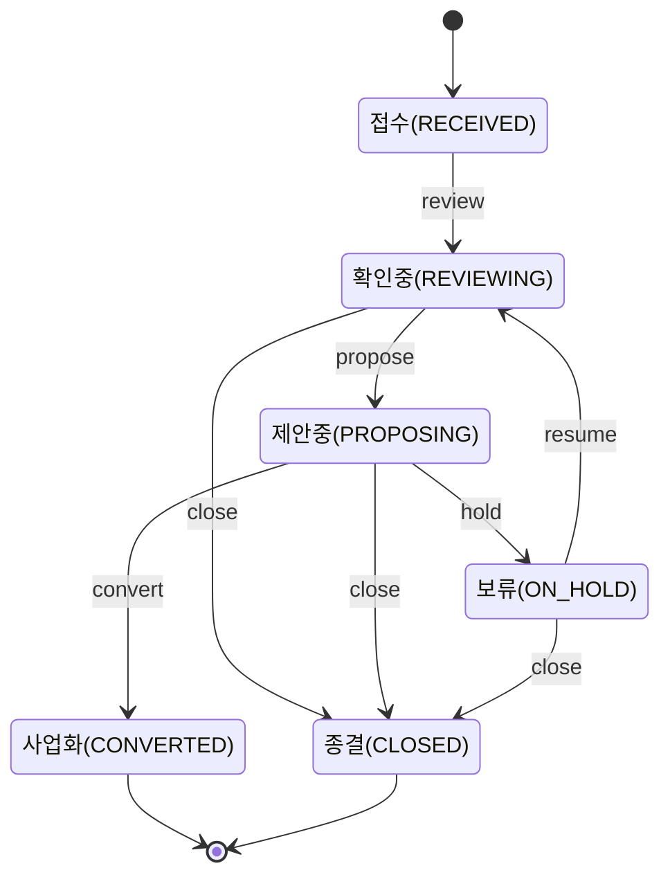

# 프로젝트 구조 (Next.js)

ADR-0001에서 결정한 대로 Next.js(App Router) + TypeScript 단일 모놀리스로 구성한다.
인증(ADR-0002)·이메일 발송(ADR-0003)이 추가되며 `(protected)` 라우트 그룹이 생겼다.

## 디렉터리

```
src/
  app/
    layout.tsx            루트 레이아웃 — 모바일 뷰포트, Pretendard 폰트 링크, AppHeader
    globals.css           디자인 토큰(색상·반경·그림자)과 카드·배지·버튼 기본 스타일
    login/                비로그인 사용자용 — (protected) 밖에 있다
      page.tsx             이메일 입력 → 매직링크 요청
      check-email/page.tsx "메일을 확인하세요"
      totp/page.tsx         2단계 인증 코드(또는 복구코드) 입력
      totp/setup/page.tsx   TOTP 최초 등록(QR·비밀키·복구코드 발급)
    (protected)/          로그인(및 필요 시 TOTP)이 끝나야 들어오는 화면 — layout.tsx가 막는다
      layout.tsx            세션 확인 + 리다이렉트 + BottomNav
      page.tsx               내 홈 — 참여 중인 활동·보완 요청·최근 확인 결과 요약
      activities/
        page.tsx              활동 목록 (FR-04) — 활동 운영 역할이면 등록 링크 노출
        new/page.tsx          활동 등록 (FR-04) — 활동 운영 역할만 접근
        [activityId]/page.tsx 활동 상세 (FR-04/05) — 참여 신청 폼 + 책임자용 수락·거절·종료
        [activityId]/edit/page.tsx 활동 수정 (FR-04) — 책임자만, 종료·취소 활동은 잠김
        [activityId]/revise/page.tsx 활동 정정 이력 만들기 — 종료·취소 활동 전용, 원본 값으로 미리 채움
      my/
        participation/page.tsx  내 참여 (FR-05) — 신청 목록, 철회, 기록하기 진입
        contributions/page.tsx  내 기여 (FR-07) — 실제 목록, 이어 작성·정정 요청 링크
        contributions/new/page.tsx  기여 작성 = "기록하기" (FR-06) — 새로 작성/이어 작성/정정 + 증빙 첨부(이어 작성 시)
        profile/page.tsx   내 정보 (FR-03) — 로그인 이메일·로그아웃, 연락처·관심 분야 수정
        audit-log/page.tsx 내 담당 이력 — 내가 책임자·담당자인 활동·상담의 AuditLog만
        notifications/page.tsx 알림 (FR-10) — 목록·읽음 처리
      needs/
        page.tsx              상담·수요 목록 (FR-08) — 로그인한 누구나 조회
        new/page.tsx          상담·수요 접수 (FR-08) — 활동 운영 역할만 접근
        [needId]/page.tsx     상담·수요 상세 — 상태 관리는 담당자만
        [needId]/edit/page.tsx 상담·수요 수정 (FR-08) — 담당자만, 사업화·종결 건은 잠김
      review/page.tsx      담당자 확인함 (FR-07) — 실제 확인·보완요청 동작
      admin/
        page.tsx              관리자 설정 허브 — 하위 도구로 이동하는 링크 모음
        invitations/page.tsx  초대 관리(SECRETARIAT/SYSTEM_ADMIN 전용) — 발급·재발송·취소, 주체 미리 연결
        subjects/new/page.tsx 사람 미리 등록(SECRETARIAT/SYSTEM_ADMIN 전용) — 계정 없이 사람 정보만 등록
        roles/page.tsx        역할 관리(SECRETARIAT/SYSTEM_ADMIN 전용) — 역할 부여·종료
        org-units/page.tsx    기구 관리(SECRETARIAT/SYSTEM_ADMIN 전용) — 기구 등록·목록·보관·복원
        org-units/[id]/edit/page.tsx  기구 정보 수정 — 등록과 같은 필드
        org-units/merge/page.tsx  기구 병합 — 선택 → 미리보기(개수 조회) → 확정 2단계
        classifications/page.tsx  분류 관리(SECRETARIAT/SYSTEM_ADMIN 전용) — 지역·전문영역 분류 등록·사용 중지
        audit-log/page.tsx    상태 이력 조회(SECRETARIAT/SYSTEM_ADMIN 전용) — AuditLog 조회·필터
      forbidden/page.tsx    로그인은 됐지만 역할·담당 범위가 안 맞을 때
    api/
      health/route.ts      헬스체크 (DB 연결 확인)
      profile/
        update/route.ts            POST: 내 정보(Subject) 수정 — 이름·지역·연락처 등
      notifications/
        [id]/read/route.ts         POST: 알림 하나 읽음 처리(본인 것만)
        read-all/route.ts          POST: 안 읽은 알림 모두 읽음 처리
      auth/
        login/route.ts             POST: 매직링크 요청
        verify/route.ts            GET: 매직링크 소비 → 세션 발급
        logout/route.ts            POST: 세션 폐기
        accept-invitation/route.ts GET: 초대 수락 → 계정(+필요 시 주체) 생성 → 세션 발급
        totp/setup/route.ts        POST: TOTP 등록 확인·활성화
        totp/verify/route.ts       POST: TOTP 코드 또는 복구코드 확인
      contributions/
        save/route.ts               POST: 임시저장/제출 (BR-01, BR-06 멱등성)
        [id]/confirm/route.ts       POST: 담당자 확인 (BR-04/05 버전 대체 처리)
        [id]/request-revision/route.ts  POST: 보완 요청
        [id]/attachments/route.ts   POST: 증빙 첨부(DRAFT/NEEDS_REVISION일 때만)
      attachments/
        [id]/download/route.ts      GET: 첨부파일 다운로드(업로더·담당자만, entityType 무관 공용)
        [id]/delete/route.ts        POST: 첨부파일 소프트 삭제(업로더 본인만, entityType 무관 공용)
      activities/
        create/route.ts             POST: 활동 등록(항상 PLANNING 상태로 시작)
        [activityId]/
          transition/route.ts       POST: 활동 상태 전이(승인·반려·보류·재개·종료·취소)
          update/route.ts           POST: 활동 정보 수정(등록과 같은 필드·검증)
          revise/route.ts           POST: 정정 이력 생성(종료·취소 활동, 참조 6종 이전)
          attachments/route.ts      POST: 활동 첨부(책임자만, 종료·취소 시 잠김)
      activity-assignments/
        apply/route.ts              POST: 참여 신청(PROPOSED 생성, 중복 신청 방지)
        [id]/accept/route.ts        POST: 책임자가 수락 → ACCEPTED
        [id]/reject/route.ts        POST: 책임자가 거절 → CANCELLED
        [id]/end/route.ts           POST: 책임자가 종료 처리 → ENDED
        [id]/withdraw/route.ts      POST: 본인이 철회(PROPOSED일 때만) → CANCELLED
        [id]/start/route.ts         POST: 본인이 진행 시작(ACCEPTED일 때만) → IN_PROGRESS
      needs/
        create/route.ts             POST: 상담·수요 접수(항상 RECEIVED 상태로 시작)
        [needId]/
          transition/route.ts       POST: 상담·수요 상태 전이(확인·제안·사업화·보류·재개·종결)
          update/route.ts           POST: 상담·수요 정보 수정(접수와 같은 필드·검증)
          attachments/route.ts      POST: 상담·수요 첨부(담당자만, 사업화·종결 시 잠김)
      admin/
        roles/
          grant/route.ts             POST: 역할 부여
          [id]/revoke/route.ts       POST: 역할 종료(endDate 채움, 삭제 아님)
        invitations/
          create/route.ts            POST: 초대 발급 + 이메일 발송(주체 미리 연결 검증 포함)
          [id]/resend/route.ts       POST: 새 토큰 발급 후 재발송(같은 레코드 재사용)
          [id]/revoke/route.ts       POST: 초대 취소
        subjects/
          create/route.ts            POST: 사람(Subject type=PERSON) 미리 등록(계정 없음)
        org-units/
          create/route.ts            POST: 기구(Subject type=ORG_UNIT) 등록
          [id]/update/route.ts       POST: 기구 정보 수정(등록과 같은 필드·검증)
          [id]/archive/route.ts      POST: 기구 보관(archivedAt 채움, 삭제 아님)
          [id]/restore/route.ts      POST: 기구 보관 복원(archivedAt을 null로)
          merge/route.ts             POST: 기구 병합(참조 6종 이전 후 source 보관)
        classifications/
          create/route.ts            POST: 지역·전문영역 분류 등록(코드 정규화, 중복 거부)
          [id]/deactivate/route.ts   POST: 분류 사용 중지(active=false, 삭제 아님)
          [id]/activate/route.ts     POST: 분류 다시 사용(active=true)
  components/
    AppHeader.tsx        브랜드 로고(라임 배지 "IT" + 워드마크) — 모든 화면 상단에 고정
    BottomNav.tsx        모바일 기본 메뉴 (v0.2 §2.1): 홈/참여할 일/기록하기/우리 조합/내 정보
    ScreenPlaceholder.tsx  아직 구현되지 않은 화면의 공통 자리표시자
    AuditLogEntries.tsx   AuditLog 목록 렌더링 — 관리자 상태 이력 조회·내 담당 이력이 공유
  lib/
    prisma.ts            PrismaClient 싱글턴
    display-id.ts        ACT-0001 등 표시번호를 원자적으로 채번(DisplaySequence upsert)
    contribution-labels.ts  기여 유형·유무급·상태·증거수준 enum의 한글 라벨(화면 3곳 이상 공유)
    attachment-storage.ts   첨부파일 저장 추상화(ADR-0004) — 저장·읽기, 허용 타입·용량 제한
    subject-labels.ts     SubjectStatus(활성/휴면/종료/확인필요) 한글 라벨
    activity-labels.ts   ActivityManagementType·Mission·Visibility·ActivityStatus 한글 라벨
    activity-status.ts   활동 상태 전이표(ACTIVITY_TRANSITIONS), 전이 동작 한글 라벨
    activity-hierarchy.ts 상위 활동 순환 방지 — 자신+모든 하위 활동 id 계산
    need-labels.ts       NeedChannel·NeedStatus·NeedCloseType 한글 라벨
    need-status.ts       상담·수요 상태 전이표(NEED_TRANSITIONS), 전이 동작 한글 라벨
    role-labels.ts       PermissionRole·ScopeType enum의 한글 라벨
    audit-labels.ts      AuditAction 한글 라벨, beforeData/afterData 변경분만 뽑는 diffAuditData
    assignment-labels.ts AssignmentStatus 한글 라벨, 역할 선택지, 재신청 가능 상태 목록
    classification-labels.ts 지역·전문영역 분류 도메인·한글 라벨, 코드 정규화,
                          레거시 자유 텍스트를 잃지 않는 선택형 검증(isAllowedControlledValue)
    notification-labels.ts NotificationType 한글 라벨
    notifications.ts     알림 생성 헬퍼(notify) — FR-10, 큐 없이 트랜잭션 안에서 즉시 생성
    auth/
      crypto.ts            토큰 생성·해시, TOTP 비밀키 암호화(AES-256-GCM), 복구코드 생성
      config.ts            토큰 TTL·세션 기간·TOTP 강제 대상 역할·getBaseUrl() 등
      session.ts           세션 생성·조회·폐기 (DB 기반, 계정 상태 실시간 확인)
      roles.ts             역할 조회(getActiveRoles/hasAnyRole), 페이지 가드(requireRole),
                            담당자 확인함 접근 판정(canAccessReviewInbox)
      login.ts             매직링크 요청·소비
      totp.ts              TOTP 등록·검증, 복구코드 소비
    email/
      resend.ts            ADR-0003: Resend 발송 래퍼(로그인·초대 공용). API 키 없으면
                            콘솔에 링크 출력
prisma/
  schema.prisma          R1 데이터 모델 (별도 설계 문서: docs/design/r1-schema.md)
  bootstrap-admin.ts     최초 관리자 초대장을 만드는 1회성 스크립트 — 이제 정식 화면
                         (/admin/invitations)이 있지만, 첫 관리자는 그 화면에 들어갈
                         계정 자체가 없어 여전히 스크립트로 부트스트랩해야 한다.
```

## 화면 디자인 시스템 (1차 개선)

사용자가 제공한 "공동체IT 운영허브" 디자인 컨셉(짙은 숲색 + 라임 포인트 + 따뜻한
크림 배경, 둥근 흰 카드, 색깔 있는 상태 배지)을 참고해 화면 룩을 다듬었다. 그
컨셉 자체는 데스크톱 사이드바 기반의 더 넓은 운영허브(사업·정산·의사결정 등,
R1 범위 밖) 목업이었지만, 이번 작업은 **색상·타이포그래피·카드·배지 같은 시각
언어만 가져오고, 기존 모바일 우선 IA(바텀 내비게이션, v0.2 §2.1)는 그대로
유지**했다 — 사이드바로 갈아엎는 것은 이번 "1차 룩 개선" 범위를 넘어서는 별도
결정이라고 판단했다.

- **디자인 토큰은 CSS 변수 하나로 모은다(`globals.css`)**: `--color-primary`(짙은
  숲색), `--color-accent`(라임), `--color-bg`(크림), `--color-text-muted`,
  `--radius-card`/`--radius-pill` 등을 `:root`에 선언했다. 색을 바꾸고 싶으면
  이 파일 하나만 고치면 된다.
- **버튼·입력창은 페이지를 고치지 않아도 저절로 바뀐다**: 이 프로젝트의 거의
  모든 페이지는 `<button>`·`<input>`·`<select>`·`<textarea>`에 인라인
  `style={{}}`로 크기(padding·fontSize)만 지정하고 색·모양(배경·테두리·둥근 정도)은
  지정하지 않았다는 공통점을 이용해, `globals.css`에 태그 단위 기본 스타일(둥근
  버튼, 라운드 인풋, 포커스 시 초록 테두리 등)을 추가했다 — 그 결과 이번에
  손대지 않은 화면(예: `/admin/roles`, `/admin/invitations`)도 배경·폰트·버튼
  모양은 자동으로 새 디자인을 따른다(실제로 `/admin/roles`를 스크린샷으로
  확인해 검증함, §검증 이력).
- **카드·배지는 손댄 화면에만 있다**: `.card`(흰 배경, 둥근 모서리, 옅은 그림자)·
  `.card-list`(카드 간격)·`.badge`+색상별 modifier(`badge-green`/`blue`/`red`/
  `yellow`/`gray`)는 CSS 클래스라 각 페이지가 명시적으로 붙여야 적용된다. 이번에
  붙인 화면: 홈(자리표시자), 로그인 전체 흐름(로그인/메일 확인/TOTP 설정·인증),
  활동 목록·상세·등록·수정, 우리 조합(상담·수요) 목록·상세·접수, 내 기여
  목록·작성(증빙 첨부 포함), 내 참여, 담당자 확인함, 내 정보, 관리자 허브.
- **상태 배지 색은 라벨 파일에 같이 둔다**: `ACTIVITY_STATUS_BADGE_TONE`,
  `NEED_STATUS_BADGE_TONE`, `CONTRIBUTION_STATUS_BADGE_TONE`,
  `ASSIGNMENT_STATUS_BADGE_TONE`을 각각 `activity-labels.ts`/`need-labels.ts`/
  `contribution-labels.ts`/`assignment-labels.ts`에 추가했다 — `*_LABELS`
  상수 옆에 나란히 둬서, 새 상태가 생기면 라벨과 배지 색을 같은 곳에서 같이
  챙기게 했다.
- **버튼 안에 버튼을 넣지 않는다**: "새로 만들기" 같은 링크를 버튼처럼 보이게
  할 때 `<Link>` 안에 `<button>`을 넣지 않고(잘못된 HTML 중첩), `.btn-link`
  클래스를 `<Link>`에 직접 붙였다. 되돌리기·삭제 같은 덜 중요한 동작은
  `.btn-outline`(흰 배경, 테두리)으로 주 버튼과 구분했다.
- **폰트는 Pretendard**: 시스템 폰트 스택에 이름만 있고 실제로 로드되지 않았던
  것을, 루트 레이아웃에서 CDN(`jsdelivr`)으로 실제 로드하도록 바꿨다.
- **정직하게 남겨둔 것 — "1차"인 이유**: `/admin/roles`, `/admin/invitations`,
  `/admin/org-units`, `/admin/audit-log`, 활동/상담 접수 폼의 세부 필드,
  기여 이어 작성 폼의 나머지 부분은 전역 스타일(색·폰트·버튼 모양)만 자동으로
  받았을 뿐, 카드·배지로 다시 짜지는 않았다. 데스크톱 사이드바 레이아웃으로
  전환하는 것도 하지 않았다(위 참고). 상태 배지 색 매핑은 6~8개 상태를 초록/
  파랑/노랑/빨강/회색 다섯 톤에 임의로 배분한 것이라, 실제 사용해보고 조합의
  감각과 안 맞으면 톤 배정만 바꾸면 된다.

## 인증 흐름 (ADR-0002 구현)

```
[초대 수락]                    [로그인]
accept-invitation?token=…      login (이메일 입력)
   ↓ 계정 생성 + 세션 발급          ↓ POST /api/auth/login
   ↓                              check-email
   ├─ TOTP 불필요 → 홈             ↓ 메일의 링크 클릭
   └─ TOTP 필요 → totp/setup      GET /api/auth/verify?token=…
                                    ├─ TOTP 불필요 → 홈
                                    ├─ 미등록인데 필요 → totp/setup
                                    └─ 등록됨 → totp (코드 또는 복구코드)
```

- 세션은 `Session` 테이블에 저장되고, 쿠키에는 원문 대신 해시 대조용 랜덤 토큰만 있다.
- `(protected)/layout.tsx`가 매 요청마다 `getActiveSession()`으로 계정 상태·세션 만료·
  2단계 인증 완료 여부를 확인한다. 계정을 정지하면 그 다음 요청부터 바로 막힌다(FR-01).
- 인가(authorization)는 `src/lib/auth/roles.ts`에 있다 — 아래 "역할 기반 접근 제어" 참고.
- CSRF는 세션 쿠키의 `SameSite=Lax`에 기대고 있다 — 별도 CSRF 토큰은 아직 없다.
- 로그인 요청(`/api/auth/login`)에 속도 제한이 없다 — Redis 등 배경작업 인프라가
  아직 없어서다(ADR-0001). 대량 스팸 발송 위험은 남아 있는 과제로 남겨둔다.

## 내 정보 화면 (`/my/profile`, FR-03 구현)

v0.1 P01(주체) 필드 중, 조직이 관리해야 하는 항목(활동 상태·책임 담당자)을 뺀
나머지 — 이름·지역·전문영역/관심·연락처·수신 동의 — 를 본인이 직접 고치는
화면이다. 이전까지는 로그인 이메일 표시·로그아웃만 실제 동작이었고 나머지는
`ScreenPlaceholder`였다.

- **이름을 바꾸면 이전 이름이 자동으로 남는다**: v0.1 P01의 "별칭·이전 이름:
  검색용, 변경 이력 보존"을 그대로 구현했다 — `name`을 직접 덮어쓰지 않고, 바뀌기
  전 이름을 `previousNames` 배열에 추가한다(중복 방지). 별도의 "이전 이름 수정"
  UI는 없다 — 이 배열은 이름을 바꿀 때만 자동으로 쌓인다.
- **"확인일"은 저장하는 순간 자체**: v0.1 P01은 "확인일: 오래된 정보를 현재
  사실로 오인하지 않음"을 요구한다. 별도의 "확인" 버튼을 만드는 대신, 본인이 이
  화면에서 저장할 때마다 `confirmedAt`을 지금 시각으로 찍는다 — 그 자체가 본인이
  최신 정보임을 확인한 것이기 때문이다.
- **최초 확인 대기 상태는 이 화면에서 풀린다**: 초대를 수락할 때 사무국이 미리
  연결해둔 사람이 없으면 `Subject.status`가 `NEEDS_CONFIRMATION`으로 자동
  생성된다("인증 흐름" 참고). 본인이 이 화면에서 처음 저장하면 그 순간
  `ACTIVE`로 바뀐다 — 그 외 상태(휴면·종료)는 조직이 관리하는 값이라 이 화면은
  건드리지 않는다.
- **연락처·수신 동의는 구조화된 JSON으로 저장한다**: `contactInfo`는
  `{ value: "..." }`, `contactConsent`는 `{ promotionalOptIn: boolean, updatedAt }`
  형태로 저장한다 — v0.1이 "연락처: 외부 공개 금지"라고 명시하므로, 다른 조합원이
  볼 수 있는 화면 어디에도 이 값을 노출하지 않는다(지금은 노출할 화면 자체가 없다).
  체크박스를 해제하고 저장해도 `promotionalOptIn: false`로 명시적으로 남는다 —
  "동의한 적 없음"과 "거부함"을 구분하려는 것이다.
- **지역·전문영역/관심은 분류표(`Classification`) 기반 선택형이다**: 지역은
  `<select>` 하나, 전문영역·관심은 체크박스 목록으로 바뀌었다 — "분류 관리
  화면" 절 참고. 필드 자체(`Subject.region: String?`, `expertiseTags: String[]`)는
  그대로다: 선택한 항목의 `label` 문자열을 저장할 뿐 `Classification`을 외래키로
  참조하지 않는다 — 분류를 사용 중지해도 이미 저장된 문자열 값 자체는 안 바뀌게
  하려는 것과, 스키마 마이그레이션 없이 이번 기능을 넣으려는 것 둘 다를 노린
  선택이다.
- **수정 이력도 감사기록을 남긴다**: 활동 상태 전이·수정과 같은 `AuditLog`(action
  `UPDATE`)에 이름·지역·연락처·전문영역·수신동의의 변경 전·후 값을 남긴다.

## 활동 등록 화면 (FR-04 구현)

`/activities/new`에서 활동을 만든다. 여태 `prisma/seed-sample-data.ts` 스크립트나 DB
직접 조작으로만 생기던 활동을, 이제 화면에서 만들 수 있다.

- **접근 권한**: `ACTIVITY_OPERATIONS_ROLES`(ACTIVITY_MANAGER/DOMAIN_OPERATOR/
  SECRETARIAT/BOARD/SYSTEM_ADMIN)를 가진 계정만 들어올 수 있다 — `/review` 접근 판정에
  쓰던 역할 목록을 그대로 재사용했다(같은 역할이 "활동을 운영·확인할 자격"이라는
  동일한 의미이기 때문에, 별도 상수를 새로 만들지 않고 `canAccessReviewInbox`가 쓰던
  비공개 상수를 `ACTIVITY_OPERATIONS_ROLES`라는 이름으로 내보내는 것으로 바꿨다).
  화면(`requireRole`)과 API(`/api/activities/create`, `hasAnyRole` 직접 확인) 양쪽에서
  같은 역할을 다시 확인한다 — 폼을 거치지 않고 바로 POST가 올 수 있어서다.
- **필수 입력(v0.1 A01)**: 활동명·목적·유형(사업/조직활동)·미션(1개 이상)·책임자 계정을
  모두 채워야 한다. 하나라도 비었거나 미션을 하나도 안 고르면 `error=invalid`로
  되돌아간다. 책임자로 고른 계정이 실존하지 않으면(레이스 등) `error=invalid_manager`.
  종료 예정일이 시작 예정일보다 빠르면 `error=invalid_dates` — 둘 다 선택 입력이라
  하나만 채워도 저장은 되고, 둘 다 있을 때만 순서를 검사한다.
- **상태는 폼 입력이 아니다**: 새 활동은 항상 `PLANNING`(기획)으로 시작한다 — 승인
  절차를 건너뛰고 곧바로 진행·완료 상태로 등록하는 것을 막기 위한 의도적 제약이라,
  상태 선택 UI 자체를 만들지 않았다. 등록 이후 상태를 바꾸는 방법은 바로 다음 절
  "활동 상태 전이"에서 다룬다.
- 표시번호는 `ACT-0001`처럼 `nextDisplayId`로 채번한다(기여의 `CTB-`, 배정과 같은 방식).
- 공개 범위(visibility)는 기본값 `TEAM`(담당팀만)이며 화면에서 바꿀 수 있다.
- `/activities` 목록 화면은 `ACTIVITY_OPERATIONS_ROLES`를 가진 계정에게만 "+ 새 활동
  등록" 링크를 보여준다 — 일반 조합원 화면에는 링크 자체가 없다.
- **상위 활동·예산(선택)**: 둘 다 스키마에 처음부터 있었지만 화면 필드가 없어 등록 이후
  뒤늦게 채워 넣는다. 상위 활동은 등록 시점엔 존재하는 활동 중에서 고르면 되므로
  순환 걱정이 없지만(새 활동은 아직 누구의 부모도 아니다), 수정 화면에서는 순환이
  생길 수 있어 별도 방지 로직이 있다(바로 아래 "활동 수정 화면" 참고). 예산은
  0 이상의 숫자만 허용하고(`error=invalid_budget`), 화면에는 `Intl`이 아니라 단순
  `toLocaleString("ko-KR")`로 "1,500,000원"처럼 보여준다.

## 활동 상태 전이 (`src/lib/activity-status.ts`, FR-04 구현)

v0.1 §3.2의 활동 상태표를 그대로 코드화했다: 기획→승인대기→준비→진행→수행완료→종료가
정상 경로이고, 보류·취소는 "진행 중"인 상태에서 빠지는 곁가지다.

```
기획 ──승인 요청──▶ 승인대기 ──승인──▶ 준비 ──진행 시작──▶ 진행 ──수행완료 처리──▶ 수행완료 ──종료──▶ 종료
        ▲               │(반려)                                                              (종료는 상태전이의
        └───────────────┘                                                                      종점, 그 이후는
                                                                                                 정정 이력으로만 수정)
[기획·승인대기·준비·진행] ──보류──▶ 보류 ──재개──▶ (보류 진입 직전 상태로 복귀)
[기획·승인대기·준비·진행·보류] ──취소──▶ 취소 (종점)
```

- **전이표는 한 곳에 있다**: `activity-status.ts`의 `ACTIVITY_TRANSITIONS`가 각 동작마다
  "어느 상태에서 가능한지"·"사유 입력이 필수인지"를 선언한다. 화면(어떤 버튼을 보여줄지)과
  API(`/api/activities/[activityId]/transition`, 실제 검증)가 같은 표를 참조해서 둘이
  어긋날 일이 없다.
- **권한**: 참여 신청 수락·거절·종료와 같은 원칙 — 그 활동의 `managerAccountId`만 상태를
  바꿀 수 있다. `ACTIVITY_OPERATIONS_ROLES`를 가졌어도 자기 담당이 아닌 활동은 못
  건드린다(활동을 등록한 사람과 상태를 운영하는 사람이 다를 수 있다는 걸 인정한 것 —
  실제로 다른 계정이 만들고 제3의 계정을 책임자로 지정한 활동에서, 책임자 계정만
  전이에 성공하고 나머지는 `forbidden`으로 막히는 것을 확인했다).
- **승인 요청 전 필수 필드 확인**: v0.1 §3.2는 승인대기로 넘어가려면 "책임자·목적·미션·
  예정기간"이 있어야 한다고 명시한다. 책임자·목적·미션은 등록 시 이미 필수였으니,
  전이 시점에는 `plannedStartDate`/`plannedEndDate`(둘 다 등록 화면에서는 선택 입력이다)
  만 추가로 확인한다 — 비어 있으면 `error=missing_planned_dates`.
- **보류는 "이전 상태로 복귀"를 실제로 구현했다**: 보류로 들어갈 때 상태를 저장하는 별도
  컬럼을 추가하지 않고, 모든 전이를 `AuditLog`(entityType `"Activity"`, action
  `STATUS_CHANGE`)에 `beforeData`/`afterData`로 남긴 뒤, 재개할 때 그 활동의 가장 최근
  전이 기록에서 "보류 진입 직전 상태(`beforeData.status`)"를 읽어 그 상태로 되돌린다.
  진행 중이던 활동을 보류했다가 재개하면 정확히 `IN_PROGRESS`로 돌아오는 것을
  확인했다. `AuditLog`는 스키마에는 있었지만 이번이 첫 실제 사용이다 — 부수 효과로
  모든 상태 전이 이력이 공짜로 남는다(조회 화면은 아직 없음, "아직 없는 것" 참고).
- **사유가 필수인 전이**: 반려(승인대기→기획)·보류·취소·종료 네 가지는 사유 없이 제출하면
  `error=reason_required`로 막는다. 종료의 사유는 `AuditLog.reason`뿐 아니라
  `Activity.closeEvaluationNote`에도 그대로 저장된다 — v0.1이 요구하는 "종료 시 평가"를
  담는 필드가 스키마에 이미 있었는데 지금까지 채워진 적이 없었다. 종료할 때
  `closedAt`·`actualEndDate`(비어 있었다면)도 함께 채운다. 보류는 사유에 더해 선택 항목인
  재검토일을 받아 `AuditLog.afterData`에 같이 남긴다(전용 컬럼 대신 JSON에 둔 것은, 이
  값이 화면에 다시 노출되는 별도 조회 기능이 아직 없기 때문).
- **종료·취소는 종점이다**: 종료된 활동은 상태 관리 UI 자체가 사라지고 "수정은 정정
  이력으로 남겨야 합니다" 안내만 보인다(v0.1: "종료: 수정은 정정 이력, 새 일은 후속
  활동"). 취소도 마찬가지로 더 이상 전이할 수 없다 — 취소된 활동을 되살리는 기능은
  의도적으로 만들지 않았다.
- **정직하게 남겨둔 것**: v0.1이 요구하는 "종료 체크"(열린 청구·지급 처리, 후속 과업
  담당·날짜 확인 등)는 계약·지급(F01/F02) 테이블이 R1에 아직 없어 검증하지 않는다 —
  지금의 종료 평가는 자유 텍스트 한 줄로만 남는다. '준비 승인'의 결재 권한자를
  책임자와 분리하는 위임 규정도 아직 없어, 지금은 책임자 본인이 스스로 승인까지
  처리한다.

## 활동 수정 화면 (`/activities/[activityId]/edit`, FR-04 구현)

등록 후 오탈자를 고치거나 계획을 바꿀 방법이 없던 것을 채운다. 등록 화면과 같은
필드(활동명·유형·목적·미션·책임자·공개범위·예정기간·상위 활동·예산)를 그대로
다시 보여주고, 같은 검증 규칙(제목·목적·미션 1개 이상·책임자 필수, 종료일<시작일
거부, 예산 0 이상)을 쓴다.

- **권한**: 상태 전이와 같은 원칙 — 그 활동의 `managerAccountId`만 수정할 수 있다.
  `ACTIVITY_OPERATIONS_ROLES`를 가졌어도 자기 담당이 아니면 `error=forbidden`으로
  막힌다. 화면(리다이렉트)과 API 양쪽에서 같은 검사를 반복한다.
- **종료·취소된 활동은 잠긴다**: v0.1 §3.2가 "종료 후 수정은 정정 이력으로"라고
  명시하므로, `CLOSED`·`CANCELLED` 상태에서는 수정 화면 진입 자체가
  `error=locked`로 막힌다. 활동 상세 화면의 "활동 정보 수정" 링크도 이 두 상태에서는
  아예 보이지 않는다 — 대신 "정정 이력 만들기" 링크가 나타난다(§"활동 정정 이력"
  참고).
- **책임자를 바꾸면 그 순간 권한도 넘어간다**: 별도의 "담당자 이관" 절차 없이 이
  화면에서 바로 책임자를 바꿀 수 있다. 바꾸고 나면 이전 책임자는 그 즉시 이
  화면·상태 전이·신청 수락 모두에 접근할 수 없고, 새 책임자만 할 수 있다 — 실제로
  책임자를 바꾼 뒤 이전 계정이 수정·전이 양쪽에서 `forbidden`으로 막히고 새 계정은
  둘 다 성공하는 것을 확인했다.
- **수정도 감사기록을 남긴다**: 상태 전이와 같은 `AuditLog`(action `UPDATE`)에
  바뀌기 전·후 값을 통째로 남긴다 — 나중에 "누가 언제 무엇을 바꿨는지" 조회 화면을
  붙일 때 데이터가 이미 쌓여 있게 하려는 것이다.
- **상위 활동 순환 방지**: 등록 화면과 달리 수정 화면에서는 이미 부모-자식 관계가
  있는 활동끼리 서로를 상위로 지정해 순환(A→B→A)을 만들 수 있다. `src/lib/
  activity-hierarchy.ts`의 `getSelfAndDescendantActivityIds`가 그 활동 자신과 모든
  하위 활동(자식의 자식까지, 트리 깊이에 관계없이)의 id를 모아, 상위 활동
  드롭다운에서 아예 후보로 보여주지 않는다. API도 같은 함수로 다시 확인해
  `error=invalid_parent_cycle`로 거부한다 — 화면에서 안 보이더라도 직접 API를
  호출하면 뚫릴 수 있어서다. 자기 자신을 상위로 지정하는 것도 같은 오류로 막힌다.
## 활동 정정 이력 (`/activities/[activityId]/revise`, v0.1 §3.2 구현)

종료·취소된 활동은 직접 고칠 수 없다는 잠금을 만들어 뒀지만("활동 수정 화면"),
그럼 오탈자나 잘못된 정보는 어떻게 고치는가에 대한 답이 이번에 생겼다 —
기여의 `revisionOfId`/`supersededByContributionId`와 같은 패턴을 활동에도
그대로 옮겼다(`Activity.revisionOfId`/`supersededByActivityId`, 새 마이그레이션
`add_activity_revision`).

```
[CLOSED/CANCELLED 활동 A]                    POST /api/activities/[A]/revise
  "정정 이력 만들기" (책임자만) ───────────────→  ├ 새 활동 B 생성(A의 상태·종료일 등 그대로 승계)
                                               ├ A를 가리키던 참조를 전부 B로 이전
                                               │  (하위 활동·참여 배정·기여·연결된 필요·
                                               │   분류·첨부파일·권한 범위)
                                               └ A.supersededByActivityId = B
```

- **기여와 다른 점 — 확인 절차가 없다**: 기여의 정정은 작성자가 아닌 담당자가
  다시 확인해야 새 버전이 유효해진다(BR-04/05). 활동의 등록 정보(제목·목적·
  미션 등)는 담당자 본인이 유일한 권위자이므로, 별도로 확인해줄 사람이 없다 —
  그래서 정정 이력은 **만드는 즉시** 현재 기록이 된다. 상태 값 자체는 새로
  승인받지 않고 원본의 것(`status`·`actualStartDate`·`actualEndDate`·
  `closeEvaluationNote`·`closedAt`)을 그대로 물려받는다 — 이미 끝난 일의
  기록을 고치는 것이지, 그 일을 다시 진행하는 것이 아니기 때문이다.
- **필드는 수정 화면과 같다**: 활동명·유형·목적·미션·상위 활동·예산·책임자·
  공개범위·예정기간을 원본 값으로 미리 채운 채 다시 보여주고, 같은 검증
  규칙(제목·목적·미션 1개 이상, 종료일<시작일 거부, 예산 0 이상, 상위 활동
  순환 방지)을 그대로 쓴다. 순환 방지는 원본 기준으로 계산한다 — 새 행이
  원본이 트리에서 있던 자리를 물려받으므로, 원본 자신이나 원본의 하위 활동을
  상위로 고르면 여전히 순환이 생긴다.
- **원본을 가리키던 참조 여섯 가지를 전부 옮긴다**: `Activity.parentActivityId`
  (하위 활동), `ActivityAssignment.activityId`(참여 배정), `Contribution.
  activityId`(기여), `NeedActivityLink.activityId`(연결된 상담·수요),
  `ActivityClassification.activityId`, 첨부파일(`entityType=ACTIVITY`)과
  `PermissionGrant`(scopeType `ACTIVITY`)의 범위까지 — 기구 병합 때 세운
  "원본을 가리키던 모든 참조를 옮긴다" 원칙을 그대로 적용했다. `AuditLog`만은
  옮기지 않는다 — 그 변경이 실제로 원본에서 일어난 시점의 기록이라는 역사적
  정확성을 유지하려는 것이다.
- **원본은 지워지지 않고 "정정됨" 표시만 남는다**: 원본의 상태(`CLOSED`/
  `CANCELLED`)는 그대로 두고 `supersededByActivityId`만 채운다. 원본 상세
  화면에는 "이 활동 정보는 정정되었습니다 → 최신 버전 보기" 배너가 뜨고,
  참여 신청·기여 작성 같은 실사용 UI는 숨긴다(그 데이터는 이미 새 행으로
  옮겨졌으므로). 새 행의 상세 화면에는 반대로 "이 활동은 원본의 정정본입니다
  → 원본 보기" 배너가 뜬다. 정정된 원본은 활동 목록과 상위 활동·참여·확인
  등 모든 선택형 드롭다운(`supersededByActivityId: null` 필터)에서 자동으로
  빠져, 새로 시작하는 작업이 낡은 기록을 참조하지 않게 한다.
- **거듭 정정은 최신 버전에서만**: 이미 정정된 원본에서 다시 "정정 이력
  만들기"를 시도하면(화면 진입도, API 직접 호출도) `error=already_revised`와
  함께 최신 버전으로 안내한다 — 정정의 정정은 최신 버전을 기준으로 새로
  시작해야 한다.
- **정직하게 남겨둔 것**: 정정 이력을 여러 번 거친 활동의 "변경 계보"를 한
  화면에서 죽 보여주는 뷰는 없다 — 원본↔최신 버전을 오가는 배너 링크로만
  탐색할 수 있다.

## 참여 신청·배치 흐름 (FR-05 구현)

```
[조합원]                                [활동 책임자]
/activities/[id]                        /activities/[id]
  └ 참여 신청(PROPOSED) ─────────────────→  ├ 수락 → ACCEPTED (startDate 채움)
                                           └ 거절 → CANCELLED
/my/participation
  ├ 신청 철회(PROPOSED일 때만) → CANCELLED   활동 책임자만 종료 처리 가능:
  └ 진행 시작(ACCEPTED일 때만) → IN_PROGRESS  ACCEPTED/IN_PROGRESS → ENDED (endDate 채움)
```

- **배치는 실적이 아니다(BR-02)**: `ActivityAssignment`는 "누가 참여하기로 했는가"만
  기록한다. 실제 기여는 별도로 `/my/contributions/new`에서 작성해야 한다 — 수락됐다고
  자동으로 기여가 생기지 않는다. `/my/participation`과 활동 상세 화면 모두 수락된
  참여 옆에 "이 활동으로 기록하기" 링크만 둔다.
- **ACCEPTED → IN_PROGRESS 전환은 본인이 한다**: 실제로 일을 시작했는지는 책임자보다
  본인이 더 정확히 알기 때문에, 수락·거절·종료(책임자 권한)와 달리 이 전환은
  신청 철회와 같은 원칙으로 본인만 할 수 있다(`POST
  /api/activity-assignments/[id]/start`). `ACCEPTED` 상태가 아니면(아직 `PROPOSED`거나
  이미 `IN_PROGRESS`/`ENDED`/`CANCELLED`면) 조용히 무시하고, 배정 본인이 아니면
  `forbidden`으로 막는다. 별도의 시작 시각 필드는 없다 — `startDate`는 이미 수락
  시점에 채워져 있으므로 상태만 바뀐다.
- **중복 신청 방지**: 이미 PROPOSED·ACCEPTED·IN_PROGRESS 상태의 신청이 있으면 같은
  활동에 다시 신청할 수 없다. 거절(CANCELLED)되거나 종료(ENDED)된 뒤에는 다시 신청할
  수 있다 — 실제로 거절 후 재신청, 재신청 철회까지 확인했다.
  이 로직은 최신 배정 하나가 아니라 "현재 열려 있는 상태"가 있는지로 판단하므로,
  과거 이력이 몇 건이든 관계없이 동작한다.
- **권한**: 수락·거절·종료는 그 활동의 `managerAccountId`만 할 수 있다(다른 관리자
  계정으로 시도하면 거부됨을 확인). 철회는 신청 본인만, 그리고 아직 PROPOSED일
  때만 가능하다 — 수락된 뒤에는 본인이 스스로 빠질 수 없고 책임자가 종료 처리해야
  한다(활동을 무단이탈처럼 보이지 않게 하기 위한 의도적 제약).
- 역할(`role`)은 자유 문자열이지만 v0.1 A05의 예시(책임/개발/강의/보조/운영/기록/자문)를
  선택지로 제공한다(`src/lib/assignment-labels.ts`).

## 기여 작성·확인 흐름 (FR-06/07 구현)

```
[조합원]                              [담당자]
/my/contributions/new                 /review
  ├ 임시저장(DRAFT) ──┐                  ├ 확인 → CONFIRMED
  │  (활동/필요 없어도 됨, BR-01)          │   (자기 자신의 기여는 거부: self_confirm)
  └ 제출(SUBMITTED) ──┼─────────────────┤
     (활동 또는 필요 필수)                 └ 보완 요청 → NEEDS_REVISION ──┐
                                                                        │
     ┌────────── 이어 작성(같은 submissionKey로 업데이트) ◄─────────────┘
     │
     └ 확인된 기여를 "정정 요청"하면 새 행(revisionOfId 연결)을 만들고,
       그 새 행이 확인되면 원본을 SUPERSEDED로 바꾼다(BR-03~05).
```

- **멱등성(BR-06/AT-04)**: 페이지를 새로 열 때마다 서버가 `submissionKey`를 새로 발급해
  숨은 필드에 넣는다. 같은 페이지에서 제출 버튼을 여러 번 눌러도 같은 키로 upsert되어
  한 건만 생긴다. 두 요청이 진짜로 동시에 도착해 둘 다 "아직 없음"으로 보고 생성을
  시도하는 경우에도, DB 유일 제약(P2002) 위반을 잡아 조용히 넘어가도록 처리했다 —
  실제로 3개 동시 요청을 보내 한 건만 생성됨을 확인했다(§검증 이력).
- **담당 범위(FR-07의 "담당 범위별 확인 대기 목록")**: "이 항목을 확인해도 되는가"는
  역할이 아니라 소유권(`Activity.managerAccountId`, `Need.assigneeAccountId`)으로 계속
  판단한다 — 역할이 있어도 남의 활동 제출물은 볼 수 없어야 하므로. 아래 "역할 기반
  접근 제어"가 추가한 것은 "이 화면 자체에 들어올 수 있는가"라는 한 단계 위의 문제다.
- **자가확인 제한(v1.0 §3)**: 확인(`/confirm`)은 작성자 본인이면 거부한다. 보완 요청은
  막지 않는다 — 스스로에게 더 해달라고 요청하는 것은 위험한 자가승인이 아니기 때문이다.
  "소규모 조직의 자가확인 예외"는 정책이 아직 없어(ADR-0001) 구현하지 않았다.
- **주체 연결**: 초대를 수락할 때 사무국이 미리 사람을 연결해두지 않았으면, 계정에 최소
  정보의 `Subject`(상태 `NEEDS_CONFIRMATION`)를 자동으로 만들어 연결한다 — 기여를
  남기려면 반드시 주체가 있어야 하기 때문이다. "사무국이 미리 연결해두는" 경로는
  이제 실제로 있다 — 초대 관리 화면의 "미리 연결할 사람" 선택지와 사람 미리 등록
  화면 참고.

## 첨부파일 (ADR-0004, v0.1 A06 구현)

첨부는 스키마(`Attachment`)에는 R1 설계 때부터 있었지만, 어디에 저장할지(S3/
MinIO 등)가 조합 결정 사항으로 남아 있어(ADR-0001) 업로드 화면 자체가 없었다.
**ADR-0004**로 "R1은 로컬 디스크에 저장하고, 다운로드는 인증 라우트로만 제공한다"고
임시 결정해 막힌 것을 풀었다 — 나중에 S3/MinIO로 옮길 때도 `src/lib/
attachment-storage.ts` 두 함수(저장·읽기)만 바꾸면 되도록 감싸 뒀다. 기여
증빙(CONTRIBUTION)이 먼저 생겼고, 활동·상담·수요(ACTIVITY/NEED)는 나중에
같은 저장소·같은 다운로드·삭제 라우트를 공유하도록 확장했다.

### 기여 증빙 첨부파일

```
/my/contributions/new?id=…            [담당자] /review
  (임시저장·보완요청 상태에서만)              증빙 링크로 다운로드
  ├ 파일 첨부 → Attachment 생성            (활동 책임자·수요 담당자만)
  │  (SELF_REPORTED였다면 DOCUMENTED로 자동 승격)
  └ 첨부 삭제(소프트) → 남은 첨부가 0건이면 DOCUMENTED를 SELF_REPORTED로 되돌림
```

- **어디서 첨부하는가**: 새로 작성하는 화면(`/my/contributions/new`, `id` 없음)에는
  첨부 UI가 없다 — `Attachment.contributionId`가 실제 레코드를 가리켜야 하는데,
  아직 저장되지 않은 기여에는 붙일 대상이 없기 때문이다. 먼저 임시저장한 뒤
  "이어 작성"(`?id=...`)으로 들어와야 첨부 영역이 나타난다.
- **잠금 조건**: 첨부 추가·삭제는 그 기여가 `DRAFT`/`NEEDS_REVISION`일 때만 된다 —
  `?id=`로 들어오는 화면 자체가 이미 이 두 상태만 통과시키므로(그 외 상태는 목록으로
  리다이렉트) 화면에서는 항상 열려 있지만, API(`/api/contributions/[id]/attachments`,
  `/api/attachments/[id]/delete`)도 독립적으로 같은 조건을 다시 확인한다 — 제출·확인된
  기여에 몰래 증거를 끼워 넣거나 빼는 것을 막기 위해서다.
- **업로드 제한**: 이미지(JPEG/PNG/WEBP/GIF) 또는 PDF만, 파일당 10MB까지
  (`src/lib/attachment-storage.ts`). 그 외 형식이나 용량 초과는 각각
  `error=attachment_type`/`attachment_too_large`로 거부한다. 원본 파일명은
  화면에 보여줄 때만 쓰고, 실제 저장 키(`fileKey`)는 서버가 무작위로 만든다 —
  경로 조작이나 파일명 충돌을 막기 위해서다.
- **증거 수준 자동 승격/강등**: v0.1 A06은 "증거 없는 자가신고도 허용하되 등급
  표시"라고 요구한다. 스키마에 있던 `Contribution.evidenceLevel`을 이번에 처음
  실제로 움직인다 — 자가신고(`SELF_REPORTED`) 상태에서 첫 증빙을 첨부하면
  자동으로 증빙 첨부됨(`DOCUMENTED`)으로 올라가고, 마지막 남은 첨부를 지우면
  다시 `SELF_REPORTED`로 되돌아간다. 참여자 확인(`PARTICIPANT_CONFIRMED`)처럼
  더 높은 등급이 이미 있으면(아직 그 등급을 매기는 화면은 없지만) 건드리지 않는다.
- **다운로드 권한**: 업로더 본인이거나, 그 기여가 딸린 활동의 책임자·상담의
  담당자(=`/review`에서 그 항목을 볼 수 있는 사람)만 내려받을 수 있다. `public/`
  폴더에 두지 않고 `/api/attachments/[id]/download`를 거치게 해 URL만 안다고
  아무나 못 받게 막았다.
- **삭제는 소프트 삭제, 파일은 남긴다**: 지운 첨부는 `deletedAt`만 채우고 실제
  파일은 디스크에 그대로 둔다 — 실수로 지운 파일을 되살릴 여지를 남기려는
  것이며(수동 복구는 아직 DB 조작으로만 가능), 다운로드 라우트는 `deletedAt`이
  있으면 무조건 거부한다.

### 활동·상담·수요 첨부파일

`Attachment.entityType`에 처음부터 있던 `ACTIVITY`·`NEED`를 실제로 채운다.
계획서·정산 자료·회의록처럼 기여 증빙과는 성격이 다른 자료를 위한 것이라 화면·
API는 따로 두되(`/api/activities/[activityId]/attachments`, `/api/needs/[needId]/
attachments`), 다운로드·삭제(`/api/attachments/[id]/delete`, `.../download`)는
기여 증빙과 하나의 라우트를 공유한다 — `attachment.entityType`으로 분기해
누가 담당자인지, 잠겼는지를 그때그때 다시 조회해 확인한다.

- **업로드 권한·잠금은 그 대상의 수정 권한과 같다**: 활동 첨부는 그 활동의
  `managerAccountId`만, 종료·취소(`CLOSED`/`CANCELLED`)면 잠긴다(활동 수정과
  똑같은 조건). 상담·수요 첨부는 그 건의 `assigneeAccountId`만, 사업화·종결
  (`CONVERTED`/`CLOSED`)이면 잠긴다(상담·수요 수정과 똑같은 조건). 별도의 잠금
  규칙을 새로 만들지 않고 이미 있는 "이 상태에서는 못 고친다" 판단을 그대로
  재사용한 것이다.
- **잠긴 뒤에도 기존 첨부는 그대로 보인다**: 잠금은 "추가·삭제"만 막는다.
  활동을 종료한 뒤에도 종료 전에 올린 첨부는 목록에 그대로 남고 다운로드도
  똑같이 된다 — 화면에서는 그 상태일 때 "첨부"·"삭제" 버튼 자체가 사라질 뿐이다.
- **목록은 담당자에게만 보인다**: 다운로드 권한이 업로더·담당자로 제한되는 것과
  같은 이유로, 첨부 섹션 자체를 활동 책임자·상담 담당자가 아닌 사람에게는
  아예 보여주지 않는다 — 눌러도 막히는 링크를 보여주는 것보다 화면에서부터
  안 보이는 편이 맞다고 판단했다.
- **정직하게 남겨둔 것**: ADR-0004가 명시하듯 이 저장 방식은 서버를 한 대만
  운영한다고 전제한다(수평 확장 불가), 백업 계획이 없다, 바이러스 검사를 하지
  않는다.

## 우리 조합 = 상담·수요 화면 (`/needs`, FR-08 구현)

v0.1 §3.1 "필요·기회" 상태전이 다이어그램을 활동 상태 전이와 같은 방식으로
코드화했다(`src/lib/need-status.ts`). 이전까지 `ScreenPlaceholder`였던 화면을
실제 접수·목록·상태 관리로 채운다.



- **접근 권한**: 목록(`/needs`)은 활동 목록과 같은 원칙 — 로그인한 누구나 볼 수 있고,
  "+ 새 상담·수요 접수" 링크와 `/needs/new`는 `ACTIVITY_OPERATIONS_ROLES`를 가진
  계정만 볼 수 있다. 상세 화면은 누구나 볼 수 있지만, 상태 전이(`상태 관리` 절)는
  그 상담·수요의 `assigneeAccountId`(담당자)만 할 수 있다 — 활동 상태 전이와 똑같은
  원칙("이 화면에 들어올 수 있는가"와 "이 항목을 처리할 수 있는가"를 분리)이다.
- **전이별 필수 조건을 v0.1 표 그대로 구현**: `NEED_TRANSITIONS`(`need-status.ts`)에
  전이마다 "어느 상태에서 가능한지"·"사유가 필수인지"를 선언하고, 전이 고유의
  추가 조건은 API에서 직접 확인한다.
  - **접수→확인중(`review`)**: "담당·다음 행동일"이 조건이다. 담당자는 접수 시 이미
    필수 입력이므로, 다음 행동일(`nextActionDate`)만 레코드에 없으면 이 전이에서
    같이 받는다.
  - **확인중→제안중(`propose`)**: "문제·대상·대안"이 조건이다. 문제(`content`)는
    접수 시 이미 필수이므로, 대상(`beneficiarySubjectId`)·대안(`nextAction`)만 레코드에
    없으면 이 전이에서 같이 받는다. 한 번 채워지면 다음에 이 상태를 다시 거쳐도
    다시 물어보지 않는다(보류→재개 후 재상신에서 확인).
  - **제안중→사업화(`convert`)**: "실행 합의·활동ID"가 조건이다. 활동을 선택하면
    `NeedActivityLink`(linkType `PRIMARY`)를 만든다. v0.1의 "동일 필요·활동·연결유형은
    유일하다; 중복 생성 방지" 규칙은 스키마의 `@@unique([needId, activityId, linkType])`
    제약과 P2002 캐치(기여 제출 멱등성과 같은 패턴)로 이중 보장한다.
  - **제안중→보류(`hold`)**: "사유·재검토일"이 조건이다. 활동의 보류와 같은 방식으로
    사유는 필수, 재검토일은 선택이며 둘 다 `AuditLog`에 남는다. 다이어그램상
    보류는 제안중에서만 빠질 수 있다(확인중→보류는 없음) — 표의 "진행→보류"를
    다이어그램 기준으로 해석한 것이다.
  - **보류→확인중(`resume`)**: 활동의 재개(직전 상태로 복귀)와 달리, 여기는 다이어그램이
    복귀 지점을 확인중 하나로 고정해뒀으므로 별도의 이력 조회 없이 바로
    `REVIEWING`으로 되돌린다.
  - **확인중·제안중·보류→종결(`close`)**: "종결유형·사유"가 조건이다. 스키마에 이미
    있던 `closeType`(자체 해결/타 기관 연계/진행 안 됨/철회/사업화됨)·`closeReason`
    필드를 이 시점에 처음 채운다.
- **"사업 책임자"를 담당자로 단순화**: v0.1 표는 사업화(`convert`) 전이의 수행자를
  "사업 책임자"라고 다르게 부르지만, 이 프로젝트에는 상담·수요 담당자와 활동
  책임자를 자동으로 연결할 권한 이양 규칙이 없다. 다른 모든 전이와 마찬가지로
  상담·수요의 `assigneeAccountId` 본인만 사업화 전이도 처리하도록 단순화했다.
- **관련 기여·연결된 활동 표시**: 상세 화면은 이 상담·수요로 남겨진 기여 건수와,
  사업화로 만들어진 `NeedActivityLink`(연결된 활동 링크)를 보여준다.
- **정직하게 남겨둔 것**: 종결 후 "새 요청은 원본을 참조하는 새 필요로 만든다"는
  v0.1의 요구를 아직 구현하지 않았다 — 원본을 가리키는 필드가 스키마에 없어서다.
  지금은 종결된 상담을 참고해 완전히 새로운 상담을 접수해야 한다. 접수 후 내용
  수정 화면도 없다(활동 수정 화면과 달리 아직 안 만듦).

## 역할 기반 접근 제어 (`src/lib/auth/roles.ts`)

`PermissionGrant`(사람별 역할·기간)를 근거로 두 가지를 제공한다.

- `hasAnyRole(accountId, roles)` / `getActiveRoles(accountId)`: 시작·종료일이 지금 유효한
  부여만 센다 — 임기가 끝난 임원이 계속 권한을 갖지 않는다. 실제로 만료된 부여로는
  막히고, 유효한 부여로는 통과하는 것을 확인했다(§검증 이력).
- `requireRole(roles)`: Server Component에서 "이 역할이 없으면 못 들어온다"를 강제한다.
  실패하면 `/login`이 아니라 `/forbidden`으로 보낸다 — 이미 로그인은 되어 있으니
  "다시 로그인하라"는 안내는 틀린 안내이기 때문이다. 지금 `/admin`(SECRETARIAT,
  SYSTEM_ADMIN)에 적용했다.

`/review`는 순수 역할 게이트를 쓰지 않고 `canAccessReviewInbox`라는 별도 함수를 쓴다 —
역할이 있거나(ACTIVITY_MANAGER 등) **또는** 실제로 어떤 활동·수요의 담당자로 지정되어
있으면 통과한다. 활동 등록 화면(`/activities/new`)이 생긴 지금도 책임자는 "활동 운영
역할을 가진 계정 중에서" 고르는 게 아니라 아무 ACTIVE 계정이나 지정할 수 있다 — 순수
역할 게이트를 썼다면 이런 "역할은 없지만 실제로 담당자로 지정된" 계정이 자기 활동의
제출물조차 확인할 수 없는 상황이 생겼을 것이다. 실제로 이 세 조합(역할 없음+담당 없음 → 차단,
역할 없음+담당 있음 → 통과, 담당 있어도 역할 없으면 `/admin`은 여전히 차단)을 모두
확인했다(§검증 이력).

### 역할 관리 화면 (`/admin/roles`)

`PermissionGrant`를 만들고 종료하는 화면이다. SECRETARIAT·SYSTEM_ADMIN만 들어올 수
있고, API(`/api/admin/roles/grant`, `/api/admin/roles/[id]/revoke`)도 화면과 별개로
같은 역할을 다시 확인한다 — 폼 렌더링을 거치지 않고 바로 POST가 올 수 있어서다.

- **범위 지정은 이제 선택형이다**: 역할을 전체(GLOBAL) 또는 특정 활동·기구
  (ACTIVITY/ORG_UNIT)로 좁힐 수 있다. "활동" 필드는 실제 활동 목록에서 고르는
  드롭다운이고("선택 안 함"이면 전체 범위), "기구" 필드는 `Subject`(type=ORG_UNIT)
  레코드가 하나라도 있으면 드롭다운으로, 없으면(지금은 항상 없음 — 기구 등록 화면
  자체가 없다) ID를 직접 입력하는 텍스트 입력으로 자동 전환된다. 두 필드는 화면에서
  분리돼 있지만 실제로는 "범위 하나"를 고르는 것이라, 둘 다 채워서 제출하면
  `scope_ambiguous`로 거부한다. `scopeType`이라는 별도 선택지는 없앴다 — 어느 필드가
  채워졌는지로 자동 결정된다.
- **범위 대상의 존재도 검증한다**: 예전에는 활동·기구 ID가 순수 자유 텍스트라
  존재하지 않는 ID를 넣어도 그대로 저장됐다. 지금은 활동 ID는 `Activity` 테이블에서,
  기구 ID는 `Subject`(type이 정확히 ORG_UNIT인지까지) 테이블에서 실존을 확인하고,
  없으면 `invalid_scope`로 거부한다.
- **목록에도 사람이 읽는 이름이 보인다**: 부여된 역할 목록은 원래 범위를 `scopeId`
  원문(UUID)으로 그대로 보여줬다. 이제 활동/기구 이름을 조회해 "특정 활동:
  ACT-0001 · 신규 테스트 활동"처럼 보여준다(조회에 실패하면 ID로 안전하게 대체).
- **종료는 삭제가 아니다**: "종료" 버튼은 `endDate`를 오늘로 채운다. 누가 언제까지 그
  역할을 가지고 있었는지 이력이 남는다(v0.1 §2.1 "삭제 대신 보관").
- **자기 잠금 방지**: 자신의 마지막 SECRETARIAT/SYSTEM_ADMIN 부여를 스스로 종료하려
  하면 막는다 — 그렇지 않으면 소규모 조직에서 관리자가 한 명뿐일 때 실수로 자기 자신을
  관리 화면에서 내쫓는 상황이 생긴다.
- 계정 목록에는 이메일·연결된 주체 이름·상태와 현재 유효한 역할만 보여준다(만료된
  과거 부여는 이 목록에서 숨긴다 — 바로 아래 "지난 역할 부여 이력"에서 따로 본다).
- **지난 역할 부여 이력**: 같은 화면 아래에 `endDate`가 지난(오늘보다 이전인)
  `PermissionGrant`를 최근 200건까지 모아 보여준다 — "종료" 버튼으로 끝낸 부여든
  임기가 자연히 끝난 부여든 구분 없이 여기로 넘어온다. 계정별로 묶지 않고 전체를
  `endDate` 내림차순 평평한 목록으로 보여준다(계정 수가 많아지면 계정별 중첩보다
  "최근에 끝난 순"이 더 유용하다고 판단). 범위 표시는 위 "부여" 목록과 같은
  `scopeLabel` 함수를 재사용한다.

### 초대 관리 화면 (`/admin/invitations`)

지금까지 초대장은 `prisma/bootstrap-admin.ts` 스크립트로만 만들 수 있었다. 이제
SECRETARIAT·SYSTEM_ADMIN이 화면에서 이메일과(선택적으로) 역할을 입력해 초대를 보낼
수 있다. 역할을 함께 지정하면 그 역할이 가입과 동시에 `PermissionGrant`로 부여되고,
그 역할이 TOTP 대상(BOARD/FINANCE/SECRETARIAT/SYSTEM_ADMIN)이면 가입 직후 TOTP 등록이
강제된다 — 이 흐름은 이미 accept-invitation route에 있던 로직 그대로다.

- **중복 방지**: 이미 가입된 이메일은 거부하고("역할 관리에서 부여하라"고 안내), 이미
  PENDING 상태인 초대가 있으면 새로 만들지 않고 재발송을 쓰라고 안내한다.
- **재발송은 같은 레코드를 재사용**: 새 토큰을 발급하고 만료일을 늘려 다시 보낸다.
  이전 토큰은 그 순간 무효가 된다(같은 Invitation 행의 tokenHash가 바뀌므로). 실제로
  이전 토큰으로 접속하면 거부되는 것을 확인했다.
- **취소는 상태만 REVOKED로 바꾼다** — 레코드를 지우지 않으므로 "누가 언제 초대를
  취소했는가"가 남는다(다만 "누가"는 아직 감사기록에 남기지 않는다).
- **주체(Subject) 미리 연결하기**: "미리 연결할 사람" 선택형이 생겼다. `Invitation.
  prelinkedSubjectId`는 스키마와 accept-invitation route 양쪽에 이미 있었지만(가입
  시 그 값이 있으면 새 주체를 안 만들고 그대로 쓰는 로직) 실제로 값을 넣는 화면이
  없었다 — 이번에 그 틈을 채웠다. 선택지는 계정이 아직 없는 사람 주체
  (`type=PERSON`, `account: null`)만 보여준다. 목록에 원하는 사람이 없으면 아래
  "사람 미리 등록" 화면에서 먼저 만들어야 한다.
- **같은 사람을 두 초대가 동시에 노리지 못하게 막는다**: 이미 다른 PENDING
  초대에 연결된 사람은 선택지에서 빠지고(화면), API도 다시 확인해
  `error=subject_already_invited`로 거부한다 — 그렇지 않으면 두 초대가 모두
  수락될 때 `Account.subjectId` 유일 제약을 두 번째 수락이 위반하게 된다.
  그래도 못 막는 경쟁(예: 다른 경로로 그 사이에 계정이 생기는 경우)에 대비해
  accept-invitation route도 계정 생성 시 유일 제약 위반(P2002)을 잡아
  `/login?error=prelink_conflict`로 안전하게 돌려보낸다 — 초대·주체 레코드가
  깨진 상태로 남지 않는다.
- **미리 연결된 사람은 목록에도 보인다**: 초대 목록에 "미리 연결: SUB-0010 ·
  이름"처럼 표시해, 이 초대가 수락되면 어떤 기존 사람에게 연결될지 미리 알 수
  있다.

### 사람 미리 등록 화면 (`/admin/subjects/new`)

주체(Subject) 미리 연결 기능이 실제로 쓸모 있으려면 연결할 대상 자체가 계정 없이
먼저 존재해야 한다. 지금까지 사람 주체(`type=PERSON`)는 초대를 수락할 때만
생길 수 있었다(계정과 항상 함께). 이 화면은 그 유일한 예외를 만든다 —
SECRETARIAT·SYSTEM_ADMIN이 계정 없이 사람 정보만 먼저 등록할 수 있다.

- **기구 등록과 같은 원칙, 더 적은 필드**: 이름(필수)·지역·전문영역/관심(둘 다
  분류표 기반 선택형)·연락처만 받는다. 책임 담당자·공개범위는 기구에만 해당하는
  개념이라 넣지 않았다.
- **상태는 항상 확인 대기**: `NEEDS_CONFIRMATION`으로 시작한다 — 본인이 아직
  이 정보를 확인한 적이 없기 때문이다(초대를 수락해 로그인한 뒤 `/my/profile`에서
  저장하는 순간 `ACTIVE`로 바뀐다, 자동 생성된 주체와 같은 규칙).
  자기 정보가 아닌데도 신뢰할 수 있는지 여부는 확인일(`confirmedAt`)이 계속 비어
  있다는 사실 자체로 드러난다.
- **등록하면 바로 초대 관리 화면으로**: 등록 성공 시 그 사람이 이미 선택된
  상태로 `/admin/invitations`에 도착한다(`?prelinked=<id>`) — 등록과 초대를
  분리된 화면으로 두면서도 두 단계를 자연스럽게 이어지게 했다.
- **정직하게 남겨둔 것**: 등록한 뒤 목록에서 보거나 수정·보관하는 화면은 없다
  (초대 관리 화면의 "미리 연결할 사람" 선택지가 사실상 목록 역할을 한다). 사람
  주체끼리의 동명이인·중복 정리(병합) 화면도 없다 — 기구 병합과 달리, 사람은
  로그인 계정·자기 확인이라는 정체성 문제가 얽혀 있어 범위를 넓히지 않았다.

### 기구 관리 화면 (`/admin/org-units`)

`Subject`(type=`ORG_UNIT`)를 만드는 화면이다. 역할 관리 화면의 "기구" 범위
선택형이 이미 기구 목록을 참조하고 있었지만(§"역할 관리 화면"), 그 목록에 넣을
기구를 만드는 화면 자체가 없어 DB를 직접 조작해야 했다 — 그 틈을 채운다.
SECRETARIAT·SYSTEM_ADMIN만 들어올 수 있고, `/api/admin/org-units/create`도
화면과 별개로 같은 역할을 다시 확인한다.

- **필드는 최소로**: 이름(필수), 지역·전문영역/관심(분류표 기반 선택형 — "분류
  관리 화면" 절 참고)·책임 담당자·공개범위는 모두 선택이다. 사람 주체(내 정보
  화면)와 달리 연락처·수신 동의 필드는 넣지 않았다 — 기구 자신이 로그인해서
  동의를 표시할 일이 없기 때문이다.
- **표시번호는 사람과 같은 채번을 쓴다**: `SUB-0001`처럼 접두사 `SUB`를 그대로
  쓴다 — `Subject`는 유형과 무관하게 하나의 채번 계열이라고 이미 정해져 있었다
  (초대 수락 시 자동 생성되는 사람 주체와 같은 방식, `src/lib/display-id.ts`).
- **등록하면 바로 다른 화면에 반영된다**: 새로 등록한 기구는 역할 관리 화면의
  "기구" 드롭다운에 즉시 나타난다(그 전까지 텍스트 입력이던 필드가 자동으로
  선택형으로 바뀐다) — 실제로 등록 직후 확인했다.
- **책임 담당자 지정만, 별도 권한 부여는 아니다**: `responsibleAccountId`는
  "이 기구를 관리하는 사람이 누구인지"를 기록하는 필드일 뿐, 그 계정에게 자동으로
  어떤 역할이나 권한 범위가 부여되지는 않는다 — 권한이 필요하면 역할 관리
  화면에서 별도로 부여해야 한다.

**기구 정보 수정 (`/admin/org-units/[id]/edit`)** — 등록 화면과 같은 필드(이름·
지역·전문영역·책임 담당자·공개범위)를 그대로 다시 보여주고 같은 검증을 쓴다.
내 정보 수정과 같은 원칙으로 이름이 바뀌면 옛 이름을 `previousNames`에 남기고,
변경 전·후 값을 `AuditLog`(entityType `"Subject"`, action `UPDATE`)에 남긴다 —
사람 주체 수정(`/my/profile`)과 코드 경로를 공유하지는 않지만 같은 패턴을 그대로
따랐다.

**기구 보관·복원** — v0.1 §2.1 "삭제 대신 보관" 원칙을 여기서도 지킨다. 목록의
"보관하기" 버튼은 그 기구의 `archivedAt`만 채우고(`AuditLog` action `ARCHIVE`),
실제로 지우지는 않는다. 보관된 기구는 등록 화면 목록과 역할 관리 화면의 "기구"
드롭다운 등 `archivedAt: null`을 거르는 모든 조회에서 자동으로 빠지지만, 이미
그 기구를 가리키고 있던 `PermissionGrant.scopeId`나 `Need.raisedBySubjectId` 같은
참조는 그대로 남는다 — 실제로 지우는 것이 아니기 때문이다. 목록 화면 아래
"보관된 기구" 섹션에서 "복원" 버튼으로 언제든 되돌릴 수 있다(`archivedAt`을 다시
`null`로, `AuditLog` action `UPDATE`) — 보관이 되돌릴 수 있는 결정이라는 것을
실제로 보장한다.
동명이인·중복 기구를 하나로 합치는 병합 화면은 별도 절("기구 병합 화면")로
아래에 다룬다.

### 분류 관리 화면 (`/admin/classifications`)

`Classification`(domain·code·label·active 조회표)은 R1 스키마 설계 때부터 있었지만
아무 화면도 쓰지 않았다. 지역·전문영역/관심 두 필드를 자유 텍스트에서 선택형으로
옮기면서 이번에 처음 실제로 채운다. SECRETARIAT·SYSTEM_ADMIN만 들어올 수 있고,
`/api/admin/classifications/*`도 화면과 별개로 같은 역할을 다시 확인한다.

- **도메인은 지금 두 가지로 고정했다**: `REGION`(지역)·`EXPERTISE`(전문영역·관심).
  `domain`은 스키마에서 자유 문자열이라 나중에 활동 서비스 분류 같은 다른 도메인이
  필요해지면 `src/lib/classification-labels.ts`의 `CLASSIFICATION_DOMAINS` 배열에
  추가하면 된다 — 화면 선택지도 그 배열을 그대로 읽으므로 같이 늘어난다.
- **코드는 서버가 정규화한다**: 사람이 입력한 코드(예: " seoul ")를 대문자·공백을
  밑줄로 바꿔 저장한다(`SEOUL`) — "seoul"과 "SEOUL"이 표기 차이만으로 별개
  레코드가 되는 것을 막는다. 정규화한 뒤에도 같은 (domain, code)가 있으면
  DB 유일 제약(P2002)을 잡아 `error=duplicate`로 거부한다.
- **삭제 대신 사용 중지**: `active` 플래그를 끄고 켤 뿐 레코드를 지우지 않는다 —
  지우면 그 분류를 이미 고른 사람·기구가 "무엇을 골랐었는지" 알 수 없게 되기
  때문이다. 사용 중지하면 그 즉시 다른 화면(내 정보, 기구 등록·수정)의 선택지에서
  빠지고, 다시 사용으로 켜면 즉시 돌아온다.
- **저장 방식은 참조가 아니라 문자열 복사**: 지역·전문영역 필드(`Subject.region`,
  `expertiseTags`)는 `Classification`을 외래키로 가리키지 않고, 고른 항목의
  `label` 문자열을 그대로 저장한다. 이 화면에서 라벨 자체를 고치는 기능은 없지만,
  만약 생기더라도 이미 저장된 값에는 소급 적용되지 않는다는 뜻이다 — 스키마
  마이그레이션 없이 넣을 수 있는 가장 단순한 형태를 택한 것이다.
- **레거시 자유 텍스트를 잃지 않는다**: 이 기능 이전에 자유 텍스트로 저장된
  지역·전문영역 값(또는 나중에 분류를 사용 중지한 뒤에도 남아 있는 값)은 활성
  분류표에 없어도 그 항목의 수정 화면에서 "(목록에 없음)"이라고 표시된 채 계속
  선택지로 나타난다(`src/lib/classification-labels.ts`의
  `isAllowedControlledValue` — "활성 분류표에 있거나, 이 항목이 원래 갖고 있던
  값이면 허용"). 수정 화면 자체가 없는 새 등록(기구 등록)에는 이 예외가 없다 —
  처음부터 활성 분류표 값만 허용한다. 화면과 API 양쪽에서 같은 규칙을 다시
  검증한다(직접 API를 호출해 목록에 없는 값을 새로 끼워 넣는 것을 막기 위해서).

### 기구 병합 화면 (`/admin/org-units/merge`)

동명이인·중복 등록된 기구를 하나로 합친다 — "아직 없는 것"에 남아 있던 마지막
틈이었다. 지우는 화면이 아니라 **옮기는** 화면이다: 없앨 기구(source)를 가리키던
모든 참조를 남길 기구(target)로 옮긴 뒤, source는 기구 보관과 똑같이
`archivedAt`만 채운다 — 실제로 지우지 않는다.

- **옮기는 참조 여섯 가지**: `Need.raisedBySubjectId`·`beneficiarySubjectId`(제기한/
  대상 상담·수요), `Activity.organizerSubjectId`(주최한 활동), `ActivityAssignment.
  subjectId`(참여 배정), `Contribution.contributorSubjectId`(기여),
  `PermissionGrant`(scopeType `ORG_UNIT`인 경우의 scopeId, 역할 범위) — 여기에
  source에 로그인 계정이 연결돼 있으면(`Account.subjectId`, 원래 기구는 로그인할
  일이 없어 거의 생기지 않는 상태) 그 계정도 target으로 옮긴다. 전부 한
  트랜잭션 안에서 처리해, 일부만 옮겨진 채 실패하는 중간 상태가 생기지 않는다.
- **미리보기 없이 바로 실행하지 않는다**: 화면은 두 단계다. 먼저 없앨 기구·남길
  기구를 고르는 GET 폼, 그다음 "이 여섯 항목이 몇 건씩 옮겨진다"는 개수를
  실제로 조회해 보여주는 미리보기(같은 화면을 쿼리스트링으로 다시 그린 것)와
  "병합 확정" 버튼이다. 되돌리기 번거로운 작업이라 실수로 한 번의 클릭만으로
  끝나지 않게 했다.
- **기구 자신의 정보는 옮기지 않는다**: 이름·지역·전문영역·책임 담당자 같은
  target 자신의 필드는 병합으로 바뀌지 않는다 — "참조를 정리한다"와 "정보를
  합친다"는 서로 다른 결정이라, 정보를 맞추고 싶으면 병합 전후로 기구 정보
  수정 화면에서 따로 고쳐야 한다.
- **막는 경우**: 같은 기구를 고르면(`error=same_subject`), 둘 중 하나가 이미
  보관된 상태면(`error=archived` — 먼저 복원해야 한다), 둘 다에 로그인 계정이
  연결돼 있으면(`error=account_conflict` — `Account.subjectId`가 유일 제약이라
  둘 다는 옮길 수 없다) 각각 거부한다. 화면(쿼리스트링 검증)과 API 양쪽에서
  같은 조건을 다시 확인한다.
- **병합 후에도 흔적이 남는다**: source를 보관하며 `AuditLog`(entityType
  `"Subject"`, action `ARCHIVE`)에 `afterData.mergedIntoSubjectId`로 어디로
  합쳐졌는지 남기고, `reason`에 "기구 병합: SUB-0009 · ...으로 참조를 옮기고
  보관함"처럼 사람이 읽는 설명도 남긴다 — 별도 스키마 필드(예: `mergedIntoId`)를
  추가하지 않고 이미 있던 `AuditLog.reason`·JSON 필드로 기록했다.
- **정직하게 남겨둔 것**: 병합할 후보를 자동으로 찾아 추천하는 기능은 없다 —
  관리자가 목록에서 직접 골라야 한다.

## 상태 이력 조회 화면 (`/admin/audit-log`)

활동 상태 전이·수정, 상담·수요 상태 전이, 내 정보(Subject) 수정이 모두
`AuditLog`에 남고 있었지만, 그동안 그 이력을 사람이 보는 화면이 없어 DB를 직접
조회해야 했다. v1.0 §3 역할표가 "감사기록은 시스템 관리자 몫"이라고 명시하므로
SECRETARIAT·SYSTEM_ADMIN만 들어올 수 있다(`/admin`의 다른 화면과 같은 권한).

- **필터는 실제 데이터에서 뽑는다**: "종류"(entityType) 드롭다운은 하드코딩한
  목록이 아니라 `AuditLog` 테이블에 실제로 쓰인 값을 조회해 채운다 — 나중에 다른
  기능이 새 entityType으로 로그를 남기기 시작해도 이 화면을 고칠 필요가 없다.
  "대상 ID"로 특정 활동·상담·수요 하나의 이력만 좁혀볼 수도 있다.
- **바뀐 값만 보여준다**: `beforeData`/`afterData`(JSON)를 그대로 덤프하지 않고,
  두 값이 다른 키만 뽑아 "key: 이전값 → 이후값"으로 보여준다(`src/lib/
  audit-labels.ts`의 `diffAuditData`). 활동 상태 전이 하나만 있는 로그는
  `status: PENDING_APPROVAL → PLANNING`처럼 한 줄로, 활동 정보 수정처럼 여러
  필드가 한 번에 바뀐 로그는 그 필드 수만큼 여러 줄로 나온다.
- **대상으로 바로 이동**: entityType이 `Activity`·`Need`이면 대상 ID를 그
  활동·상담 상세 화면으로 가는 링크로 보여준다. 그 외(예: `Subject`)는 아직 상세
  화면이 없어 ID만 보여준다.
- **행위자는 이메일로 표시**: `actorAccountId`(계정 ID)를 그대로 보여주지 않고
  이메일·전화번호로 바꿔 보여준다. 시스템이 자동으로 남긴 로그(행위자 없음)는
  "시스템"으로 표시한다(지금은 모든 로그에 행위자가 있지만, 앞으로 배치
  작업 등이 생기면 대비한다).
- **정직하게 남겨둔 것**: 페이지네이션 없이 최근 200건만 보여준다.
- 로그 한 건을 렌더링하는 부분(시각·행위자·변경분·사유)은 `src/components/
  AuditLogEntries.tsx`로 분리해 아래 "내 담당 이력" 화면과 공유한다 — 둘의
  차이는 필터링 범위뿐이다.

## 내 담당 이력 화면 (`/my/audit-log`)

`/admin/audit-log`는 v1.0 역할표대로 시스템 관리자 전용으로 좁혀 뒀지만, 그 결과
활동 책임자·상담 담당자는 자기가 맡은 항목이라도 변경 이력을 볼 방법이 없었다 —
이 화면이 그 틈을 채운다.

- **역할 게이트가 아니라 조회 범위로 막는다**: 로그인만 하면 누구나 들어올 수
  있다("내 참여"·"내 정보"처럼) — 대신 조회 자체를 "내가 `managerAccountId`인
  활동" 또는 "내가 `assigneeAccountId`인 상담·수요"의 로그로 미리 좁힌다. 남의
  활동·상담을 관리자 화면처럼 자유롭게 찾아볼 수는 없다 — `entityId`를 직접
  URL에 넣어 우회해도, 애초에 그 항목이 내 것이 아니면 필터링된 목록에 없으므로
  결과가 비어 있다.
- **활동 정정 이력도 자연히 따라온다**: 정정된 원본과 새 활동 모두
  `managerAccountId`가 (보통) 같은 사람이라, 원본의 종료 시점 로그와 정정
  생성·이관 로그가 한 목록에 같이 나온다 — 별도로 "정정 이력만 모아 보기"를
  만들지 않아도 이미 시간순으로 섞여 보인다.
- **어디서 들어가는가**: 내 정보 화면("내 담당 이력 보기"), 그리고 활동·상담
  상세 화면에 각각 "이 활동/상담·수요 변경 이력 →" 링크를 달아 해당 항목의
  `entityId`로 이미 좁혀진 채로 들어갈 수 있다.
- **정직하게 남겨둔 것**: 관리자 화면과 달리 필터의 "종류" 선택지는 Activity·
  Need 둘로 고정했다(관리자 화면처럼 실제 데이터에서 뽑지 않는다) — 이 화면의
  조회 범위 자체가 애초에 이 둘뿐이기 때문이다.

## 내 홈 화면 (`/`, v1.0 §6 구현)

이전까지 `ScreenPlaceholder`였던 첫 진입 화면을 v1.0 §6이 요구하는 "참여 중인 활동,
기록하기, 보완 요청, 최근 확인 결과"로 채운다. 새로 만든 테이블이나 상태는 없다 —
이미 있는 `ActivityAssignment`·`Contribution`을 로그인한 사람(`Subject`) 기준으로
다시 모아 보여주는 조회 화면이다.

- **세 묶음으로 구성**: "참여 중인 활동"은 `ActivityAssignment.status`가
  `ACCEPTED`/`IN_PROGRESS`인 것, "보완 요청"은 `Contribution.status`가
  `NEEDS_REVISION`인 것, "최근 확인 결과"는 `CONFIRMED`인 것 중 최근 5건이다 —
  각각 참여 신청·배치 흐름과 기여 작성·확인 흐름에서 이미 쓰던 상태값을 그대로
  재사용할 뿐, 홈 화면을 위한 별도 필드는 추가하지 않았다.
  - **활동 카드마다 바로 기록하기 링크**: 참여 중인 활동 각각에 "이 활동으로
    기록하기" 링크를 달아 `/my/contributions/new?activityId=...`로 바로 들어가게
    했다 — 기록하기 화면까지 가서 다시 활동을 찾아 선택하는 단계를 없앤다.
  - **보완 요청 카드마다 재제출 링크**: 보완 요청된 기여 각각에 사유(빨간 글자)와
    "보완해서 다시 제출" 링크(`/my/contributions/new?id=...`)를 함께 보여준다 —
    기존 "내 기여" 목록에 있던 것과 같은 이어 작성 링크를 홈에서도 바로 쓸 수 있게
    한 것이다.
- **역할별 홈 화면은 아직 없다**: v1.0 §8이 언급하는 역할별로 다른 홈 구성은
  만들지 않았다 — 누구나 자신의 참여·기여 현황을 똑같은 구성으로 본다("아직 없는
  것" 참고).
- **주체가 연결되지 않은 계정을 방어**: 이론적으로 계정에 `Subject`가 없는 상태(초대
  수락 흐름상 항상 자동 생성되므로 실제로는 발생하지 않지만)를 대비해, 그 경우
  "계정에 연결된 사람 정보가 없습니다" 안내만 보여주고 조회를 하지 않는다.
- **안 읽은 알림 배너**: 안 읽은 `Notification`이 있으면 맨 위에 "새 알림이 N건
  있습니다"라는 배너를 띄운다(§"알림 화면" 참고).

## 알림 화면 (`/my/notifications`, FR-10 구현)

`Notification` 모델은 R1 스키마 설계 때부터 있었지만("보완요청·확인결과·배정변경을
앱 안에서 확인") 이번에 처음 실제로 채운다. 이메일 발송(ADR-0003, Resend)과는
완전히 별개의 통로다 — 이메일은 로그인·초대 두 가지뿐이고, 이 알림은 앱 안에서만
보인다.

```
[이벤트를 일으키는 요청들]                         [받는 사람]
보완 요청(request-revision)     ─┐
기여 확인(confirm)               ├→ src/lib/notifications.ts의 notify() ─→ Notification 생성
참여 수락·거절·종료(accept/       │    (이벤트를 처리하는 트랜잭션 안에서 바로)      (status=SENT)
  reject/end)                   │
상담·수요 접수·담당자 변경        ─┘
  (create/update, 배정자가 바뀔 때만)
```

- **큐를 거치지 않는다**: "백그라운드 작업 큐(BullMQ/Redis)"도 후보였지만, 이메일
  발송이 지금도 동기로 문제없이 나가고 있어 당장 급한 필요가 아니었고, Redis를
  새 필수 의존성으로 들이는 것은 더 무거운 결정(ADR 필요)이라 판단해 미뤘다. 대신
  이 알림은 이벤트를 일으키는 요청의 트랜잭션 안에서 바로 만든다 — `status`는
  항상 `SENT`로 채운다("PENDING → 발송 시도"라는 중간 단계가 없다는 뜻). `PENDING`·
  `FAILED`는 나중에 이메일 등 외부 채널로도 보내는 실제 발송 계층이 생기면 쓸
  자리로 스키마에 남겨둔다.
- **어디서 만들어지는가**: `src/lib/notifications.ts`의 `notify()` 헬퍼 하나를
  다섯 라우트가 함께 쓴다 — 기여 보완 요청·확인(`REVISION_REQUESTED`/
  `CONTRIBUTION_CONFIRMED`, 받는 사람은 `Contribution.contributorSubjectId`의
  계정), 참여 배정 수락·거절·종료(`ASSIGNMENT_CHANGED`, 받는 사람은
  `ActivityAssignment.subjectId`의 계정), 상담·수요 접수·담당자 변경
  (`NEED_ASSIGNED`, 받는 사람은 새 `assigneeAccountId`, 단 그 사람이 자기
  자신에게 배정한 경우는 알리지 않는다). 대리입력 등으로 받는 사람의 계정을
  찾을 수 없으면(예: 기여자 주체에 로그인 계정이 없음) 조용히 건너뛴다.
- **화면은 세 가지**: 목록(`/my/notifications`, 안 읽은 것 굵게+"안 읽음" 표시),
  낱개 읽음 처리(`POST /api/notifications/[id]/read`, 본인 알림만), 모두 읽음
  처리(`POST /api/notifications/read-all`). 알림 제목은 `relatedEntityType`에
  따라 실제 활동·상담·기여 화면으로 가는 링크가 된다(기여는 `/my/contributions/
  new?id=...`로, 이어 작성 화면과 같은 링크 규칙).
- **홈 화면·내 정보 화면에서 진입**: 안 읽은 알림이 있으면 홈 화면 맨 위에 배너로
  뜨고, 내 정보 화면에도 "알림 보기" 링크를 뒀다.
- **정직하게 남겨둔 것**: 이메일 등 외부 채널로 이중 발송하지 않는다(로그인 링크·
  초대 메일만 계속 Resend로 나간다). `GENERIC` 타입은 아직 아무 데서도 안 쓴다 —
  나중에 정형화되지 않은 공지가 필요해지면 쓸 자리로 남겨뒀다.

## 상담·수요 수정 화면 (`/needs/[needId]/edit`, FR-08 구현)

우리 조합 화면을 처음 만들 때 "접수 후 내용 수정 화면이 없다"고 남겨뒀던 틈을
채운다. 활동 수정 화면과 완전히 같은 원칙으로 만들었다 — 접수 화면과 같은 필드를
그대로 다시 보여주고 같은 검증 규칙을 쓰며, 상태 전이 전용 필드(다음 행동·다음
행동일·종결유형·종결사유 등)는 여기서 건드리지 않고 `/transition`에게 계속
맡긴다(두 개의 서로 다른 변경 경로가 같은 필드를 두고 경쟁하지 않도록).

- **권한**: 활동 수정과 같은 원칙 — 그 상담·수요의 `assigneeAccountId`(담당자)만
  수정할 수 있다. 활동 운영 역할이 있어도 자기 담당이 아니면 `error=forbidden`으로
  막힌다. 화면(리다이렉트)과 API 양쪽에서 같은 검사를 반복한다.
- **사업화·종결된 건은 잠긴다**: `CONVERTED`·`CLOSED` 상태에서는 수정 화면 진입
  자체가 `error=locked`로 막힌다 — 활동의 "종료 후 수정은 정정 이력으로"와 같은
  이유다(정정 이력 절차는 아직 없어 지금은 막기만 한다). 상세 화면의 "상담·수요
  정보 수정" 링크도 이 두 상태에서는 아예 보이지 않는다.
- **담당자를 바꾸면 그 순간 권한도 넘어간다**: 활동 책임자 변경과 같은 방식 — 별도
  이관 절차 없이 이 화면에서 바로 담당자를 바꿀 수 있고, 바꾸는 즉시 이전 담당자는
  수정·상태 전이 모두에서 접근할 수 없다.
- **수정도 감사기록을 남긴다**: `AuditLog`(action `UPDATE`)에 바뀌기 전·후 값을
  통째로 남긴다 — `/admin/audit-log`에서 바로 조회할 수 있다.
- **정직하게 남겨둔 것**: 종결 후 "새 요청은 원본을 참조하는 새 필요로 만든다"는
  v0.1의 요구는 여전히 구현하지 않았다 — 원본을 가리키는 필드가 스키마에 없어서다.

## 화면과 요구사항 번호의 연결

`src/app` 폴더 구조는 v1.0 §6(화면 구성)의 R1 화면과 §5(FR 번호)에 맞춰 배치했다.
아직 로직이 없는 화면은 `ScreenPlaceholder` 컴포넌트로 표시해, 어떤 화면이 "존재하지만
비어 있는지"와 "아직 라우트조차 없는지"를 구분할 수 있게 했다. `activities/`와 인증
흐름 전체는 실제로 DB에 붙여 스택이 동작하는지 확인했고, 나머지 화면의 데이터 연동은
이후 작업이다.

## 아직 없는 것 (의도적으로 비워둠)

- **역할별 화면 커스터마이징**: 지금은 "들어올 수 있는가/없는가"만 있고, 역할에 따라
  메뉴나 화면 내용 자체를 다르게 보여주는 것은 없다(v1.0 §8의 역할별 홈 화면 등).
- **사람 주체 동명이인·중복 정리**: 기구는 병합 화면이 있다(`/admin/org-units/
  merge`). 사람 주체끼리 병합하는 화면은 없다 — 로그인 계정·자기 확인이라는
  정체성 문제가 얽혀 있어 범위를 넓히지 않았다(§"사람 미리 등록 화면"의 "정직하게
  남겨둔 것" 참고).
- **정정 계보 조회 화면**: 활동 정정 이력(`/activities/[id]/revise`)은 있지만,
  여러 번 정정된 활동의 변경 계보를 한 화면에서 죽 보여주는 뷰는 없다 —
  원본↔최신 버전을 오가는 배너 링크로만 탐색할 수 있다.
- **결재 위임·지급 확인**: 활동 책임자·상담 담당자가 "내가 담당한 항목의 변경
  이력만" 보는 화면은 이제 있다(`/my/audit-log`). 다만 '준비 승인'의 결재
  권한자를 책임자와 분리하는 위임 규정은 없어, 지금은 책임자 본인이 승인까지
  처리한다. 종료 시 v0.1이 요구하는 "열린 청구·지급 확인"도 계약·지급 테이블이
  없어 검증하지 않는다.
- **상담·수요 종결 후 후속 필요 생성**: 접수 후 내용을 고치는 수정 화면은 이제 있다
  (`/needs/[needId]/edit`). 다만 종결 후 "새 요청은 원본을 참조하는 새 필요로
  만든다"(v0.1)는 요구는 원본 참조 필드가 스키마에 없어 여전히 구현하지 않았다 —
  지금은 완전히 새로운 상담으로 접수해야 한다.
- **분류 도메인 확장·병합**: 지역·전문영역 두 도메인만 있다 — 활동 서비스 분류
  같은 다른 도메인(`ActivityClassification`이 이미 참조를 예정해둔)은 아직 화면이
  없다. 분류 라벨을 고치거나 두 분류를 하나로 합치는 기능도 없다(사용 중지만
  가능).
- **첨부파일의 실제 객체 스토리지 이전**: ADR-0004가 명시한 대로, 지금은 로컬
  디스크 임시 저장이다 — 조합이 S3/MinIO 등을 정하면 `attachment-storage.ts`만
  바꿔 이전해야 한다(활동·상담·수요·기여 네 entityType 모두 이 파일 하나를 통해
  저장·조회하므로 이전 지점은 한 곳뿐이다).
- **백그라운드 작업 큐(BullMQ/Redis), 로그인 요청 속도 제한**: 앱 내 알림(FR-10,
  `/my/notifications`)은 이제 있지만, 이메일 등 외부 채널로 재시도·지연 발송하는
  실제 작업 큐는 없다 — 지금은 이메일도 요청 안에서 동기로 바로 보낸다
  (ADR-0003). Redis를 새 필수 의존성으로 들이는 결정이라 실제 필요(재시도 실패가
  잦아진다거나, 대량 발송이 요청을 느리게 만든다거나)가 확인되기 전에는 미룬다.
- **Docker Compose 배포 설정**: 로컬 검증은 이 컨테이너에 설치된 PostgreSQL로 직접 진행했다.

## 로컬 실행

```bash
npm install
cp .env.example .env        # DATABASE_URL, APP_BASE_URL, TOTP_ENCRYPTION_KEY 등을 채운다
                             # TOTP_ENCRYPTION_KEY 생성: openssl rand -base64 32
npx prisma migrate dev
npx tsx prisma/bootstrap-admin.ts you@example.org   # 최초 관리자 초대
npm run dev                  # http://localhost:3000
```

`RESEND_API_KEY`를 비워두면 실제 발송 없이 콘솔에 로그인·초대 링크가 출력된다.

## 검증 이력

- `npm run build`, `npm run lint` 통과
- 로컬 PostgreSQL 16을 대상으로 `next start` 실행 후 다음을 실제로 확인:
  - 비로그인 상태로 `/` 접근 시 `/login`으로 리다이렉트
  - 초대 수락 → 계정 생성 → TOTP 강제 등록 → 복구코드 발급까지 전체 플로우
  - 재로그인(매직링크) 시 이미 등록된 TOTP는 코드 입력 화면으로 감
  - 잘못된 TOTP 코드 거부, 올바른 코드 통과
  - 매직링크 토큰 재사용 거부(1회용)
  - 복구코드로 로그인 성공 후 같은 코드 재사용 시 거부(1회용)
  - 로그아웃 후 보호된 화면 재접근 시 `/login`으로 리다이렉트
  - **계정을 정지(SUSPENDED)로 바꾸면, 만료되지 않은 기존 세션 쿠키로도 즉시 접근이
    막힘**(FR-01의 핵심 요건)
  - 서로 다른 두 계정(조합원 1명·활동 책임자 1명 — 후자는 SYSTEM_ADMIN 역할이라 TOTP도
    함께 확인)으로 다음을 실제로 확인:
    - 활동/필요 모두 선택하지 않은 임시저장 성공(BR-01), 그 상태로 제출 시도하면 거부
    - 활동 연결 후 제출 → 상태가 SUBMITTED로 바뀜
    - 작성자 본인이 자신의 기여를 확인하려 하면 거부(self_confirm), 담당 범위 밖의
      기여를 확인하려 하면 거부(forbidden)
    - 담당자가 보완을 요청하면 NEEDS_REVISION으로 바뀌고, 같은 화면에서 고쳐 재제출하면
      같은 레코드(같은 displayId)가 다시 SUBMITTED로 바뀜 — 중복 레코드 생성 없음
    - 확인된 기여에 "정정 요청"을 하면 새 레코드(revisionOfId로 연결)가 생기고, 원본은
      확인 전까지 그대로 유지됨(BR-04). 새 레코드가 확인되면 원본이 SUPERSEDED로 바뀌고
      새 레코드를 가리킴(BR-05)
    - 같은 제출 키로 요청을 3개 동시에 보내도 레코드가 1건만 생성됨(BR-06/AT-04) —
      DB 유일 제약 위반을 잡아 조용히 넘어가도록 처리해 검증함
  - 역할 기반 접근 제어: SYSTEM_ADMIN 계정은 `/admin`·`/review` 모두 접근 가능; 역할도
    없고 담당 활동·수요도 없는 일반 계정은 둘 다 `/forbidden`으로 밀려남; 그 계정을
    역할 없이 어떤 활동의 담당자로만 지정하면 `/review`는 통과하되 `/admin`은 여전히
    막힘(소유권이 다른 화면 권한까지 주지 않음); 만료된 역할 부여(`endDate`가 과거)는
    무효로 취급되고, 유효한 부여로 바꾸면 즉시 통과됨
  - 역할 관리 화면(`/admin/roles`): 관리자가 다른 계정에 전체(GLOBAL) 역할 부여 성공;
    부여한 역할을 종료하면 `endDate`가 채워지고 목록에서 사라짐; 관리자가 자신의
    마지막 관리자 역할을 스스로 종료하려 하면 차단되고 역할은 그대로 유지됨; 역할이
    없는 일반 계정은 이 화면과 grant/revoke API 양쪽 모두에서 `/forbidden`으로
    밀려남(직접 API를 호출해도 막힘)
  - 역할 관리 화면의 활동·기구 선택형 범위: "활동" 필드는 실제 활동 목록이 드롭다운에
    그대로 뜨는 것을 확인; "기구" 필드는 `Subject`(type=ORG_UNIT)가 하나도 없을 때는
    텍스트 입력으로, 하나라도 만든 뒤에는 드롭다운으로 자동 전환됨을 확인; 활동과
    기구를 동시에 선택해 제출하면 `scope_ambiguous`로 거부; 존재하지 않는 활동
    ID·기구 ID(타입이 ORG_UNIT이 아닌 Subject 포함)로 시도하면 `invalid_scope`로
    거부; 활동으로 범위를 좁힌 부여와 기구로 범위를 좁힌 부여 모두 성공한 뒤, 계정별
    역할 목록에 raw ID가 아니라 "특정 활동: ACT-0001 · 신규 테스트 활동", "특정 기구:
    SUB-ORGTEST-1 · 테스트 분과위원회"처럼 사람이 읽는 이름으로 표시됨을 확인
  - 초대 관리 화면(`/admin/invitations`): 역할을 지정한 초대 발급 성공, 콘솔에 초대
    링크 출력(dev 이메일 폴백) 확인; 같은 이메일로 중복 초대 시도 거부(already_invited),
    이미 가입된 이메일 초대 시도 거부(already_registered), 형식이 틀린 이메일 거부;
    재발송하면 새 토큰이 발급되고 옛 토큰은 즉시 무효화됨(실제로 옛 토큰 접속이
    거부되는 것을 확인); 초대를 수락하면 지정한 역할이 실제로 부여됨(TOTP 비대상
    역할은 TOTP 없이 바로 홈 진입); 취소한 초대는 상태가 REVOKED로 바뀌고 그 토큰으로
    접속 시 거부됨; SECRETARIAT/SYSTEM_ADMIN이 아닌 역할(DOMAIN_OPERATOR로 테스트)은
    이 화면과 초대 발급 API 양쪽 모두에서 차단됨
  - 참여 신청·배치 흐름(`/activities/[id]`, `/my/participation`): 신청(PROPOSED) 생성
    성공; 같은 활동에 열려 있는 신청·배정이 있으면 중복 신청 거부; 활동 책임자가
    아닌 계정의 수락·거절 시도는 차단; 책임자가 수락하면 ACCEPTED로 바뀌고
    startDate가 채워짐; 책임자가 거절하면 CANCELLED로 바뀌고, 거절된 뒤에는 같은
    사람이 같은 활동에 다시 신청할 수 있음(재확인함); 본인이 아직 PROPOSED인 신청을
    스스로 철회하면 CANCELLED로 바뀜; 다른 사람의 신청을 철회하려는 시도와 이미
    ACCEPTED인 신청을 본인이 철회하려는 시도는 모두 차단됨(수락 후에는 책임자만
    종료 가능); 책임자가 종료 처리하면 ENDED로 바뀌고 endDate가 채워짐
  - 배정 IN_PROGRESS 전환(`/api/activity-assignments/[id]/start`): 아직 PROPOSED인
    신청에 대해 시도하면 상태가 안 바뀌고 조용히 무시됨(no-op); 수락(ACCEPTED)한
    뒤 배정 당사자가 아닌 계정(활동 책임자 포함)이 시도하면 `forbidden`으로 차단;
    배정 당사자가 시도하면 정확히 IN_PROGRESS로 바뀌고, `/my/participation`의
    "진행 시작" 버튼이 사라짐과 활동 상세 화면의 책임자용 참여 중 목록에 "진행
    중"으로 표시됨을 확인; 이미 IN_PROGRESS인 배정에 다시 시도해도 안전하게
    무시됨(no-op)을 확인
  - 활동 등록 화면(`/activities/new`): 활동 운영 역할이 없는 일반 계정은 화면 접근 자체가
    `/forbidden`으로 막힘; SYSTEM_ADMIN 계정은 접근 가능하고 목록 화면에도 등록 링크가
    보임(일반 계정에는 링크 자체가 없음을 확인); 미션을 하나도 선택하지 않으면
    `error=invalid`로 거부; 종료 예정일을 시작 예정일보다 이르게 넣으면
    `error=invalid_dates`로 거부; 두 미션을 선택해 등록하면 `ACT-0001` 표시번호가
    채번되고 상태가 항상 `PLANNING`으로 시작하며 작성자가 `createdBy`에 기록됨; 새로
    만든 활동의 상세 화면에 한글 라벨(기획/소비자의 성장/공유 자원 확대 등)이 정상
    출력됨; 그렇게 만든 활동에 다른 계정이 실제로 참여 신청(PROPOSED)까지 성공해,
    활동 등록이 기존 참여 신청·배치 기능과 끊김 없이 이어짐을 확인
  - 활동 상태 전이(`/api/activities/[activityId]/transition`): 책임자가 아닌 계정의
    전이 시도는 `forbidden`으로 차단; 현재 상태에서 허용되지 않은 동작(예: 기획 상태에서
    `approve`)은 `invalid_transition`으로 거부; 시작·종료 예정일이 없는 활동은
    승인 요청 시 `missing_planned_dates`로 거부; 반려·보류·취소·종료를 사유 없이
    시도하면 `reason_required`로 거부; 기획→승인대기→반려(사유 입력)→기획, 다시
    승인대기→승인→준비→진행 시작(actualStartDate 자동 채워짐 확인)까지 정상 전이;
    진행 중 보류(사유+재검토일 입력)→재개 시 정확히 보류 직전 상태(`IN_PROGRESS`)로
    복귀함을 `AuditLog`에서 확인; 수행완료 처리→종료(평가 사유 입력) 시
    `closeEvaluationNote`·`closedAt`·`actualEndDate`가 모두 채워지고, 종료 후에는
    상태 관리 UI 자체가 사라지며 어떤 전이도 `invalid_transition`으로 거부됨; 별도
    활동으로 취소(사유 입력)까지 확인, 취소 후에도 추가 전이가 모두 거부됨; 모든
    전이가 `AuditLog`(entityType `"Activity"`, action `STATUS_CHANGE`)에
    beforeData/afterData/reason으로 정확히 남는 것을 직접 조회해 확인
  - 활동 수정 화면(`/activities/[activityId]/edit`): 책임자가 아닌 계정은 수정 화면
    접근·직접 API 호출 모두 `forbidden`으로 차단; 미션 미선택은 `error=invalid`,
    종료일<시작일은 `error=invalid_dates`로 거부; 활동명·유형·목적·미션·공개범위·
    예정기간을 한 번에 바꾼 뒤 DB에서 실제로 반영됨과 `AuditLog`(action `UPDATE`)에
    변경 전·후 값이 정확히 남는 것을 확인; 수정 화면에서 책임자를 다른 계정으로
    바꾸면 그 즉시 이전 책임자는 수정·상태 전이 양쪽에서 `forbidden`으로 막히고
    새 책임자만 성공함을 확인; 활동을 실제로 종료(CLOSED)까지 전이시킨 뒤에는
    수정 화면 접근이 `error=locked`로 막히고, 직접 API를 호출해도 같은 이유로
    거부되며, 활동 상세 화면의 "활동 정보 수정" 링크 자체가 사라짐을 확인
  - 내 정보 화면(`/my/profile`): 이름을 비워서 제출하면 `error=invalid`로 거부;
    이름·지역·전문영역(쉼표 목록, 중복 제거)·연락처·수신 동의를 한 번에 저장한 뒤
    DB에 정확히 반영됨을 확인; 이름을 바꾸면 옛 이름이 `previousNames`에 자동으로
    쌓이고 화면에도 "이전 이름: ..."으로 표시됨을 확인; 저장 즉시 `confirmedAt`이
    채워지고, 저장 전 `NEEDS_CONFIRMATION`이던 활동 상태가 저장 후 `ACTIVE`로
    자동 전환됨을 확인; 연락처를 빈 값으로 다시 저장하면 `contactInfo`가 `null`로
    지워지고, 수신 동의 체크박스를 해제하고 저장하면 `promotionalOptIn: false`로
    명시적으로 저장됨(필드 자체가 사라지지 않음)을 확인; 모든 변경이
    `AuditLog`(entityType `"Subject"`, action `UPDATE`)에 변경 전·후 값으로 남는
    것을 직접 조회해 확인
  - 우리 조합 = 상담·수요 화면(`/needs`): 활동 운영 역할이 없는 계정은 `/needs/new`
    접근이 `/forbidden`으로 막히고 목록에도 접수 링크가 안 보임(역할이 있으면 둘 다
    보임)을 확인; 필수 필드 누락 시 `error=invalid`로 접수 거부; 담당자가 아닌 계정의
    상태 전이 시도는 `forbidden`으로 차단; 접수(RECEIVED) 상태에서 다음 행동일 없이
    확인 시작을 시도하면 `missing_next_action_date`로 거부, 채우면 확인중(REVIEWING)
    으로 전이; 확인중에서 대상·다음 행동 없이 제안 전환을 시도하면
    `missing_proposal_fields`로 거부(존재하지 않는 대상 ID는 `invalid_beneficiary`로
    별도 거부), 채우면 제안중(PROPOSING)으로 전이하고 한 번 채워진 값은 이후
    보류→재개로 되돌아와 다시 거쳐도 재입력을 요구하지 않음을 확인; 제안중에서
    활동을 선택해 사업화(convert)하면 `NeedActivityLink`(PRIMARY)가 생성되고 상태가
    사업화(CONVERTED)로 바뀌며, 사업화 이후에는 상태 관리 UI 자체가 사라지고 어떤
    전이도 거부됨을 확인; 제안중에서 사유·재검토일을 채워 보류(ON_HOLD)한 뒤
    재개(resume)하면 다이어그램대로 정확히 확인중(REVIEWING)으로 돌아옴을 확인;
    확인중·제안중·보류 각 상태에서 종결유형·사유 없이 종결을 시도하면 `reason_required`
    로 거부, 채우면 종결(CLOSED)로 바뀌고 `closeType`·`closeReason`이 채워짐을 확인;
    사유가 필요한 전이(보류·종결)와 상태 전이 전체가 `AuditLog`(entityType `"Need"`,
    action `STATUS_CHANGE`)에 beforeData/afterData/reason으로 정확히 남는 것을
    직접 조회해 확인
  - 기여 증빙 첨부파일: 새로 작성 화면(`id` 없음)에는 첨부 UI가 없고, 먼저
    임시저장한 뒤 "이어 작성"으로 들어가야 나타남을 확인; 허용되지 않는 파일
    형식(.exe)은 `attachment_type`으로, 10MB를 넘는 파일은 `attachment_too_large`로
    거부; 정상 이미지 파일을 첨부하면 `Attachment` 레코드가 생기고 파일이 로컬
    디스크에 저장되며, 자가신고(SELF_REPORTED)였던 `evidenceLevel`이 증빙
    첨부됨(DOCUMENTED)으로 자동 승격됨을 확인; 업로더가 아닌 계정의 다운로드·삭제
    시도는 각각 `/forbidden`·`error=forbidden`으로 차단; 업로더 본인의 다운로드는
    원본과 바이트 단위로 동일한 파일을 받음을 확인; 기여를 그 활동의 책임자에게
    제출한 뒤에는 그 책임자도(=`/review`에서 볼 수 있는 사람) 같은 첨부를 내려받을
    수 있고 `/review` 화면에도 증빙 링크가 표시됨을 확인; 제출(SUBMITTED)된 뒤에는
    첨부 추가·삭제 API를 직접 호출해도 `error=locked`로 거부됨을 확인; 마지막 남은
    첨부를 삭제하면 `evidenceLevel`이 다시 SELF_REPORTED로 되돌아가고, 삭제된
    첨부는 DB에서 `deletedAt`만 채워질 뿐 실제 파일은 디스크에 남으며 다운로드는
    `/forbidden`으로 막힘을 확인
  - 기구 관리 화면(`/admin/org-units`): SECRETARIAT/SYSTEM_ADMIN이 아닌 계정(DOMAIN_
    OPERATOR로 테스트)은 화면 접근이 `/forbidden`으로 막힘; 이름 없이 제출하면
    `error=invalid`, 존재하지 않는 책임 담당자 계정 ID는 `error=invalid_responsible`로
    거부; 이름·지역·중복된 전문영역 태그·책임 담당자·공개범위를 채워 등록하면
    `SUB-0005` 표시번호가 채번되고 태그 중복이 제거된 채 저장됨을 확인; 등록 직후
    역할 관리 화면(`/admin/roles`)의 "기구" 드롭다운에 곧바로 나타나 선택 가능함을
    확인(그 전까지 텍스트 입력이던 필드가 자동으로 선택형으로 바뀜)
  - 기구 정보 수정·보관·복원(`/admin/org-units/[id]/edit`, `.../archive`,
    `.../restore`): 역할 없는 계정은 수정 화면 접근·수정/보관/복원 API 호출 모두
    `/forbidden`으로 차단; 이름 없이 제출하면 `error=invalid`, 존재하지 않는 책임
    담당자 ID는 `error=invalid_responsible`로 거부; 이름·지역·전문영역·공개범위를
    한 번에 바꾼 뒤 DB 반영과 이름 변경 시 `previousNames`에 옛 이름이 쌓임을
    확인; 잘못된 열거형 값(존재하지 않는 `visibility`)은 조용히 기본값(TEAM)으로
    대체됨을 확인; 보관하면 그 기구가 목록의 "등록된 기구"에서 "보관된 기구"로
    옮겨가고 역할 관리 화면의 "기구" 드롭다운에서 즉시 사라짐을 확인; 복원하면
    반대로 두 곳 모두에 즉시 다시 나타남을 확인; 이미 활성인 기구를 다시
    복원하거나 존재하지 않는 ID로 보관을 시도해도 오류 없이 안전하게 무시됨을
    확인; 수정 2건·보관 1건·복원 1건 모두 `AuditLog`(entityType `"Subject"`,
    action `UPDATE`/`ARCHIVE`)에 정확한 전·후 값으로 남고 `/admin/audit-log`에서
    필터링해 확인됨
  - 상태 이력 조회 화면(`/admin/audit-log`): SECRETARIAT/SYSTEM_ADMIN이 아닌 계정은
    `/forbidden`으로 차단; 활동을 승인 요청→반려(사유 입력)까지 실제로 전이시킨 뒤
    이 화면에서 `상태 변경`·`수정` 각 로그가 시각·행위자(이메일)·"status:
    PENDING_APPROVAL → PLANNING" 형태의 변경분·사유와 함께 정확히 표시됨을 확인;
    entityType 드롭다운이 실제 `AuditLog`에 쓰인 값(Activity 등)만 보여주고, 그
    값으로 필터링하면 해당 종류만, 존재하지 않는 종류(Need)로 필터링하면 "이력이
    없습니다"가 뜸을 확인; entityId로 필터링하면 그 활동의 로그만 정확히 좁혀짐을
    확인; Activity 로그의 대상 ID가 실제 활동 상세 화면으로 가는 링크로 렌더링됨을
    확인
  - 화면 디자인 시스템(1차 개선): `npm run build`·`npx eslint .` 통과 확인에 더해,
    로컬 서버(`next start`)를 실제로 띄우고 Playwright로 모바일 뷰포트
    (390×844) 스크린샷을 찍어 육안으로 확인했다 — 로그인, 내 홈(자리표시자),
    활동 목록(상태 배지 색 3종: 기획=회색, 진행=초록), 우리 조합 목록(확인중=
    파랑 배지), 활동 상세(상태 배지 + 카드 + 참여 신청 폼), 기록하기 폼(카드로
    감싼 입력·버튼, 증빙 첨부 안내), 내 정보(저장은 주 버튼, 로그아웃은 아웃라인
    버튼으로 구분), 관리자 허브(카드형 도구 목록). 이번에 직접 카드·배지로
    고치지 않은 `/admin/roles`도 스크린샷으로 확인해, 배경·폰트·버튼·인풋 모양이
    전역 스타일만으로 자동으로 새 디자인을 따르는 것을 확인했다.
  - 내 홈 화면(`/`): 활동 책임자 1명·참여자 1명 계정으로 활동을 만들고 참여 신청을
    수락시킨 뒤 홈 화면에서 "참여 중인 활동 (1)"에 활동명·표시번호·상태 배지·역할이
    정확히 표시되고 "이 활동으로 기록하기" 링크가 그 활동을 가리킴을 확인; 그
    활동에 대해 작성한 기여 하나를 담당자가 보완 요청(사유 입력)하면 "보완 요청
    (1)"에 표시번호·활동명·사유(빨간 글자)·재제출 링크가 뜸을 확인; 다른 기여
    하나를 담당자가 확인(CONFIRMED)하면 "최근 확인 결과"에 표시번호·확인일·활동명·
    내용이 뜸을 확인; 참여 중인 활동·보완 요청 각각이 0건일 때는 안내 문구와
    대체 링크("참여할 일 둘러보기")가 대신 표시됨을 확인
  - 상담·수요 수정 화면(`/needs/[needId]/edit`): 담당자가 아닌 계정의 화면 접근과
    직접 API 호출 모두 `error=forbidden`으로 차단; 필수 필드(내용) 누락은
    `error=invalid`, 예산 상한이 하한보다 작으면 `error=invalid_budget`으로 거부;
    제목·내용·접수 경로·접수일·담당자·긴급도·예산 상하한·공개범위를 한 번에 바꾼 뒤
    DB에 정확히 반영됨과 `AuditLog`(entityType `"Need"`, action `UPDATE`)에 변경
    전·후 값이 정확히 남는 것을 직접 조회해 확인; 상담·수요를 실제로 종결(CLOSED)까지
    전이시킨 뒤에는 수정 화면 접근이 `error=locked`로 막히고 상세 화면의 "상담·수요
    정보 수정" 링크 자체가 사라짐을 확인
  - 활동 상위 구조·예산(등록·수정 화면, 상세 화면): 상위 활동을 지정해 활동을
    등록하면 상세 화면에 "상위 활동" 링크가, 그 상위 활동의 상세 화면에는 "하위
    활동" 목록에 방금 만든 활동이 뜸을 확인; 존재하지 않는 상위 활동 ID는
    `error=invalid_parent`, 음수 예산은 `error=invalid_budget`으로 거부; 정상 등록한
    예산이 상세 화면에 "1,500,000원"처럼 천 단위 구분 기호와 함께 표시됨을 확인;
    수정 화면에서 그 상위 활동 자신을 새로 만든 자식의 하위 활동으로(순환) 지정하려
    하면, 자식의 상위 활동 드롭다운에는 그 상위 활동이 애초에 후보로 나타나지
    않음을 확인했고, 직접 API로 그 상위 활동의 부모를 자기 자식으로 지정하거나
    자기 자신으로 지정하는 시도 모두 `error=invalid_parent_cycle`로 거부됨을 확인;
    예산을 다른 값으로 수정하면 `AuditLog`(entityType `"Activity"`, action
    `UPDATE`)에 전·후 값이 정확히 남는 것을 확인
  - 역할 부여 이력 조회(`/admin/roles`): 역할 없는 계정은 화면 접근이 `/forbidden`으로
    차단; 종료일이 지난 역할 부여(직접 종료일을 과거로 지정해 부여한 것, 그리고
    이전에 "종료" 버튼으로 끝낸 부여 모두)가 "지난 역할 부여 이력" 목록에
    `endDate` 내림차순으로 나타나고, 계정 이메일·연결된 주체 이름·역할·범위
    (예: "특정 활동: ACT-0001 · ...")·시작~종료일이 정확히 표시됨을 확인; 아직
    끝나지 않은(현재 유효한) 부여는 이 목록에 나타나지 않고 위 "계정별 현재 역할"
    목록에만 남아 있음을 확인
  - 활동·상담·수요 첨부파일(`/api/activities/[activityId]/attachments`,
    `/api/needs/[needId]/attachments`, 공용 `/api/attachments/[id]/{download,delete}`):
    활동은 책임자가 아닌 계정, 상담·수요는 담당자가 아닌 계정의 업로드 시도가
    각각 `error=forbidden`으로 차단됨을 확인; 허용되지 않는 형식(.exe)은
    `error=attachment_type`으로 거부; 정상 업로드 후 담당자의 상세 화면에 파일명·
    다운로드 링크·삭제 버튼이 나타나고, 담당자가 아닌 계정에게는 "첨부파일" 구획
    자체가 렌더링되지 않음을 확인; 담당자가 아닌 계정의 다운로드·삭제 시도는
    `/forbidden`으로 차단, 담당자 본인의 다운로드는 업로드한 파일과 바이트 단위로
    동일함을 확인; 활동을 실제로 종료(CLOSED)까지, 상담·수요를 종결(CLOSED)까지
    전이시킨 뒤에는 업로드 시도가 `error=locked`로 막히고 화면에서 첨부·삭제
    버튼이 사라지지만, 잠기기 전에 올려둔 파일은 목록에 그대로 남아 계속
    다운로드됨을 확인; 다운로드·삭제 라우트를 세 entityType 공용으로 바꾼 뒤에도
    기존 기여 증빙 흐름(업로드 시 SELF_REPORTED→DOCUMENTED 자동 승격, 마지막 첨부
    삭제 시 되돌림, 바이트 단위 동일성)이 그대로 동작함을 다시 확인해 회귀가
    없음을 검증
  - 분류 관리 화면(`/admin/classifications`)과 지역·전문영역 선택형 전환(`/my/
    profile`, `/admin/org-units` 등록·수정): 역할 없는 계정은 분류 관리 화면
    접근이 `/forbidden`으로 차단; 코드·라벨 누락은 `error=invalid`, 존재하지
    않는 도메인은 `error=invalid_domain`으로 거부; 대소문자·공백만 다른 코드
    (" Seoul "과 "seoul")를 연달아 등록하면 정규화(`SEOUL`) 후 유일 제약에
    걸려 `error=duplicate`로 거부됨을 확인; 등록한 분류가 내 정보·기구 등록
    화면의 선택지에 즉시 나타남을 확인; 분류를 사용 중지하면 그 즉시 두 화면의
    선택지에서 빠지고, 다시 사용으로 켜면 즉시 돌아옴을 확인(레코드 자체는
    지워지지 않음); 기구 등록 시 분류표에 없는 지역·전문영역 값은
    `error=invalid_region`/`error=invalid_expertise_tag`로 거부됨을 확인(등록은
    레거시 예외가 없다); 이미 레거시 자유 텍스트 값을 가진 기구를 수정 화면에서
    열면 그 값이 "(목록에 없음)"으로 표시된 채 선택지에 남아 있고, 그 값을
    그대로 다시 제출하면 성공하며, 완전히 새로운(분류표에도 레거시 값에도 없는)
    값을 제출하면 거부되고, 체크박스에서 레거시 태그를 빼고 저장하면 실제로
    빠짐을 확인; `/my/profile`에서도 같은 세 가지(레거시 유지·새 값 거부·정상
    선택 저장)를 동일하게 확인했고, 저장 성공 시 `AuditLog`(entityType
    `"Subject"`, action `UPDATE`)에 전·후 값이 정확히 남는 것을 확인
  - 기구 병합 화면(`/admin/org-units/merge`): 역할 없는 계정은 화면 접근·API
    호출 모두 차단됨을 확인; 같은 기구를 두 필드에 고르면 `error=same_subject`로
    거부; 없앨 기구(source)에 상담·수요(제기·대상 각 1건)·주최한 활동·참여
    배정·기여·권한 범위(역할 부여)까지 여섯 종류 참조를 모두 만들어 둔 뒤
    미리보기 화면에서 정확히 "1건"씩 표시됨을 확인; "병합 확정" 후 여섯 참조가
    전부 실제로 남길 기구(target)를 가리키도록 바뀌고 source에는 하나도 남지
    않음을 직접 조회해 확인; source가 그 직후 `archivedAt`이 채워져 보관 처리되고
    병합 화면의 선택지에서도 사라짐을 확인; 이미 보관된 기구를 다시 source로
    지정하면 `error=archived`, 존재하지 않는 ID는 `error=not_found`로 거부;
    source·target 양쪽 모두에 로그인 계정이 연결된 경우 `error=account_conflict`로
    거부되고, source에만 계정이 연결된 경우에는 병합 성공과 함께 그 계정의
    `subjectId`가 target으로 옮겨감을 확인; 병합 후 source의 `AuditLog`(action
    `ARCHIVE`)에 `afterData.mergedIntoSubjectId`와 `reason`으로 어디로
    합쳐졌는지 남는 것을 확인
  - 사람 미리 등록(`/admin/subjects/new`)과 초대 시 주체 미리 연결(`/admin/
    invitations`): 역할 없는 계정은 등록 화면 접근이 `/forbidden`으로 차단;
    이름 누락은 `error=invalid`, 분류표에 없는 지역은 `error=invalid_region`으로
    거부; 정상 등록하면 `SUB-0010` 표시번호로 상태 `NEEDS_CONFIRMATION`인 사람
    주체가 만들어지고, 초대 관리 화면으로 그 사람이 이미 선택된 채(`?prelinked=`)
    이동함을 확인; 그 사람을 "미리 연결할 사람"으로 골라 초대를 보내고 실제로
    수락하면, accept-invitation이 새 주체를 만들지 않고 그 계정의 `subjectId`가
    미리 등록해 둔 주체를 정확히 가리키며 이름도 이메일에서 자동 생성되지 않고
    미리 등록한 이름 그대로 유지됨을 확인; 같은 사람을 두 번째 대기 중인 초대에
    또 연결하려 하면 화면 선택지에서부터 빠지고 API도 `error=subject_already_
    invited`로 거부함을 확인; 존재하지 않는 사람 ID·이미 계정이 연결된 사람
    ID는 `error=invalid_subject`로 거부; 화면의 검증을 우회해(직접 DB로 같은
    주체를 가리키는 PENDING 초대 두 건을 만들어) 경쟁 상황을 재현한 결과, 첫
    번째 수락은 성공하고 두 번째 수락은 `Account.subjectId` 유일 제약에 걸려
    `/login?error=prelink_conflict`로 안전하게 되돌아가며 계정이 생기지도, 두
    번째 초대 상태가 깨지지도 않음을 확인(트랜잭션 롤백 검증)
  - 활동 정정 이력(`/activities/[id]/revise`): 책임자가 아닌 계정은 화면 접근·
    API 호출 모두 `error=forbidden`으로 차단; 진행 중(PLANNING)인 활동에 시도하면
    `error=not_locked`으로 거부(정정은 종료·취소된 활동 전용); 하위 활동 1건·
    참여 배정 1건·기여 1건·연결된 상담·수요(사업화) 1건·첨부파일 1건·권한 범위
    (역할 부여) 1건까지 원본을 가리키는 참조 여섯 종류를 모두 만들어 둔 뒤 실제로
    종료(CLOSED)시키고 정정을 실행한 결과, 여섯 참조가 전부 새 활동으로 옮겨가고
    원본에는 하나도 남지 않음을 직접 조회해 확인; 새 활동이 원본의 상태·
    실제시작일·종료일을 그대로 승계하면서 정정한 제목·목적·예산은 새 값으로
    반영됨을 확인; 필수 필드 누락·종료일<시작일·음수 예산은 각각 기존 수정
    화면과 같은 오류 코드로 거부; 원본의 자기 자신이나 하위 활동(방금 옮겨온
    것 포함)을 새 활동의 상위 활동으로 지정하려는 시도는 `error=invalid_parent_
    cycle`로 거부; 정정 후 원본 상세 화면에는 "정정되었습니다" 배너와 최신 버전
    링크가, 새 활동 상세 화면에는 "정정본입니다" 배너와 원본 링크가 뜨고,
    원본에서는 참여 신청·기여 작성·첨부 추가 UI가 모두 사라짐을 확인; 활동
    목록·상위 활동 선택지·역할 관리의 활동 범위 선택지·필요 사업화 선택지
    네 곳 모두에서 원본이 사라지고 새 활동만 남음을 확인; 이미 정정된 원본에
    다시 정정을 시도하면(화면 진입·API 직접 호출 모두) `error=already_revised`와
    함께 최신 버전으로 리다이렉트됨을 확인; 원본의 `AuditLog`(action `UPDATE`,
    reason에 새 활동 표시번호 포함)와 새 활동의 `AuditLog`(action `CREATE`,
    reason에 원본 표시번호 포함)가 각각 정확히 남는 것을 확인
  - 내 담당 이력(`/my/audit-log`): 역할 없이 로그인만 한 계정도 화면 접근이
    가능하지만, 아무 것도 담당하지 않으면 "조건에 맞는 이력이 없습니다"만
    보임을 확인; 어떤 계정이 책임자인 활동을 수정하고 담당자인 상담·수요를
    상태 전이시킨 뒤 그 계정으로 조회하면 두 로그(활동 `UPDATE`의 변경분,
    상담·수요 `STATUS_CHANGE`)가 모두 정확히 표시됨을 확인; 그 활동·상담을
    전혀 담당하지 않는 다른 계정으로 조회하면 같은 로그가 전혀 보이지 않고
    빈 상태만 뜸을 확인(직접 `entityId`를 URL에 넣어도 결과 없음); `entityType`·
    `entityId` 필터가 관리자 화면과 동일하게 동작함을 확인; 활동·상담 상세
    화면의 "이 활동/상담·수요 변경 이력 →" 링크가 해당 `entityId`로 이미
    좁혀진 채 이 화면으로 연결됨을 확인; 로그 렌더링을 `AuditLogEntries`
    컴포넌트로 공유 리팩터링한 뒤에도 `/admin/audit-log`가 SYSTEM_ADMIN 계정
    에게는 그대로 보이고 역할 없는 계정에게는 여전히 `/forbidden`으로 막히는
    것을 재확인해 회귀가 없음을 검증
  - 알림(`/my/notifications`): 참여 신청 수락·거절·종료, 기여 보완 요청·확인,
    상담·수요 접수 시 다른 사람을 담당자로 지정 — 다섯 가지 이벤트를 실제로
    일으킨 뒤 받는 사람 계정으로 조회하면 각각 정확한 제목·타입(`ASSIGNMENT_
    CHANGED`·`REVISION_REQUESTED`·`CONTRIBUTION_CONFIRMED`·`NEED_ASSIGNED`)의
    알림 6건(참여 3건+기여 2건+배정 1건)이 모두 `status=SENT`로 만들어짐을
    확인; 홈 화면 배너("새 알림이 N건 있습니다")와 알림 목록 화면의 "모두
    읽음으로 표시 (N)" 버튼에 정확한 안 읽은 개수가 표시됨을 확인; 낱개 읽음
    처리 시 그 알림만 `status=READ`로 바뀌고 개수가 정확히 줄어듦을 확인;
    받는 사람이 아닌 다른 계정이 그 알림의 읽음 처리 API를 직접 호출해도
    조용히 무시되고(`status`가 안 바뀜) 소유권 없는 알림은 건드릴 수 없음을
    확인; "모두 읽음" 처리 후 홈 화면 배너가 사라짐을 확인; 알림 목록의
    관련 항목 링크가 활동·상담·기여 각각 실제 상세/이어 작성 화면으로 정확히
    연결됨을 확인; 담당자를 자기 자신으로 지정한 상담·수요 접수는 알림이
    생기지 않음을 확인(자기 자신에게 알릴 필요가 없다는 조건)
