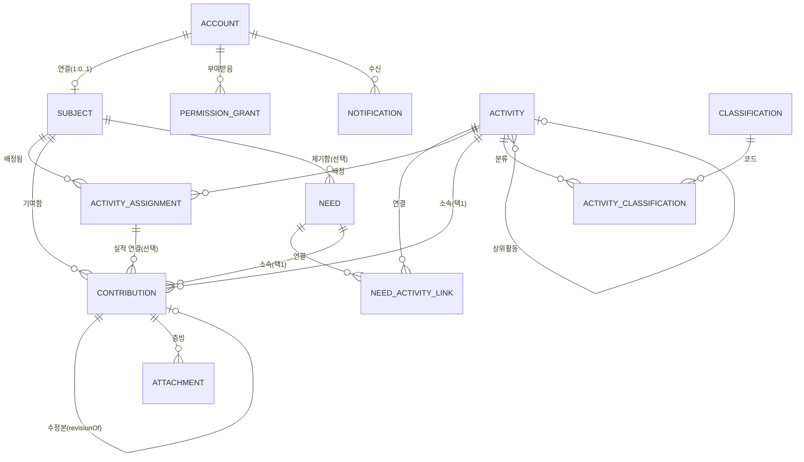

# R1 스키마 설계

- 대상: `prisma/schema.prisma`
- 범위: 기획서 v1.0 §2의 R1(참여 시범) — FR-01 ~ FR-12
- 검증: PostgreSQL 16에 실제 마이그레이션 적용 + 스모크 테스트로 핵심 제약조건 확인 완료 (§5)

## 1. ERD (R1 범위)



## 2. FR → 테이블 매핑

| FR | 기능 | 관련 테이블 |
|---|---|---|
| FR-01 | 초대·로그인·복구 | `Invitation`, `Account`, `LoginToken`, `Session`, TOTP 관련(`Account.totpSecretCiphertext`, `TotpRecoveryCode`) — ADR-0002 참고 |
| FR-02 | 계정과 사람 연결 | `Account.subjectId`(1:0..1), `Subject` |
| FR-03 | 내 정보 관리 | `Subject` (연락처·관심 필드) |
| FR-04 | 활동 등록·조회 | `Activity` |
| FR-05 | 참여 신청·배치 | `ActivityAssignment` |
| FR-06 | 기여 작성·수정 | `Contribution` (+ `submissionKey`, `revisionOf`) |
| FR-07 | 기여 확인·보완 | `Contribution.status/confirmedBy*` |
| FR-08 | 상담·수요 접수 | `Need` |
| FR-09 | 첨부파일 관리 | `Attachment` |
| FR-10 | 알림 | `Notification` |
| FR-11 | 감사·내보내기·백업 | `AuditLog` (내보내기·백업은 스키마 밖 운영 절차) |
| FR-12 | Notion 출처·원본 | `SourceLink`, `MigrationRun`, `SystemOfRecordAssignment` |

## 3. 업무 규칙(BR) → 구현 방식

| BR | 규칙 | 구현 |
|---|---|---|
| BR-01 | 임시저장은 활동 없어도 됨, 제출엔 활동 연결 필요 | `Contribution.activityId/needId`는 nullable이지만 CHECK로 "정확히 하나"만 강제. "제출 시점에 필요"라는 조건부 규칙은 DB가 아니라 애플리케이션의 제출 액션에서 검사(임시저장 상태는 DRAFT로 별도 허용) |
| BR-02 | 배치는 실적이 아님 | `ActivityAssignment`(계획)과 `Contribution`(실적)을 별도 테이블로 분리 |
| BR-03~05 | 확인된 기여 수정 시 새 버전, 재확인 전까지 기존값 유지, 중복 합산 금지 | `Contribution.revisionOfId`(원본 참조) + `supersededByContributionId`(유일 인덱스). 집계 쿼리는 `status = CONFIRMED`인 행만 사용 |
| BR-06 | 중복 제출 방지 | `Contribution.submissionKey` 유일 제약(클라이언트 idempotency key) |
| BR-07 | 동시수정 충돌 방지 | R1 스키마에는 낙관적 잠금 컬럼을 넣지 않음 — `updatedAt` 비교 방식을 애플리케이션 계층에서 사용 예정 (아래 "미해결 항목" 참고) |
| BR-08 | 유급·무급·미확인 구분, 무급만 자원활동 집계 | `Contribution.compensationBasis` enum |
| BR-09 | 교육 출석 → 자원활동 자동전환 금지 | 교육 출석 자체가 R2 범위라 R1 스키마엔 해당 테이블이 없음 — R2에서 별도 테이블로 만들고 자동 합산 로직을 두지 않을 것 |
| BR-11 | 배부 합계 ≤ 확정액 | 청구·입출금·배부는 R3 범위라 이 스키마엔 없음 |
| BR-13 | 최종 수정 시스템은 지정 범위마다 하나 | `SystemOfRecordAssignment`(scopeType+scopeId 유일 제약) |

## 4. Prisma로 표현할 수 없어 raw SQL로 보강한 제약

`prisma/migrations/20260916095244_add_contribution_activity_need_xor_check/migration.sql`:

- `contributions_activity_or_need_xor`: `activityId`/`needId` 중 정확히 하나만 채워야 한다는
  v0.1 A06 규칙은 Prisma 스키마 문법(XOR)으로 표현할 수 없어 CHECK 제약으로 추가했다.
- `contributions_minutes_non_negative`, `activity_assignments_planned_minutes_non_negative`:
  분 단위 시간 필드의 음수 방지.

두 제약 모두 로컬 PostgreSQL 16에 실제 적용하고, 위반 케이스가 실제로 거부되는지 스모크 테스트로 확인했다(§5).

## 5. 검증 방법

```bash
cp .env.example .env   # DATABASE_URL을 실제 개발 DB로 수정
npx prisma migrate dev # 스키마 검증 + 마이그레이션 적용
npx prisma generate
```

세 가지를 실제 PostgreSQL 16에 대해 확인했다.

1. `npx prisma validate` / `npx prisma generate` 통과.
2. `npx prisma migrate dev`로 초기 스키마 + CHECK 제약 마이그레이션이 정상 적용됨.
3. 스모크 테스트(activity만 채운 정상 기여 생성, activity/need 둘 다 없는 기여 생성 시도,
   음수 시간 기여 생성 시도)에서 정상 케이스는 성공하고 두 위반 케이스 모두
   `23514 check_violation`으로 거부됨을 확인.

## 6. R1 이후로 미룬 것과 이유

기획서 v1.0 §2가 R2~R4로 명시한 기능은 이번 스키마에 포함하지 않았다. 미리 테이블만 만들어두는 것도
하지 않았다 — 실제 요구사항(필드, 상태전이)이 확정되지 않은 채 테이블을 먼저 만들면 R2 설계 시
다시 뜯어고쳐야 할 가능성이 크기 때문이다.

| 미룬 항목 | 예정 릴리스 | 비고 |
|---|---|---|
| 관계 이력(P02), 사람·단체 복수 소속 | R2 (FR-13) | 현재 `Subject`는 계정 연결에 필요한 최소 필드만 가짐 |
| 활동 유형별 상세(A02/A03: 계약조건, 의결여부 등) | R2/R3 | `Activity`는 공통 필드만 가짐 |
| 실행 기록(A04, 회차·회의) | R2 | 현재 `Contribution`은 `Activity`/`Need`에 직접 연결 |
| 의사결정(A08) | R2 (FR-15) | |
| 교육 출석·수강(FR-16) | R2 | |
| 결과물·지식(K01/K02, FR-17) | R2 | `Attachment`는 첨부파일이며 재사용 가능한 결과물 레지스트리가 아님 |
| 지표·성과 측정(S01/S02, FR-18) | R2 | |
| 계약·청구·입출금·배부(F01~F04, FR-19/20) | R3 | |
| 자원 관리(R01/R02, FR-21) | R3 | |
| 사회적 자산 집계(FR-23) | R4 | 원자료(기여·성과)는 R1부터 쌓이므로 R4에서 집계 로직만 추가하면 됨 |
| 과거 자료 아카이브(FR-24) | R4 | |

## 7. 미해결 항목 (구현 전 결정 또는 추가 설계 필요)

- **동시수정 충돌 감지(BR-07)**: 현재 스키마에는 버전 번호/낙관적 잠금 컬럼이 없다. `updatedAt`
  타임스탬프 비교로 충분한지, 별도 `version Int` 컬럼이 필요한지는 API 설계 단계에서 정한다.
- **연락처 등 제한 필드의 열람 통제**: `Subject.contactInfo`는 스키마상 평범한 JSON 컬럼이다.
  실제 접근 통제는 v0.1 §4.10 권한표에 따라 애플리케이션(및 필요 시 PostgreSQL Row-Level
  Security)에서 구현해야 한다 — 스키마만으로는 보호되지 않는다.
- **분류 사전(Classification)의 범위**: 이번엔 활동 서비스분류만 염두에 두고 가벼운 코드-라벨
  테이블로 넣었다. 전문영역·관계유형 등 다른 통제 어휘도 이 테이블을 재사용할지, 도메인별로
  나눌지는 R2에서 분류·지표 사전(S01)을 설계할 때 다시 검토한다.
- **다형(polymorphic) 참조**: `Attachment.entityId`, `AuditLog.entityId`, `SourceLink.entityId`는
  DB 외래키로 강제되지 않는다. 대상 레코드의 실존 여부는 애플리케이션 계층의 검증에 의존한다.
