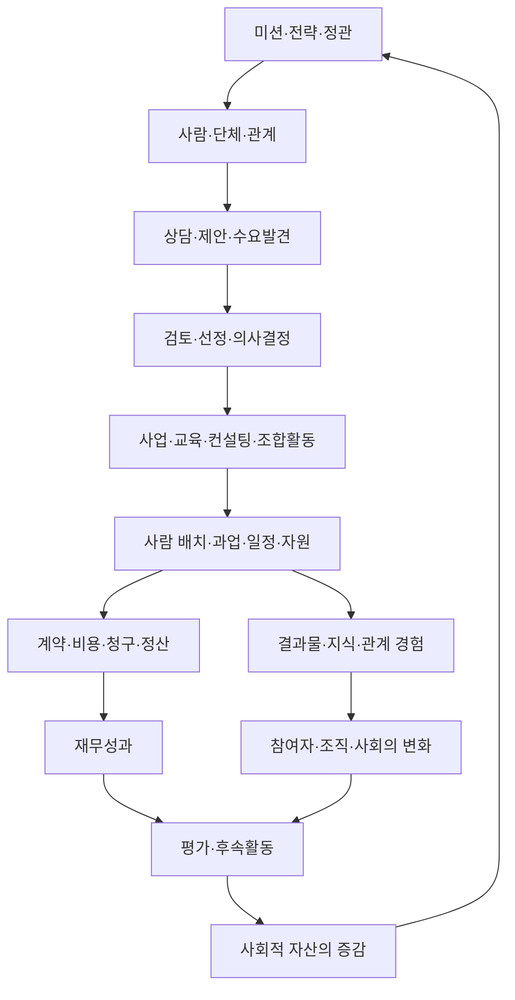

# 공동체IT 전체 업무지도 + 사회적 회계·사회적 자산 체계

작성 기준일: 2026-09-16  
검토 대상: 「공동체IT 조합원 팀스페이스 홈」과 업무 파악에 필요한 연결 페이지·데이터베이스·관련 업무 문서

## 0. 이 문서의 결론

공동체IT의 관리시스템은 `조합원 관리`, `프로젝트 관리`, `교육 관리`, `회계 관리`를 각각 독립된 메뉴로 만드는 방식보다 다음 흐름을 중심으로 설계하는 것이 적합하다.

> **주체(사람·단체) → 관계 → 필요·제안 → 사업·활동 → 기여·업무·의사결정 → 자원·돈 → 결과물 → 변화·후속관계 → 사회적 자산**

이 흐름은 기존 구상과 같지만, 노션 자료를 검토한 결과 다음 네 가지를 보완해야 한다.

1. **‘상담·제안·수요발견’을 독립된 기록 단위로 둔다.** 지금은 상담이 사업으로 바로 등록되거나 주간업무·개인 할 일·사업 페이지에 흩어진다. 아직 사업이 되지 않은 수요와 중단된 제안도 관계와 학습의 자산이다.
2. **사람의 참여를 합계 점수가 아니라 ‘기여 원장’으로 기록한다.** 참석 횟수 외에 시간, 역할, 전문성, 유·무급 여부, 제공 자원, 생성한 지식, 촉발한 관계를 사건 단위로 남겨야 한다.
3. **사업과 조직 활동 위에 공통 상위 개념인 ‘활동 단위’를 둔다.** 유상 프로젝트, 무상 지원, 교육, 조합원 모임, 이사회, 조사·연구가 모두 사람·돈·시간·문서·성과를 사용하고 만든다. 물리적으로 하나의 DB에 모두 넣지 않더라도 공통 ID와 공통 관계 규칙이 필요하다.
4. **사회적 회계는 모든 가치를 돈으로 바꾸는 체계가 아니라, 재무원장과 사회적 가치 원장을 나란히 연결하는 체계로 만든다.** 원자료(시간·인원·건수), 선택적 화폐가치, 변화의 근거를 분리해 기록한다.

---

## 1. 조사 범위와 근거

### 1.1 직접 확인한 핵심 구조

- [공동체IT 조합원 팀스페이스 홈](https://app.notion.com/p/3f5249368ffc45c79e189ae584722ff5): 사업, 네트워크, 비품·자원, 조직 활동, 위키, 통계, 미션·비전의 전체 구조
- [일](https://app.notion.com/p/c4937067adfa4710a847f4b13677a3c8): 사업 분류, 사업 DB, 공모사업, 업무 만남
- [네트워크](https://app.notion.com/p/b97afa8f8e0049fca0d0ff63b110433c): 사람들, 공급자, 조합원 기구
- [조직 활동](https://app.notion.com/p/572b6e488ba84d2693a519ab9a4e3425): 활동 분류, 조합 활동, 외부 이벤트
- [비품/자원](https://app.notion.com/p/a40bf31c3f384914add4bc3364f62f9d): 비품 분류, 비품 목록, 활용·공유·처분일지
- [위키](https://app.notion.com/p/23c0e3c5363b43dfa396a11307f01fb7): 원칙, 교육 아카이브, 가이드, 설문, 문서
- [통계](https://app.notion.com/p/3b0cb2bca7d24a998e6a689f6a16936c): 조합활동 참여와 사업 기여를 드러내려는 기존 취지
- [미션/비전](https://app.notion.com/p/1b19b99c27e28082b698d4cae467c9c2): 3대 미션과 미션 수행 활동의 연결

### 1.2 실제 운영을 이해하기 위해 추가 확인한 자료

- [조합원의 사업과 활동 참여 가이드](https://app.notion.com/p/bd622b530b1741de8b397837492effa1)
- [공동체IT DB 사용법](https://app.notion.com/p/9507d6ce5ca44709a50bcd8dc5235ada)
- [업무 만남](https://app.notion.com/p/d98d4779902b4805bea7a10c0bbb8c5a)
- [교육 아카이브](https://app.notion.com/p/b364d03801a24024a56e46a624d74f8f)
- [공모사업](https://app.notion.com/p/3219b99c27e280b98fe1d8c4ca1841f4)
- [사업비 배분/정산](https://app.notion.com/p/3109b99c27e280b4a211d5cc8ea11766)
- [법인 행정](https://app.notion.com/p/3109b99c27e280bbad73cede37f61354)
- [공동체IT 사무국](https://app.notion.com/p/e71f4b5616a94920a0e5183f50288c48)
- [최근 주간업무 사례](https://app.notion.com/p/3729b99c27e28009930cd88bda7cdb6d)
- [최근 이사회 사례](https://app.notion.com/p/f3b9b99c27e2825dab5881ac2dac9576)
- 견적 발행 DB와 사업·사람·공급자·조합활동·조합원 기구·비품 DB의 스키마 및 일부 실제 레코드

이 문서는 위 자료에서 반복적으로 확인되는 실제 업무를 구조화한 것이다. 전체 워크스페이스의 모든 개인 메모를 전수조사한 것은 아니며, 개인정보와 개인 업무 영역은 시스템 설계에 필요한 범위만 참조했다.

---

## 2. 노션에서 확인된 공동체IT의 실제 모습

### 2.1 미션은 세 갈래이며 사업·조직활동과 이미 연결되어 있다

미션 DB에는 다음 세 축이 있다.

1. **기술공동체 확산: 공유 자원 늘리기**
2. **소비자의 성장: 디지털 격차 줄이기**
3. **생산자의 즐거움: 지속가능한 IT공익활동**

미션 수행 활동에는 IT기기 나눔, 시민사회단체 IT인프라 정비, 운영 도구 제작·보급, 사회적 약자 기술교육, 조합원 교육, 조합원 자치 확대, 지역사회 연대, 생산자조합원 사업 수행 지원, 법인 운영 등이 연결되어 있다. 즉 공동체IT의 사회적 성과는 ‘취약계층을 몇 명 지원했는가’만으로는 설명되지 않는다. **이용자의 성장, 생산자의 지속가능성, 공동 자원의 축적**을 동시에 봐야 한다.

### 2.2 실제 사업 포트폴리오

사업 DB와 최근 업무 기록을 보면 다음 사업군이 반복된다.

| 사업군 | 실제 업무 예 | 만들어지는 가치 |
|---|---|---|
| 하드웨어·인프라 | PC·네트워크·NAS 점검, 장비 보급·기증, 데이터 복구 | 비용 절감, 업무 지속성, 기기 수명 연장, 디지털 접근성 |
| 소프트웨어 제작 | 홈페이지·상담DB·아카이브·업무도구 개발 및 개편 | 시민사회 조직의 서비스 역량과 정보 접근성 |
| 유지보수 | 홈페이지·DB·서버·인증서·도메인·클라우드 운영 | 장애 예방, 안정성, 장기 유지비 절감 |
| 교육 | 디지털 취약계층 기초교육, 활동가 실무교육, AI·디지털 협업·회계교육 | 개인·조직의 디지털 역량 성장 |
| 상담·컨설팅 | IT 인프라, 디지털 협업, 회계 자동화, 저작권·아카이빙 상담 | 문제 정의, 선택 역량, 과잉구매·시행착오 감소 |
| 자원 순환·공유 | 불용 IT기기 수거·정비·재분배, 공유 비품 | 공유 자산 증가, 환경 가치, 수혜기관 비용 절감 |
| 공모·CSR·연대 | 공익단체 지원사업, 지역사회 협력, 박람회 | 새 관계, 공동사업, 공익 IT 생태계 확장 |
| 조합원 사업 지원 | 견적·비교견적, 계약·청구, 협업팀 구성, 정산 | 생산자의 일거리·소득·협업 경험 |

### 2.3 사업만으로 보이지 않는 조직 운영 업무

사무국 문서와 이사회 기록에는 다음 상시 업무가 드러난다.

- 조합원 모집, 가입·탈퇴·근황·관계 관리
- 총회·이사회·위원회·분과·지역모임 지원
- 회의 준비, 안건 수렴, 결정 기록, 후속 실행 점검
- 법인 등기, 사업자등록, 사회적협동조합 공시, 사회적기업 보고, 공익법인 의무 이행
- 세무·회계, 견적·계약·청구·입금·지출·사업비 배분·원천징수·정산
- 공간·장비·서버·온라인 계정 등 공용 자원 운용
- 조합원 역량 관리, 교육, 협업팀 구성, 단기 인력 연결
- 뉴스레터, SNS, 박람회, 대외협력, 브랜드·네트워크 관리
- 업무·기술·교육자료와 조직의 역사 아카이빙
- 중장기 전략, 신규 사업 기획, 수요 조사, 성과 보고

따라서 관리시스템은 ‘수탁 프로젝트 관리 도구’가 아니라 **사업 조직·회원 조직·공익 조직·법인 조직을 동시에 운영하는 시스템**이어야 한다.

### 2.4 현재 DB가 이미 가진 강점

- 사람과 사업을 `요청자`, `공급자`, `조합 활동`, `조합원 기구`로 연결한다.
- 개인·팀 단위 공급자를 별도로 두어 협업팀을 표현한다.
- 사업을 상위·하위 항목으로 나눠 장기 사업과 세부 과업을 표현할 수 있다.
- 조합 활동에 주관 단위와 참여자를 연결한다.
- 사람별 조합활동·자치기구·책임 수행을 집계한다.
- 비품에 제공자와 사용기록을 연결한다.
- 미션 수행 활동을 사업 분류·활동 분류와 연결한다.
- 통계 페이지는 기여 정보를 ‘순위’가 아니라 **잊힌 기여를 함께 인식하고 나누기 위한 자료**라고 명시한다.

이 철학과 연결 구조는 새 시스템의 출발점으로 보존해야 한다.

### 2.5 현재 구조의 핵심 한계

| 영역 | 현재 상태 | 설계상 문제 |
|---|---|---|
| 사람·단체 | ‘사람들’ DB가 사람과 단체, 조합원·고객·협력자 역할을 폭넓게 수용 | 역할이 태그와 현재 상태 중심이라 관계의 시작·종료·변화를 추적하기 어렵다 |
| 상담·수요 | 사업, 주간업무, 개인 ToDo, 업무 만남에 분산 | 사업화 전 수요, 무산된 제안, 반복 문의를 자산으로 분석하기 어렵다 |
| 사업 수행 | 상태·기간·요청자·공급자·예산은 있음 | 실제 역할, 투입시간, 과업, 계약·청구·정산, 성과가 단절되어 있다 |
| 업무 만남 | 사람·사업·날짜·유형을 연결하지만 2018년 일부 기간 기록에 집중 | 최근 상담·회의·지원 이력이 주간일지 등으로 이동해 연속성이 끊겼다 |
| 재무 | 사업 예산, 견적, 거래·정산 기록이 여러 공간에 존재 | 사업·사람·계약·입출금·배분을 끝까지 추적하는 원장이 없다 |
| 참여 통계 | 참여 횟수·요청수·공급수·책임수를 집계 | 시간, 역할, 전문성, 결과물, 유·무급, 기여의 질과 맥락이 빠진다 |
| 성과 | 수혜인원 필드와 일부 사업별 평가 기록 | 산출물과 변화, 후속관계, 비용절감, 역량성장 측정이 표준화되지 않았다 |
| 의사결정 | 회의 페이지 본문에 안건·결정·담당·기한이 기록됨 | 결정사항이 실행 과업·사업·예산과 구조적으로 연결되지 않는다 |
| 지식 | 위키·사업 페이지·회의록에 풍부한 지식 축적 | 재사용 가능성, 저작자·기여자, 적용 사업, 갱신 주기를 집계하기 어렵다 |
| 입력 권한 | 조합원 직접 편집이 제한되고 사무국에 요청 | 참여형 시스템이 사무국의 입력 병목을 만들 수 있다 |

참고로 확인 가능한 집계에서는 사람·단체 레코드가 830건이고, 이 중 조합활동 연결 233건, 사업 요청 연결 505건, 공급자 연결 55건, 조합원 기구 연결 38건이었다. 비품은 343건이며 제공자 연결 164건, 사용기록 연결 273건이지만 평가가치 입력은 없었다. 이는 관계·활동의 기반 자료는 상당히 축적되어 있으나 가치·성과 원장으로 전환하는 필드가 부족함을 보여준다.

---

## 3. 공동체IT 전체 업무지도

### 3.1 업무 층위별 지도

| 층위 | 핵심 질문 | 공동체IT 실제 업무 | 시스템 기록 단위 |
|---|---|---|---|
| 목적·전략 | 왜 하는가 | 3대 미션, 사업계획, 중장기 전략, 사회적기업·공익법인 책무 | 미션, 전략목표, 지표, 연도계획 |
| 주체·관계 | 누구와 어떤 관계인가 | 조합원, 후원회원, 활동가, 고객, 수혜자, 협력기관, 공급자, 공공기관 | 사람, 단체, 관계 이력, 소속, 동의·권한 |
| 발견·개발 | 무엇이 필요한가 | 상담, 현장점검, 제안, 공모 탐색, 수요조사, 조합원 아이디어 | 접점, 필요, 기회, 제안, 공모 |
| 선택·의사결정 | 무엇을 할 것인가 | 견적 검토, 공급자 구성, 이사회·총회 의결, 사업 우선순위 | 안건, 선택지, 결정, 책임자, 기한 |
| 수행 | 어떻게 실행하는가 | 개발, 유지보수, 교육, 상담, 장비 정비·보급, 행사, 조직 활동 | 활동 단위, 과업, 일정, 업무기록, 참여기록 |
| 자원·재무 | 무엇을 투입·배분하는가 | 시간, 전문성, 장비, 공간, 서버, 예산, 후원, 계약·청구·정산 | 자원, 거래, 계약, 배분, 기여 원장 |
| 산출 | 무엇을 만들었는가 | 웹사이트, 수리 장비, 교육, 상담, 가이드, 데이터, 회의 결정 | 결과물, 서비스 건, 콘텐츠, 지식자산 |
| 변화·성과 | 무엇이 달라졌는가 | 비용 절감, 접근성·역량·업무 안정성, 일거리·소득, 협력관계 | 성과 사건, 전후 측정, 증거, 평가 |
| 환류 | 다음은 무엇인가 | 유지보수, 재계약, 후속교육, 가입·후원, 개선안, 새 사업 | 후속조치, 관계 단계, 학습, 재사용 |

### 3.2 네 개의 대표 업무 흐름

#### A. 상담·요청에서 사업·후속관계까지

`첫 접점 → 필요 확인 → 상담/현장점검 → 해결 대안 → 견적·제안 → 수락/보류/종료 → 사업 개설 → 팀 구성 → 수행 → 검수 → 청구·정산 → 평가 → 유지보수·재계약·소개`

중요한 수정은 상담을 사업의 부속 메모로 보지 않는 것이다. 상담만으로 문제를 해결했거나, 예산이 없어 진행되지 않았거나, 다른 기관으로 연결한 경우도 사회적 가치와 관계 형성의 기록이다.

#### B. 조합원이 사업에 참여하는 흐름

`역량·관심 등록 → 공급자/팀 구성 → 참여 가능한 일 탐색 → 참여 의사 → 역할·조건 합의 → 과업 수행 → 기여 기록 → 사업비 배분·정산 → 피드백 → 역량·평판·협업관계 갱신`

현재 참여가이드에는 이 흐름이 이미 서술되어 있다. 새 시스템은 이를 신청·승인·기여·정산 데이터로 바꿔야 한다.

#### C. 조직 의사결정과 실행 흐름

`의제 제안 → 자료·대안 준비 → 이해관계자 의견 → 회의 안건 → 결정 → 담당·기한 → 과업/예산 연결 → 진행 점검 → 완료·재논의 → 공개·아카이브`

회의록에 있는 ‘결정사항’을 별도 구조화하면, 이사회 결정이 실제 사업·업무·비용으로 이어졌는지 확인할 수 있다.

#### D. 사회적 자산 순환 흐름

`시간·기술·장비·공간·돈·관계의 제공 → 공동 활동 → 결과물과 경험 → 개인·조직의 성장 → 지식·신뢰·네트워크·공유자원의 증가 → 다음 사업과 참여를 촉진`

사회적 회계의 핵심은 이 순환을 기록하는 것이다.

---

## 4. 통합 정보구조: 8개 핵심 개념과 보조 원장

기존의 `사람-단체-관계-활동-사업-돈-의사결정-성과`를 다음처럼 구체화한다.

### 4.1 핵심 개념

| 핵심 개념 | 정의 | 주요 관계 |
|---|---|---|
| 주체 | 사람 또는 단체의 마스터 | 관계, 필요, 기여, 거래, 성과의 당사자 |
| 관계 | 주체 간 역할과 관계의 이력 | 조합원, 소속, 고객, 협력, 후원, 공급, 수혜 |
| 필요·기회 | 해결할 문제, 제안, 문의, 공모, 아이디어 | 발견 주체, 예상 수혜자, 후속 사업 |
| 활동 단위 | 목적과 기간을 가진 실행 묶음 | 사업, 프로그램, 교육기수, 조합활동, 캠페인 |
| 실행 사건 | 실제로 일어난 작업·만남·참여·서비스 | 참여자, 시간, 역할, 활동 단위, 결과물 |
| 돈·자원 | 현금과 현물의 유입·사용·배분 | 계약, 거래, 비품, 기여, 사업 |
| 의사결정 | 권한 있는 선택과 책임의 기록 | 안건, 회의, 결정, 담당, 기한, 관련 사업·예산 |
| 성과·자산 | 활동으로 생긴 산출·변화·축적 | 수혜자, 증거, 미션, 사회적 자산 계정 |

### 4.2 권장 데이터베이스 구조

물리적으로는 10~13개 핵심 DB가 적당하다. 화면에서는 역할별 메뉴로 나누되 데이터는 관계형으로 공유한다.

| DB | 핵심 필드 | 기존 자료와의 관계 |
|---|---|---|
| 1. 주체 | 이름, 유형(사람/단체), 연락·지역, 공개범위, 상태 | 기존 ‘사람들’을 정비해 승계 |
| 2. 관계 이력 | 주체A, 주체B, 관계유형, 시작·종료, 상태, 근거 | 사람 DB의 태그·소속·조합원 상태를 이력화 |
| 3. 필요·기회 | 접수일, 채널, 제안자, 대상, 필요, 긴급도, 다음 단계, 전환 결과 | 상담·제안·공모·업무 만남을 통합 |
| 4. 활동 단위 | 유형, 미션, 책임조직, 기간, 상태, 예산, 대상, 상·하위 활동 | 사업·조합활동·교육기수의 공통 상위 구조 |
| 5. 과업·일정 | 활동 단위, 담당, 기한, 상태, 선행과업, 산출물 | 주간업무와 결정 후속조치 연결 |
| 6. 기여 원장 | 날짜, 기여자, 역할, 시간, 유·무급, 전문영역, 제공 자원, 증거 | 참여 횟수 중심 통계를 사건 단위로 확장 |
| 7. 의사결정 | 회의/권한기구, 안건, 결정, 책임자, 기한, 관련 활동·예산 | 회의 본문의 결정사항을 구조화 |
| 8. 재무·정산 원장 | 유형, 금액, 거래처, 사업, 계약, 증빙, 입출금, 배분대상 | 예산·견적·거래내역·정산을 연결 |
| 9. 자원 원장 | 자원 유형, 소유/제공자, 수량·상태·가치, 이동·사용·처분 | 비품 목록과 사용·공유·처분일지 승계 |
| 10. 결과물·지식 | 유형, 저자·기여자, 관련 활동, 재사용 조건, 버전·보관처 | 위키·사업 산출물·교육자료 연결 |
| 11. 성과 사건 | 대상, 기대 변화, 지표, 기준값·결과값, 증거, 기여도·확신도 | 수혜인원 단일 필드를 확장 |
| 12. 후속활동 | 평가, 다음 연락일, 재계약·추천·가입·후원·개선 과제 | 사업 종료 후 관계와 학습 보존 |
| 13. 분류·지표 사전 | 사업·활동·관계·성과 유형, 정의, 측정법 | 현재 여러 태그·분류 DB의 기준 통합 |

### 4.3 ‘활동 단위’ 통합의 의미

사업과 조직 활동을 억지로 하나의 화면에 섞는다는 뜻이 아니다. 공통 필드를 가진 상위 개념을 두자는 뜻이다.

- 공통 필드: 목적, 미션, 기간, 상태, 책임단위, 참여자, 비용, 결과물, 성과, 의사결정
- 사업 전용 필드: 고객, 계약, 매출, 검수, 청구, 정산
- 교육 전용 필드: 과정, 기수, 회차, 학습자, 출결, 사전·사후 진단
- 조직활동 전용 필드: 주관기구, 의결 여부, 조합원 참여, 공개 범위

이렇게 하면 `공동체IT학교`처럼 교육이면서 조직 역량 강화이고, 대외 사업이며, 연구·콘텐츠 축적 활동인 복합 사업도 여러 시스템에 중복 입력하지 않아도 된다.

---

## 5. 사회적 회계의 기본 구조

### 5.1 정의

공동체IT의 사회적 회계는 다음 질문에 답하는 기록 체계다.

> 공동체IT가 누구에게서 어떤 자원을 받아, 누구와 무엇을 했으며, 어떤 결과와 변화를 만들고, 그 과정에서 어떤 공동 자산을 늘리거나 소모했는가?

재무회계가 돈의 유입·유출과 잔액을 설명한다면 사회적 회계는 **시간, 전문성, 참여, 관계, 지식, 공유자원, 역량의 흐름과 잔액**을 설명한다.

### 5.2 두 원장을 연결하되 섞지 않는다

| 재무 원장 | 사회적 가치 원장 |
|---|---|
| 계약금액, 매출, 지출, 인건비, 정산 | 유·무급 기여시간, 전문기여, 참여, 현물, 관계, 지식, 변화 |
| 회계 기준에 따른 증빙 | 활동기록, 출석, 산출물, 설문, 인터뷰, 확인 기록 |
| 금액이 기본 단위 | 시간·명·건·개·관계·콘텐츠·점수 등이 기본 단위 |
| 법적·세무 보고 | 미션·조합원·이사회·이해관계자 보고 |

같은 활동 ID로 두 원장을 연결하면 ‘얼마를 들여 무엇을 만들었고 어떤 변화가 있었는가’를 함께 볼 수 있다.

### 5.3 가치 측정의 3단계

1. **기초 수량**: 12시간, 3명, PC 5대, 상담 7건, 교육 4회, 신규 관계 2곳
2. **선택적 환산가치**: 전문자원활동 12시간 × 합의한 기준단가, 재사용 장비의 평가가치, 절감된 외부 구매비
3. **변화와 이야기**: 업무 중단 감소, 이용자의 자신감 향상, 조합원의 첫 유급 프로젝트 참여, 두 단체의 후속 협업

모든 것을 금액으로 환산하지 않는다. 금액 환산을 할 때는 `산식`, `기준단가 출처`, `평가일`, `확신도`를 반드시 기록한다.

### 5.4 기여 원장

한 사람의 기여를 하나의 총점으로 환원하지 않고 다음 항목을 각각 누적한다.

| 기여 유형 | 기록 단위 | 예시 |
|---|---|---|
| 시간 기여 | 시간 | 이사회 2시간, 교육 준비 5시간, 현장 지원 3시간 |
| 전문역량 기여 | 분야·난이도·시간 | 서버 장애 대응, 교육 설계, 회계 자문 |
| 실행 기여 | 역할·완료 과업 | 개발, 강의, 기록, 진행, 연락, 운반 |
| 관계 기여 | 연결 건·후속 결과 | 협력기관 소개, 조합원 추천, 사업 연결 |
| 자원 기여 | 품목·수량·평가가치 | 노트북 기증, 공간 제공, 서버 제공 |
| 지식 기여 | 결과물·재사용 횟수 | 가이드, 템플릿, 코드, 교육자료, 회고 |
| 거버넌스 기여 | 역할·참여·결정 후속 | 이사회, 위원회, 안건 제안, 결정 실행 |
| 돌봄·유지 기여 | 사건·시간 | 구성원 지원, 갈등 조정, 자료 정리, 반복 점검 |

필수 필드는 `기여자`, `날짜`, `관련 활동`, `역할`, `시간/수량`, `유급·무급·혼합`, `증거`, `확인자`이다. ‘보이지 않는 일’을 기록하려면 진행·연락·정리·돌봄·유지보수를 정식 기여 유형으로 인정해야 한다.

### 5.5 유급과 무급을 함께 기록하는 방법

- 유급 업무도 사회적 기여가 될 수 있다. 다만 `지급액`과 `사회적 기여량`을 별도 필드로 둔다.
- 무급 시간이 많다는 이유만으로 좋은 사업으로 평가하지 않는다. 과도한 무급 노동은 사회적 자산의 증가가 아니라 **구성원 지속가능성의 감소**일 수 있다.
- 정상 대가보다 낮은 비용으로 제공한 경우 `할인·기부`, `효율적 해결`, `미지급 노동`을 구분한다.
- 조합원의 전문노동을 ‘자원봉사’로 자동 분류하지 않는다. 당사자 동의와 조직의 보상 원칙이 필요하다.

---

## 6. 공동체IT 사회적 자산 계정

### 6.1 권장 7대 자산

| 사회적 자산 | 정의 | 핵심 지표 예시 | 증가 사건 | 감소·위험 사건 |
|---|---|---|---|---|
| 참여 자산 | 구성원이 실제로 참여할 수 있는 힘 | 활동 참여자·시간, 신규/재참여율, 역할 분산도 | 첫 참여, 정기 참여, 책임 수행 | 특정인 과부하, 이탈, 무급노동 누적 |
| 역량 자산 | 개인·팀이 문제를 해결하는 능력 | 전문분야 보유자, 교육 전후 변화, 독립 수행률 | 학습, 멘토링, 첫 수행 | 기술 노후화, 핵심인력 의존 |
| 관계 자산 | 신뢰와 협력의 연결망 | 활성 관계기관, 재의뢰, 소개, 공동사업, 지역 연결 | 상담, 협약, 후속협업 | 장기 미접촉, 갈등, 일방 관계 |
| 지식 자산 | 재사용 가능한 경험과 콘텐츠 | 가이드·코드·템플릿·사례 수, 재사용·갱신 횟수 | 문서화, 회고, 공개 | 미정리, 소유권 불명, 노후화 |
| 공유 자원 자산 | 함께 사용하는 물적·디지털 자원 | 장비 수·상태·평가가치, 사용·순환 건수, 서버·계정 | 기증, 수리, 공동구매 | 분실, 폐기, 유지비 증가 |
| 거버넌스 자산 | 함께 결정하고 실행하는 능력 | 안건 제안자 다양성, 결정 이행률, 회의 참여, 정보공개 | 숙의, 권한 분산, 결정 완료 | 미이행, 정보 집중, 반복 미결정 |
| 미션 성과 자산 | 소비자 성장·생산자 지속가능성·공동자원 확산의 축적 | 역량 향상, 비용절감, 접근성, 일거리·소득, 공익서비스 지속 | 성과 달성, 후속 확산 | 효과 소멸, 부정적 영향 |

### 6.2 자산별 최소 지표

#### 참여 자산

- 활동별 순참여자 수와 참여시간
- 신규 참여자, 반복 참여자, 3개월 이상 미참여자
- 역할을 맡은 사람 수와 특정인 집중도
- 유급·무급·혼합 기여시간

#### 역량 자산

- 전문영역별 공급 가능 인원·팀
- 교육 사전·사후 자기평가 또는 수행과제 변화
- 보조 참여에서 독립 수행으로 전환한 사례
- 멘토링·동료학습·지식전수 기록

#### 관계 자산

- 신규 접점 단체, 활성 협력단체, 휴면 관계
- 상담→사업, 사업→재의뢰, 사업→조합원/후원/소개 전환
- 공동 기획·공동 수행 관계 수
- 관계의 상호성: 요청만/공급만이 아니라 상호 기여가 있는지

#### 지식 자산

- 새로 만든 결과물, 공개 가능한 결과물, 재사용된 결과물
- 작성자·기여자 수와 적용 사업 수
- 최종 검토일과 갱신 필요 자료
- 실패·문제 해결 사례와 재발 방지 지식

#### 공유 자원 자산

- 기증·구입·수리·대여·양도·폐기 건수
- 현재 사용 가능 수량과 평가가치
- 재사용으로 절감한 구입비와 폐기 회피량
- 제공자와 수혜기관의 관계

#### 거버넌스 자산

- 회의 참석 수만이 아니라 안건 제안·자료작성·진행·후속실행
- 결정사항의 담당 지정률, 기한 준수율, 완료율
- 회의·결정 정보의 공개 범위와 접근성
- 분과·위원회별 활동 지속성

#### 미션 성과 자산

- 소비자의 성장: 디지털 역량, 문제 해결 자율성, 접근성, 조직 업무 안정성
- 생산자의 즐거움: 유급 기회, 적정 정산, 협업 만족, 역량 성장, 소진 위험
- 공유 자원 확대: 장비·지식·관계·공간·공개 콘텐츠의 순증

### 6.3 점수화 원칙

기존 참여도 취지를 살리되 단일 종합순위는 만들지 않는 것이 좋다.

- 개인 대시보드: `참여`, `전문기여`, `관계 연결`, `지식`, `거버넌스`, `돌봄`을 별도 축으로 표시
- 조직 대시보드: 총량뿐 아니라 분산도·지속성·상호성을 표시
- 보상에 사용할 때: 자동 점수만으로 결정하지 않고 당사자 확인과 동료 검토를 거침
- 외부 보고: 개인정보를 제거하고 합산값과 사례 중심으로 공개

---

## 7. 성과 측정 체계

### 7.1 공통 성과 사슬

| 단계 | 질문 | 예시 |
|---|---|---|
| 투입 | 무엇을 썼는가 | 유급 20시간, 자원활동 8시간, 장비 3대, 사업비 200만원 |
| 활동 | 무엇을 했는가 | PC 정비, 상담, 교육, 개발, 회의, 문서화 |
| 산출 | 무엇이 나왔는가 | 수리 5대, 교육 4회, 사이트 1개, 가이드 2개 |
| 단기 변화 | 바로 무엇이 달라졌는가 | 장애 해소, 업무 재개, 지식 증가, 참여 의향 |
| 중기 변화 | 행동·조직이 어떻게 달라졌는가 | 독립 문제해결, 업무시간 절감, 재참여, 새 협업 |
| 장기 기여 | 미션에 무엇을 보탰는가 | 디지털 격차 감소, 지속가능한 IT공익활동, 공유자원 확대 |

### 7.2 사업 유형별 대표 지표

| 사업 유형 | 산출 지표 | 변화 지표 | 사회적 자산 연결 |
|---|---|---|---|
| H/W·인프라 | 점검·수리·보급 장비 수, 지원기관 수 | 업무중단 시간 감소, 구매비 절감, 기기 수명 연장 | 공유 자원, 관계, 미션 성과 |
| S/W 제작·유지 | 기능·사이트·처리건수, 장애 대응 | 서비스 접근성, 처리시간, 데이터 안정성 | 지식, 관계, 미션 성과 |
| 교육 | 과정·회차·학습자·수료자 | 사전·사후 역량, 실제 적용, 독립 수행 | 역량, 참여, 관계 |
| 상담·컨설팅 | 상담건수, 진단·제안서 수 | 의사결정 개선, 비용·시행착오 감소, 후속 실행 | 관계, 지식, 미션 성과 |
| 장비 나눔 | 기증·정비·배분 수량 | 접근성 향상, 구입비 절감, 폐기 회피 | 공유 자원, 환경 가치 |
| 조합활동 | 참여자·시간·안건·결정 | 역할 분산, 결정 이행, 신규 참여 | 참여, 거버넌스, 역량 |

### 7.3 성과 증거 등급

- A: 시스템 로그, 계약·회계자료, 출석, 전후검사 등 직접 증거
- B: 참여자·고객 확인, 설문, 인터뷰
- C: 담당자 관찰과 합리적 추정
- D: 계획·기대 수준

성과 건마다 증거 등급과 공동체IT의 기여 정도를 `주요 기여 / 공동 기여 / 일부 기여 / 관계 불명`으로 기록한다. 이는 과장된 사회적 가치 주장을 막는다.

---

## 8. 메뉴가 아니라 역할별 ‘업무 화면’으로 제공할 것

데이터는 통합하되 모든 사용자가 전체 구조를 볼 필요는 없다.

### 8.1 사무국 홈

- 새 상담·요청과 다음 조치
- 진행 사업·마감·검수·청구·정산 대기
- 이사회 결정 후속조치
- 법인·공시·보고 일정
- 입력 누락과 장기 미갱신 데이터

### 8.2 조합원 홈

- 참여 가능한 일과 활동
- 내 역할·일정·기여 기록
- 내 정산 상태
- 관심 분야의 사람·팀·자료
- 조합의 최근 결정과 성과

### 8.3 사업 책임자 홈

- 고객·필요·계약·범위
- 팀·역할·과업·일정
- 투입시간·비용·결과물
- 검수·청구·정산
- 성과·회고·후속관계

### 8.4 이사회·위원회 홈

- 안건과 사전자료
- 결정·책임자·기한
- 사업·재정·사회적 자산 대시보드
- 미이행 결정과 위험
- 이해관계자 의견

### 8.5 사회적 회계 대시보드

- 3대 미션별 활동·투입·산출·변화
- 유급/무급 기여시간과 참여 분산도
- 신규·활성·후속 협력관계
- 공유 장비·지식·콘텐츠 증감
- 재무성과와 사회성과의 연결
- 근거가 부족한 지표와 다음 측정 과제

---

## 9. 기존 노션에서 새 체계로 옮기는 방법

### 1단계: 기준과 ID 정리

- 사람과 단체를 구분하되 하나의 ‘주체’ 체계로 연결
- 조합원·고객·협력자·수혜자·공급자를 고정 태그가 아니라 기간이 있는 관계 이력으로 전환
- 사업, 조합활동, 교육, 상담에 공통 활동 ID 부여
- 사업·활동·관계·성과 분류 사전 작성

### 2단계: 운영 흐름 연결

- 상담·제안·공모·수요 DB 신설
- 사업에 계약·견적·청구·입금·정산 상태 연결
- 회의의 결정사항을 의사결정 DB로 분리하고 과업에 연결
- 주간업무의 할 일을 과업 DB와 연결

### 3단계: 기여 원장 도입

- 사업과 조합활동 모두 같은 기여 입력 양식 사용
- 시간, 역할, 유·무급, 전문분야, 결과물, 제공 자원 기록
- 조합원 본인이 입력하고 책임자가 확인하는 가벼운 승인 방식 도입
- 과거 데이터는 참여 횟수 수준으로 유지하고, 전환일 이후부터 상세 기록

### 4단계: 결과물·성과·후속 기록

- 사업 종료 시 필수 종료 양식: 산출물, 수혜대상, 변화, 증거, 회고, 후속일정
- 교육은 회차·출결·사전·사후 진단을 추가
- H/W는 장비 이동과 절감·재사용 효과를 추가
- S/W는 배포·유지보수·접근성·재사용 정보를 추가

### 5단계: 사회적 자산 대시보드

- 첫해에는 완벽한 화폐환산보다 기초 수량과 기록률을 우선
- 분기별로 참여·관계·역량·지식·공유자원·거버넌스·미션성과를 검토
- 연 1회 사회적 회계 보고서를 총회 자료와 연결

---

## 10. 최소 실행안(MVP)

처음부터 모든 DB를 다시 만들 필요는 없다. 기존 노션을 유지하면서 다음 네 개만 추가·개편해도 흐름이 크게 개선된다.

1. **필요·기회 DB 신설**: 상담, 제안, 문의, 공모, 아이디어, 다음 단계
2. **기여 원장 DB 신설**: 사람, 활동, 역할, 시간, 유·무급, 결과물, 증거
3. **의사결정 DB 신설**: 회의, 결정, 담당, 기한, 관련 사업·예산, 이행상태
4. **사업 종료·성과 양식 도입**: 산출, 변화, 근거, 비용절감, 후속관계, 회고

기존 사업 DB에는 우선 다음 필드를 추가한다.

- 관련 필요·기회
- 책임자
- 계약·견적·청구·입금·정산 상태
- 관련 결정
- 기여 원장
- 결과물
- 성과 사건
- 종료 평가일
- 후속 연락일

이 MVP를 2~3개월 실제 사용한 뒤 재무 원장과 사회적 자산 대시보드를 확장하는 것이 안전하다.

---

## 11. 운영 원칙과 주의사항

### 개인정보와 공개 범위

- 연락처·정산·급여·평가·건강·갈등 기록은 역할 기반으로 제한
- 사회적 회계 대외 공개본은 개인 식별 정보를 제거
- 조합원 개인의 기여 상세 공개 범위를 당사자가 선택

### 기록 부담

- 현장에서 1분 안에 기록 가능한 최소 양식을 제공
- 시간은 15분 또는 30분 단위로 간단히 입력
- 회의 참석자·시간은 회의기록에서 기여 원장으로 자동 생성하되 확인 가능하게 함
- 사업 종료 때만 상세 성과 양식을 요구

### 평가와 보상

- 기록이 많은 사람을 곧바로 기여가 큰 사람으로 간주하지 않음
- 보상은 기록, 결과, 난이도, 책임, 당사자 협의를 함께 고려
- 시스템에 잘 기록되지 않는 돌봄·연결·유지 노동을 정식 분류로 둠
- 무급기여 확대를 성과로 오해하지 않고 소진·불평등 지표와 함께 봄

### 데이터 품질

- 필수 입력률, 관계 연결률, 종료 평가 작성률을 관리지표로 둠
- 분류와 태그를 정기 정비하고 자유 태그 남발을 제한
- ‘누가 언제 확인했는가’와 증거 링크를 남김
- 역사 데이터와 현재 운영 데이터를 구분

---

## 12. 우선 합의가 필요한 결정 7가지

1. 사람과 단체를 하나의 ‘주체’ DB로 둘지, 두 DB로 나누되 공통 관계 DB로 묶을지
2. 사업과 조합활동을 하나의 활동 DB로 통합할지, 공통 ID만 공유할지
3. 조합원이 직접 입력할 수 있는 범위와 승인 방식
4. 유급·무급·할인·기부·효율 절감을 구분하는 기준
5. 전문기여 환산단가를 사용할지와 사용 범위
6. 개인 기여 정보를 누구에게 어느 수준까지 공개할지
7. 첫해 사회적 회계 보고에서 반드시 보여줄 10개 안팎의 핵심 지표

### 권고안

- 주체는 사람·단체를 구분하되 통합 검색되는 구조
- 사업과 조직활동은 별도 DB를 유지하되 공통 활동 ID와 기여·성과 원장을 공유
- 조합원 직접 입력 + 책임자 확인
- 모든 가치를 금액으로 환산하지 않고, 시간·수량·사례를 기본값으로 사용
- 개인 점수 대신 다차원 기여 프로필 사용
- 첫해 핵심 지표는 기록 가능성과 미션 연계성을 우선

---

## 13. 첫해 사회적 회계 핵심 지표 권고안

1. 유급·무급·혼합 기여시간과 참여자 수
2. 신규 참여자와 반복 참여자 비율
3. 사업·활동의 책임 역할 분산도
4. 상담·제안 수와 사업·연결·자체해결 전환 결과
5. 지원한 사람·단체 수와 반복·후속관계 수
6. 교육 참여자의 사전·사후 역량 변화와 실제 적용 사례
7. 정비·재사용·기증한 장비 수, 평가가치, 추정 비용절감
8. 새로 만든·갱신한·재사용한 지식·콘텐츠 수
9. 이사회·총회·분과 결정사항의 이행률
10. 생산자조합원의 유급 참여·정산·역량 성장 사례
11. 3대 미션별 대표 성과 사례와 증거 등급
12. 과도한 무급노동, 특정인 의존, 미정산, 장기 미실행 결정 등 사회적 자산 위험

---

## 14. 최종 제안

공동체IT에는 이미 사회적 회계의 핵심 재료가 있다. 사람과 사업의 관계, 조합활동 참여, 공급팀, 공유 비품, 미션과 활동의 연결, 풍부한 회의·업무·기술 아카이브가 그것이다. 새 시스템의 목표는 이 자료를 버리고 다시 만드는 것이 아니라 다음 세 가지를 이루는 것이다.

1. **흩어진 기록을 하나의 흐름으로 연결한다.**
2. **보이지 않는 기여와 축적된 공동 자산을 드러낸다.**
3. **기록이 실제 의사결정·보상·후속사업으로 돌아오게 한다.**

따라서 다음 설계 단계는 화면 메뉴보다 먼저 `핵심 엔터티 관계도`, `DB별 필드 정의서`, `4개 대표 업무 흐름의 상태값`, `첫해 사회적 회계 지표 정의서`를 만드는 것이 적절하다. 그 뒤 역할별 화면과 대시보드를 설계해야 실제 업무를 놓치지 않는다.

