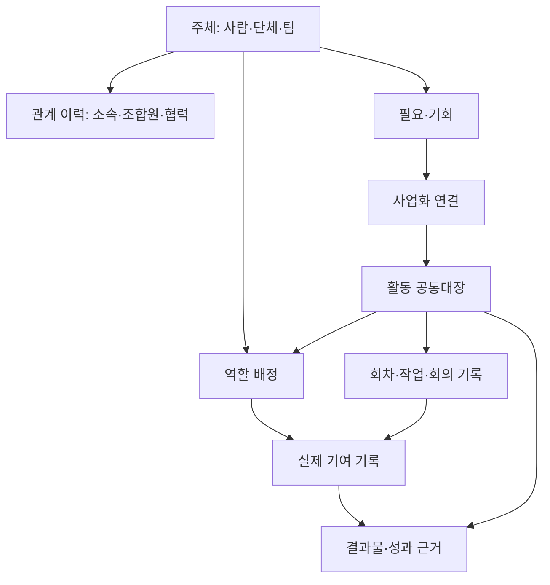
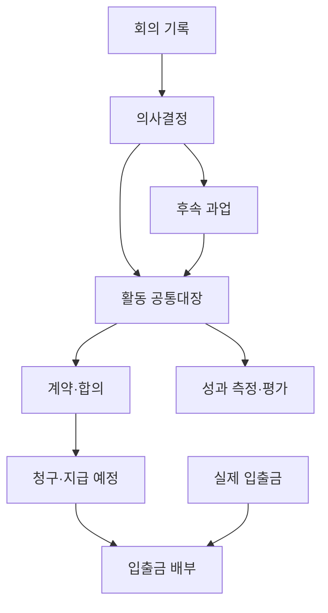
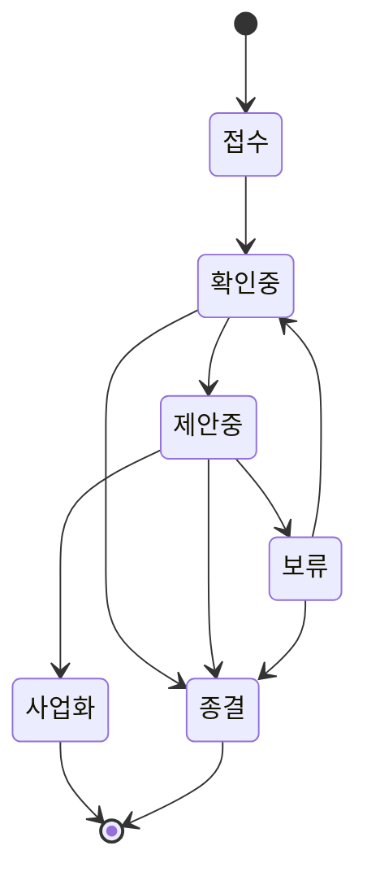

# 공동체IT 관리시스템 상세설계 v0.1

핵심 관계도 → DB별 필드 정의 → 업무 상태·전환 → 역할별 화면 구성

작성일: 2026-09-16

## 문서의 위치와 전제

이 문서는 앞서 작성한 「공동체IT 전체 업무지도 + 사회적 회계·사회적 자산 체계」의 후속 설계안이다. 앞선 대화에서 직접 읽은 노션 페이지·DB 구조·업무 기록을 근거로 작성했으며, 이번 단계에서 노션을 재조사하거나 수정하지 않았다. 아래 상태값·권한·계산 규칙은 현재 조합의 확정 규정이 아니라 구현을 위한 제안이다.

특히 기존 「조합원의 사업과 활동 참여 가이드」는 스스로 미확정 예시임을 밝히고 있다. 해당 문서의 사업비 배분·참여 절차를 정식 규정으로 간주하지 않는다. 과거 DB 건수는 조사 시점 자료이며 현재 활동 인원·유효 고객 수를 의미하지 않는다.

### 설계용 기본 선택

| 쟁점 | 이번 설계의 선택 | 이유 |
|---|---|---|
| 사람과 단체 | 통합 주체 DB + 유형 구분 | 한 사람이 조합원·강사·고객인 경우 중복 등록 방지 |
| 소속·조합원·협력 관계 | 기간이 있는 관계 DB | 현재 태그로 과거 관계를 덮어쓰지 않음 |
| 사업과 조직활동 | 활동 공통대장 + 유형별 상세 | 기존 구분을 살리고 공통 기여·성과 연결 확보 |
| 공급자·분과·위원회 | 단체 유형의 주체로 표현 | 수행팀과 의사결정기구를 구분하되 구성원 이력 공유 |
| 교육·상담 | 공통 활동 + 필요한 상세 필드 | 별도 회원·참여자 명부의 중복 생성 방지 |
| 돈 | 계약·청구·입출금·배분을 구분 | 견적액을 매출·입금액으로 오인하는 것 방지 |
| 사회적 자산 | 기여·성과·자원 기록에서 계산 | 입력 실적과 자산 잔액의 이중 집계 방지 |
| 사회적 회계 | 비재무 수량·검증 증거 우선 | 화폐환산은 선택적 보조 정보 |

이 선택은 개발 기준을 위한 기본안이다. 조합 의결·내부 운영 확인을 거쳐 확정해야 한다.

---

# 1. 핵심 데이터 관계도

## 1.1 사람·관계·활동·기여

역할 배정은 계획이고 기여 기록은 실제 수행이다. 배정 인원·예정시간을 실적에 자동 합산하지 않는다. 역할 배정 없이 발생한 일회성 지원도 기여를 제출할 수 있으며 확인 과정에서 연결한다.

## 1.2 의사결정·실행·돈

한 번의 입금으로 여러 청구를 결제하거나 한 청구를 나누어 받는 경우가 있어 입출금과 청구 사이에 ‘배부’ 기록을 둔다. 견적·계약·청구·입금 합계를 서로 더하지 않는다.

## 1.3 주요 관계와 개수 규칙

| 출발 → 도착 | 개수 | 관계 기록 방식·제약 |
|---|---|---|
| 주체 → 관계 이력 | 1:N | 관계 한 건은 시작 주체·대상 주체 각 1개 |
| 필요 ↔ 활동 | N:M | 사업화 연결 DB; 여러 필요를 한 사업으로 묶을 수 있음 |
| 활동 → 하위 활동 | 1:N | 하위 활동의 상위는 최대 1개; 순환 금지 |
| 활동 → 사업/조직활동 상세 | 1:0..1 | 최상위 관리유형에 맞는 상세만 생성 |
| 활동 → 실행 기록 | 1:N | 교육 회차·회의·현장지원 등 |
| 주체 ↔ 활동 | N:M | 배정 DB로 역할·기간·조건 기록 |
| 실행 기록 → 기여 | 1:N | 실제 참여자마다 별도 기록 |
| 회의 → 결정 → 과업 | 1:N, 1:N | 결정 1건에서 여러 실행 과업 생성 가능 |
| 활동 → 계약 → 청구 | 1:N, 1:N | 계약 없는 내부 활동 허용 |
| 청구 ↔ 입출금 | N:M | 배부액을 가진 연결 기록 |
| 활동 ↔ 결과물 | N:M | 최초 생성 활동과 재사용 활동 구분 |
| 지표 → 측정 | 1:N | 측정은 대상·기간·증거와 함께 기록 |
| 자원 → 이동·사용 기록 | 1:N | 취득·대여·반납·양도·폐기를 이력화 |

## 1.4 기존 노션 연결표

| 기존 자료 | 새 구조 | 이전 원칙 |
|---|---|---|
| 사람들 | 주체 + 관계 이력 | 원본 URL 보존; 동명이인 수동 확인; 연락처만으로 자동 병합 금지 |
| 공급자 | 팀/공급기관 주체 + 배정 | ‘사람들(현재)’로 과거 프로젝트 구성원을 추정하지 않음 |
| 조합원 기구 | 기구 주체 + 구성원 관계 | 임기·역할·책임자의 기간 보존 |
| 사업 | 활동 공통대장 + 사업 상세 | 상·하위 구조 보존; 하나의 원본에 활동 ID 하나 |
| 조합 활동·이벤트 | 활동 또는 실행 기록 | 독립 목적·예산이 있으면 활동, 단순 회차이면 실행 기록 |
| 업무 만남 | 실행 기록 + 필요·기회 | 만남 날짜와 입력일 구분; 과거 기록에 시간 임의 생성 금지 |
| 주간업무·ToDo | 과업 + 실행 기록 | 계획과 수행 문장을 구분해 검토 후 이전 |
| 이사회 회의록 | 실행 기록 + 의사결정 | 논의·제안·확정 결정 구분; 초안을 의결로 처리하지 않음 |
| 견적·거래·정산 | 계약 + 청구 + 입출금 + 배부 | 기존 회계 시스템과 대사; 법정 장부 대체로 간주하지 않음 |
| 비품·사용기록 | 자원 + 자원 이동 | 수량 누락은 미확인, 0으로 자동 변환하지 않음 |
| 위키·교육자료 | 결과물 + 재사용 연결 | AI 초안·검토완료·공개가능 상태 구분 |
| 미션·통계 | 미션·지표 사전 + 집계 화면 | 기존 합계는 역사 참고값; 새 실적과 중복 합산 금지 |

---

# 2. DB별 필드 정의서

## 2.1 공통 필드와 표기

아래 모든 DB에 공통 적용한다. `필수`는 생성 시 필수, `조건`은 해당 단계로 넘어갈 때 필수, `선택`은 생략 가능하다. 관계형 필드는 표시 이름이 아니라 고유 ID를 저장한다.

| 필드 | 자료형 | 입력 규칙 |
|---|---|---|
| record_id | UUID 또는 불변 고유값 | 자동 생성, 중복 불가, 이름 변경과 무관 |
| display_id | 문자열 | ACT-0001 등 사람이 찾는 번호; 전역 또는 DB 내 유일 |
| title | 문자열 | 필수; 개인정보를 불필요하게 제목에 넣지 않음 |
| created_at / updated_at | 일시 | 자동; 실제 활동 날짜와 별개 |
| created_by / updated_by | 사용자 관계 | 자동; 주체와 로그인 계정은 구분 |
| source_url / legacy_id | URL/문자열 | 기존 자료 이전 시 필수 |
| visibility | 선택 | 공개검토대기/조합원/담당팀/제한; 기본 담당팀 |
| evidence_urls | URL·문서 관계 목록 | 증거 파일은 별도 접근권한 확인 |
| archived_at | 일시 | 삭제 대신 보관; 실적 취소는 상태로 관리 |

변경 로그에는 대상 ID, 변경 전후, 변경자, 변경일, 변경 사유를 남긴다. 승인된 금액·시간·결정문 변경은 사유 필수다. 첨부파일 URL이 있다는 이유만으로 공개 가능한 자료로 간주하지 않는다.

## 2.2 주체·관계·필요

### P01 주체

| 필드 | 자료형 | 필수성 | 규칙 |
|---|---|---|---|
| 이름 | 문자열 | 필수 | 사람 실명/활동명 또는 단체 공식명 |
| 유형 | 선택 | 필수 | 사람/법인·외부단체/내부팀/자치기구 |
| 활동 상태 | 선택 | 필수 | 활성/휴면/종료/확인필요; 조합원 자격과 분리 |
| 별칭·이전 이름 | 문자열 목록 | 선택 | 검색용, 변경 이력 보존 |
| 지역 | 분류 | 선택 | 필요한 수준만 수집 |
| 전문영역·관심 | 분류 목록 | 선택 | 본인 확인일 함께 기록 |
| 연락처 | 제한 필드 | 선택 | 외부 공개 금지, 연락 목적·동의 상태 포함 |
| 연락 선호·수신 동의 | 구조화 값 | 조건 | 홍보 발송 시 목적별 동의 확인 |
| 책임 담당자 | 사용자 관계 | 선택 | 관계 관리 담당 |
| 확인일 | 날짜 | 선택 | 오래된 정보를 현재 사실로 오인하지 않음 |

로그인 사용자와 주체는 1:0..1 연결이 기본이다. 시스템 계정이 없는 참여자도 주체로 등록 가능하며, 교육생 전원의 실명 등록이 불필요하면 익명 참여코드를 쓴다.

### P02 관계 이력

| 필드 | 자료형 | 필수성 | 규칙 |
|---|---|---|---|
| 시작 주체 / 대상 주체 | 관계 각 1 | 필수 | 예: 사람 → 공동체IT, 사람 → 분과 |
| 관계유형 | 선택 | 필수 | 조합원/소속/협력/고객/후원/담당자/기구 구성원 |
| 역할·자격 | 분류 | 선택 | 생산자·소비자, 이사, 강사 등; 겸임 허용 |
| 상태 | 선택 | 필수 | 신청/확인중/유효/종료/반려 |
| 시작일 / 종료일 | 날짜 | 조건 | 유효·종료 시 필수; 종료일 ≥ 시작일 |
| 승인 결정 | 의사결정 관계 | 조건 | 가입·임원 선임 등 승인 대상일 때 |
| 근거·확인자 | 문서/사용자 | 조건 | 유효 확정 시 |
| 종료 사유 | 문자열 | 조건 | 종료 시; 민감 사유는 제한 |

동일 주체쌍·관계유형·역할의 중복 유효 기간은 경고한다. 조합원의 법정 명부·출자금 상세는 별도 제한 업무로 확장하며 공개 네트워크와 섞지 않는다.

### P03 필요·기회

| 필드 | 자료형 | 필수성 | 규칙 |
|---|---|---|---|
| 접수일 / 경로 | 날짜/선택 | 필수 | 전화/메일/소개/행사/자체발굴/공모 |
| 요청·발견 주체 | 주체 관계 | 선택 | 익명 문의 허용 |
| 필요·문제 | 장문 | 필수 | 해결책보다 현재 어려움 우선 |
| 대상·기대 변화 | 장문/주체 관계 | 선택 | 비용 지불자와 실제 이용자를 구분 |
| 담당자 / 상태 | 사용자/선택 | 필수 | 상태는 3장 규칙 적용 |
| 긴급도 / 응답기한 | 선택/날짜 | 선택 | 외부 마감과 내부 응답기한 분리 |
| 다음 행동 / 다음 행동일 | 장문/날짜 | 조건 | 진행 중 필수 |
| 예산 범위 | 금액 범위 | 선택 | 미정과 0원 구분 |
| 종결 유형·사유 | 선택/장문 | 조건 | 자체해결/다른기관연결/미진행/철회/사업화 |

### P04 사업화 연결

필수 필드: 필요ID(관계), 활동ID(관계), 연결일(날짜), 연결유형(주요/추가수요/후속), 확인자(사용자). 동일 필요·활동·연결유형은 유일하다. 필요 한 건에서 여러 사업이 나오더라도 ‘사업화된 필요 수’는 1건으로 집계한다.

## 2.3 활동과 실행

### A01 활동 공통대장

| 필드 | 자료형 | 필수성 | 규칙 |
|---|---|---|---|
| 활동명 / 관리유형 | 문자열/선택 | 필수 | 사업/조직활동; 교육·컨설팅 등은 서비스 분류 |
| 서비스·활동 분류 | 분류 목록 | 필수 | H/W, S/W, 유지보수, 교육, 상담, 나눔, 자치 등 |
| 미션 | 미션 관계 목록 | 필수 | 3대 미션 중 하나 이상 |
| 목적·기대 변화 | 장문 | 필수 | 산출 목표와 변화 목표 구분 |
| 상위 활동 | 자기 관계 0..1 | 선택 | 순환 금지; 프로그램→기수 등 |
| 책임자 / 주관 단위 | 사용자/주체 | 필수 | 실무책임과 조직 책임 분리 |
| 상태 | 선택 | 필수 | 3장 공통 상태 |
| 예정 시작·종료 | 날짜 | 조건 | 착수 승인 전 필수 |
| 실제 시작·완료 | 날짜 | 조건 | 착수·수행완료 시 각각 필수 |
| 예산 기준액 | 금액 | 선택 | 실제 지출 아님; 통화 KRW 기본 |
| 종료평가 / 후속 과업 | 측정·과업 관계 | 조건 | 종료 시 평가 필수, 후속 불필요 사유 허용 |

상위 활동 집계는 자신과 하위 활동의 서로 다른 원장 ID를 합산한다. 상위에는 자식의 실적을 복사 저장하지 않는다. 여러 미션에 걸친 시간·비용은 미션별로 중복 표시될 수 있으므로 총합에는 원장 ID 기준 중복 제거를 적용한다.

### A02 사업 상세 / A03 조직활동 상세

| DB | 필드 | 자료형·조건 |
|---|---|---|
| 사업 상세 | 활동ID | 관계, 필수·유일; 관리유형=사업 |
| 사업 상세 | 발주·지불 주체 / 실제 수혜 주체 | 주체 관계 목록, 계약 시 확인 |
| 사업 상세 | 수행범위 / 제외범위 / 검수 기준 | 장문, 착수 전 필수 |
| 사업 상세 | 서비스 방식 | 유상/무상/혼합; 무상도 투입비용 기록 |
| 사업 상세 | 수행팀 / 계약 목록 | 주체·계약 관계, 선택 |
| 사업 상세 | 보증·유지보수 기간 / 갱신 예정일 | 날짜 범위/날짜, 해당 시 필수 |
| 조직활동 상세 | 활동ID | 관계, 필수·유일; 관리유형=조직활동 |
| 조직활동 상세 | 주관 기구 / 활동 종류 | 주체/선택, 필수 |
| 조직활동 상세 | 의결 필요 여부 / 적용 규정 | 참거짓/문서, 해당 시 필수 |
| 조직활동 상세 | 모집 대상 / 참여 방식 | 장문/선택, 선택 |

하나의 활동에 여러 성격이 있으면 서비스 분류를 복수 선택한다. 조직운영과 수탁 계약의 책임·예산이 달라 별도 관리가 필요할 때만 하위 활동으로 나눈다.

### A04 실행 기록

| 필드 | 자료형 | 필수성 | 규칙 |
|---|---|---|---|
| 활동ID / 실행 종류 | 관계/선택 | 필수 | 회차/회의/현장지원/원격지원/상담/작업 |
| 상태 | 선택 | 필수 | 예정/실시/취소 |
| 예정 시작·종료 | 일시 | 선택 | 실제 일시와 구분 |
| 실제 시작·종료 | 일시 | 조건 | 실시 기록; 과거 불명은 미확인 표시 |
| 장소·방식 | 문자열/선택 | 선택 | 현장/온라인/혼합 |
| 내용·결과 | 장문 | 조건 | 실시 확정 시 필수 |
| 진행·기록 담당 | 사용자 관계 | 필수 | 증거 확인 책임 |
| 산출물·증거 | 결과물/문서 | 선택 | 기여 확인 근거 |

상담 단계의 실행 기록도 담으려면 활동ID 대신 필요ID 하나를 선택할 수 있다. 활동ID·필요ID 중 정확히 하나가 주 소속이며, 사업화 이후 과거 기록을 삭제·복제하지 않고 연결을 추가한다.

### A05 역할 배정

필수: 활동ID, 수행 주체ID, 역할(책임/개발/강의/보조/운영/기록/자문 등), 배정상태(제안/수락/진행/종료/취소). 선택: 시작·종료일, 예정시간, 조건합의 문서, 유·무급 구분. 보상 조건과 지급 단가는 제한 공개. 팀 배정과 개인 기여를 동시에 실적으로 더하지 않는다.

### A06 기여 원장

| 필드 | 자료형 | 필수성 | 규칙 |
|---|---|---|---|
| 기여자 / 주 소속 활동 또는 필요 | 관계 | 필수 | 정확히 1명의 사람 또는 1개 단체 |
| 실행 기록 / 배정 | 관계 | 선택 | 없으면 일회성 기여로 허용 |
| 수행일 / 역할 / 기여 종류 | 날짜/분류 | 필수 | 시간·전문성·관계연결·지식·자원·거버넌스·돌봄 |
| 시간(분) | 정수 | 조건 | 시간 기여 시 양수; 불명은 NULL |
| 보상 구분 | 선택 | 필수 | 유급/무급동의/혼합분리필요/미확인 |
| 전문영역 | 분류 | 선택 | 전문성 기여 분석용; 동일 시간을 추가 합산하지 않음 |
| 수행 내용 / 증거 | 장문/문서 | 필수 | 증거 없는 자가신고도 허용하되 등급 표시 |
| 상태 / 제출·확인자·일시 | 선택/관계/일시 | 필수·조건 | 초안/제출/보완요청/확인/취소 |
| 지급예정 연결 | 청구 관계 | 선택 | 사회적 기여 승인과 지급 승인은 별개 |
| 환산단가·버전 / 환산액 | 지표 사전/계산 | 선택 | 기준 없는 단가 자동 적용 금지 |

혼합 시간은 유급·무급 행으로 나누고 각각 분을 기록한 뒤 확인한다. 동일인·시간대 중복은 경고하고, 같은 작업의 재제출은 원본을 수정한다. 인원·시간 KPI에는 확인된 개인 행만 사용한다. 익명 단체 참여는 별도 집계로 표시해 실인원 중복 제거가 불가능함을 밝힌다.

### A07 과업·후속활동

필수: 제목, 담당자, 상태, 주 소속 활동ID 또는 필요ID. 선택: 결정ID, 기한, 선행과업ID, 완료 기준, 실제 완료일, 결과물, 후속연락 주체, 후속종류(재계약/교육/가입안내/확인/개선). 완료 시 완료 기준 충족 근거가 필수다. ‘후속활동 DB’를 따로 만들지 않고 과업의 후속 유형으로 관리한다.

### A08 의사결정

| 필드 | 자료형 | 필수성 | 규칙 |
|---|---|---|---|
| 안건 / 제안 이유 / 선택지 | 문자열·장문 | 필수 | 안건 제목과 결정문 분리 |
| 회의 실행ID / 결정 권한 주체 | 관계 | 조건/필수 | 비회의 결재도 권한·근거 필요 |
| 상태 | 선택 | 필수 | 제안/검토/결정/보류/부결/철회/대체됨 |
| 확정 결정문 / 결정일 | 장문/날짜 | 조건 | 결정 상태 필수 |
| 확인자·근거 문서 | 사용자/문서 | 조건 | 회의록 초안을 곧바로 결정으로 처리하지 않음 |
| 관련 활동 / 승인 범위·한도 | 관계/장문·금액 | 선택 | 지출 권한 부여 범위 명시 |
| 후속 과업 | 역관계 목록 | 조건 | 실행 필요 없음 사유로 대체 가능 |
| 대체 결정ID | 자기 관계 | 조건 | 변경 결정 시 원본 보존 |

결정 상태와 결정 이행 상태는 별개다. 이행 상태는 연결 과업에서 미착수/진행/완료/해당없음으로 계산한다.

## 2.4 돈·자원·지식·성과

### F01 계약·합의

필수: 활동ID, 계약 상대 주체, 상태(작성/검토/체결/종료/해지), 문서 버전. 체결 시 필수: 계약기간, 확정 금액·통화, 금액의 세금 포함 여부, 업무범위·검수 조건, 서명 증거. 선택: 갱신일, 원계약ID, 견적 문서. 변경계약은 원계약과 연결하며 최신 승인 버전만 확정액으로 집계한다. 세무처리는 기존 회계 담당 검토 기준을 적용한다.

### F02 청구·지급 예정

| 필드 | 자료형 | 필수성 | 규칙 |
|---|---|---|---|
| 활동 / 계약 | 관계 | 필수/선택 | 계약 없는 내부지출 허용 |
| 방향 / 종류 | 선택 | 필수 | 받을돈/줄돈; 사업대금/경비/배분/후원 등 |
| 상대 주체 / 지급·청구 근거 | 관계/문서 | 필수 | 개인 정산정보는 제한 |
| 예정일 / 확정액 / 통화 | 날짜/금액/선택 | 조건 | 승인 시 필수 |
| 공급가·세액·총액 | 금액 | 조건 | 적용 시 총액=공급가+세액 |
| 공제액 / 순지급액 | 금액 | 조건 | 적용 시 순지급액=총 지급액−공제액 |
| 승인 상태 / 승인자·일시 | 선택/사용자·일시 | 필수·조건 | 작성/확인요청/승인/반려/취소 |
| 지급·수금 완료액 / 잔액 | 계산 | 자동 | 확정 배부 기준; 공제·납부와 대사 필요 |
| 원본 청구ID / 조정 사유 | 관계/장문 | 조건 | 취소·감액·환불 시 원본 참조 |

배분비율·공제율은 하드코딩하지 않는다. 합의 버전, 적용 대상, 기준금액, 계산 결과를 보존한다. 기존 노션의 특정 비율을 모든 지급에 일괄 적용하지 않는다.

### F03 입출금 / F04 배부

입출금 필수: 거래일, 방향, 금액, 통화, 계정 식별자, 거래 고유번호, 증빙, 확인상태. 선택: 외부 회계 전표ID, 상대 주체. 계좌번호 등은 별도 제한 저장.

배부 필수: 입출금ID, 청구ID, 배부액, 확정자·일시. 동일 입출금의 배부 합계는 거래액 이하이며, 동일 청구의 배부 합계는 확정액 이하이다. 초과입금은 임의로 청구액을 늘리지 않고 미배부액으로 남긴다. 환불·오입력 정정은 원거래를 지우지 않고 반대 거래와 조정 사유를 연결한다.

출자금·후원금·대여금·사업수입은 서로 다른 종류로 보관한다. 돈이 들어왔다는 이유로 모두 매출로 처리하지 않는다. 이 설계의 잔액은 운영 대사용이며 법정 회계 분류와 결산은 회계 원장 기준이다.

### R01 자원 / R02 자원 이동·사용

| DB | 필드 | 규칙 |
|---|---|---|
| 자원 | 유형·이름·관리번호·수량단위 | 장비/부품/공간/디지털서비스; 단위 다른 항목 합산 금지 |
| 자원 | 소유 주체·관리자·보관장소 | 소유와 보관을 구분 |
| 자원 | 상태·평가액·평가일·평가근거 | 미평가는 0원이 아님; 평가액은 시장 확정가 아님 |
| 자원 | 이용조건·라이선스·갱신일 | 계정 비밀번호·비밀키는 저장하지 않음 |
| 이동·사용 | 자원ID·사건일·유형·수량 | 취득/기증수령/대여/반납/사용/양도/폐기/정정 |
| 이동·사용 | 제공·수령 주체·관련 활동 | 해당 시 필수 |
| 이동·사용 | 증거·확인자·상태 | 확인된 이동만 재고 반영 |

대여·반납은 소유 수량을 바꾸지 않고 가용 수량만 바꾼다. 개별 장비와 동일 부품 묶음을 구분한다. 사회적 자산 취득 평가액과 동일 물품의 기여 환산액은 총액에서 한 번만 계상한다.

### K01 결과물·지식 / K02 활동-결과물 연결

결과물 필수: 제목, 유형(코드/교육자료/문서/콘텐츠/사례/서비스), 보관 URL, 상태(초안/검토/사용가능/갱신필요/폐기), 권리·공개 범위. 선택: 기여자, 버전, 검토자·검토일, 다음 검토일, AI 활용 여부, 라이선스.

연결 필수: 활동ID, 결과물ID, 연결종류(최초생성/개선/재사용), 적용일, 근거. 같은 활동·결과물·버전의 재사용을 중복 제출하면 합치며, 단순 조회는 재사용으로 세지 않는다.

### S01 지표 사전 / S02 성과 측정

| DB | 필드 | 규칙 |
|---|---|---|
| 지표 | 코드·이름·미션·자산분류 | 자산분류는 참여/역량/관계/지식/공유자원/거버넌스/미션성과 |
| 지표 | 단위·기간·산식·대상·제외기준 | 지표 개정 시 버전 올리고 과거 계산 기준 보존 |
| 지표 | 단계 | 투입/활동/산출/변화/자산잔액 중 하나 |
| 지표 | 중복제거 키·측정주기·책임자 | 공개 전 검토 책임 포함 |
| 측정 | 지표ID·버전·활동ID·측정기간 | 필수; 조직 전체 지표는 활동ID 생략 허용 |
| 측정 | 대상 주체/익명코드·표본수·응답수 | 개인 변화와 익명 집계를 구분 |
| 측정 | 기준값·결과값·측정일 | 사전·사후가 없으면 변화량 계산 금지 |
| 측정 | 증거·근거등급·확인자·상태 | 초안/검토/확정/취소 |
| 측정 | 기여 정도·외부 요인·한계 | 공동체IT의 단독 성과로 과장하지 않음 |

근거 등급: A 직접 측정·로그, B 참여자 확인, C 담당자 추정, D 기대·계획. 확정해도 D등급은 달성 실적에서 제외한다. 외부 효과를 금액으로 환산하면 비교대안·기간·가정·중복 가능성을 반드시 기록한다.

### 운영용 논리 테이블 수

이 설계는 13개의 ‘업무 영역’을 24개의 논리 테이블로 구체화했다. 주체·관계·필요 4개, 활동·실행 8개, 재무 4개, 자원 2개, 지식 2개, 성과 2개에 권한 부여·변경 로그 2개가 추가된다. 화면 메뉴 24개를 뜻하지 않는다. 노션 시범운영에서는 일부를 필드·관계·페이지 양식으로 단순화할 수 있다.

## 2.5 사회적 회계 계산 규칙

| 지표 | 정의·산식 | 중복·해석 주의 |
|---|---|---|
| 자원활동 실인원 | 기간 내 확인된 무급동의 기여의 사람ID 수 | 유급·무급 겸업자는 전체 참여자에서는 1명 |
| 자원활동 시간 | 확인된 무급동의 기여 분 합계 ÷ 60 | 전문기여 시간을 다시 더하지 않음 |
| 조합원 참여율 | 기간 중 자격 유효자 중 유효 기간에 기여한 인원 ÷ 기간 중 자격 유효 인원 | 탈퇴 전 참여 인정; 분모 0이면 미산출 |
| 반복 참여율 | 서로 다른 실행 기록 2건 이상인 사람 수 ÷ 참여 실인원 | 동일 회의에서 두 역할 수행은 1회 |
| 기여 집중도 | 총 시간 상위 3인의 시간 ÷ 전체 확인된 개인 시간 | 공개 순위 아님; 담당자 과부하 점검 |
| 필요 해결률 | 해결·기관연결·사업화 종결 건수 ÷ 해당 기간 종결 필요 수 | 사업 성공률 아님; 종결유형도 각각 표시 |
| 활성 협력기관 | 최근 12개월 확인된 공동 수행·자원공유 사건이 있는 외부 단체 수 | 고객 명부 전체를 협력기관으로 세지 않음 |
| 지식 재사용 수 | 확인된 재사용 연결의 고유 활동ID·결과물ID 쌍 수 | 문서 조회수와 별개 |
| 교육 성장 | 동일 익명코드·동일 척도의 사후−사전 | 대응 응답 수/전체 참여 수, 결측률 표시 |
| 결정 이행률 | 이행기한이 기간 내인 실행 필요 결정 중 필수 후속과업 모두 완료인 건수 ÷ 대상 결정 수 | 기한 없는 결정은 별도 누락 목록 |
| 가용 장비 | 소유수량−대여중−수리중 등 사용불가수량 | 기간 내 나눔 대수와 잔액 구분 |
| 전문무급 환산액 | 확인 시간 × 승인된 단가 버전 | 실제 현금·매출과 합산 금지 |

기간은 한국시간 기준 시작일 00:00 이상, 종료일 다음날 00:00 미만을 권장한다. 보고서에는 기준일·기간·포함 대상·제외 건수·기록완전성·산식 버전을 표시한다.

### 사회적 자산 ‘잔액’과 ‘흐름’

- 참여시간은 기간의 흐름이다. 누적시간을 지금 사용 가능한 인력으로 해석하지 않는다.
- 관계잔액은 합의한 활성 기준에 해당하는 단체 수이며, 새 관계·휴면 전환을 별도로 표시한다.
- 지식잔액은 사용가능하고 검토기한이 지나지 않은 결과물 수다. 새 작성·갱신·폐기는 흐름이다.
- 역량은 최근 확인된 수행 가능 분야·인원으로 표현한다. 수강시간만으로 숙련을 확정하지 않는다.
- 장비잔액은 취득·양도·폐기를 반영한다. 재평가액과 신규 취득액을 구분한다.
- 신뢰·성장·관계·시간·원화는 단위가 다르므로 ‘사회적 자산 총액’ 하나로 더하지 않는다.

---

# 3. 업무 상태값과 전환 규칙

## 3.1 필요·기회

| 전환 | 수행자 | 필수 조건 | 생성·갱신 |
|---|---|---|---|
| 접수→확인중 | 접수 담당 | 담당·다음 행동일 | 확인 과업 |
| 확인중→제안중 | 담당 | 문제·대상·대안 | 견적/제안 초안 |
| 제안중→사업화 | 사업 책임자 | 실행 합의·활동ID | 사업화 연결 1건; 중복 생성 방지 |
| 진행→보류 | 담당 | 사유·재검토일 | 재검토 과업 |
| 진행→종결 | 담당 | 종결유형·사유 | 후속 필요 여부 |

사업화는 완료 성과가 아니라 수요가 실행으로 넘어간 상태다. 종결 후 새 요청은 원본을 참조하는 새 필요로 만든다. 오입력 정정은 권한자만 이력과 함께 재개한다.

## 3.2 공통 활동

| 상태 | 뜻 | 다음 상태·조건 |
|---|---|---|
| 기획 | 목적·범위 작성 중 | 승인대기: 책임자·목적·미션·예정기간 |
| 승인대기 | 실행·예산 권한 확인 중 | 준비: 승인 근거; 기획: 보완 사유 |
| 준비 | 팀·일정·자료 마련 | 진행: 책임·범위·필요한 합의 확인 |
| 진행 | 실제 수행 | 수행완료: 산출물·검수 또는 실시확인 |
| 수행완료 | 서비스 제공 완료 | 종료: 평가·돈 처리·후속 확인 |
| 종료 | 운영상 마감 | 수정은 정정 이력; 새 일은 후속 활동 |
| 보류 | 재개 가능 | 이전 상태로 복귀: 사유·재검토일 |
| 취소 | 수행하지 않거나 중단 확정 | 미정산·환불·잔여 과업 정리 필요 |

‘준비 승인’의 권한자는 활동 유형·위임규정·예산에 따라 지정한다. 금액별 결재 한도는 이번 설계에서 임의 결정하지 않는다.

종료 체크: 결과물 또는 산출 없음 사유, 평가, 기여 확인, 열린 청구·지급 처리, 후속 과업 담당·날짜. 잔금 미수 등 예외가 있으면 권한자가 사유와 별도 추적 과업을 승인해야 종료할 수 있다. 계약 종료와 활동 수행완료·운영종료는 서로 다르다.

## 3.3 과업·기여·의사결정

| 대상 | 상태 순서 | 전환 제한 |
|---|---|---|
| 과업 | 할일→진행→확인요청→완료 | 완료 기준 충족 증거; 보류·취소는 사유 필수 |
| 기여 | 초안→제출→확인 또는 보완요청 | 본인 제출과 책임자 확인 분리; 확인 후 수정은 재확인 |
| 결정 | 제안→검토→결정/보류/부결/철회 | 권한기구·결정문·근거 필수 |
| 결정 변경 | 결정→대체됨 | 새 결정 링크; 과거 결정을 지우지 않음 |
| 결과물 | 초안→검토→사용가능→갱신필요/폐기 | 권리·검토자 확인 없이 외부 공개 금지 |
| 성과 측정 | 초안→검토→확정/취소 | 증거 등급·측정대상·기간 필수 |

소규모 조직에서 제출자와 확인자가 같아야 하는 경우 ‘자가확인’ 예외로 표시하고 월별 교차 검토 대상으로 보낸다. 자동 생성된 참여·시간은 초안으로만 생성한다.

## 3.4 재무 상태는 세 축으로 분리

| 축 | 값 | 결정 방식 |
|---|---|---|
| 문서 승인 | 작성/확인요청/승인/반려/취소 | 승인 권한자 |
| 수금·지급 | 미처리/일부/완료 | 확인된 배부액으로 계산 |
| 지연 | 정상/기한경과 | 잔액>0이고 예정일이 지난 경우 |

공제액·환불·감액이 있으면 외부 회계와 대사 후 계산한다. ‘사업 완료’를 눌렀다고 입금·지급 완료로 바꾸지 않는다. 지급 실행·메시지 발송은 별도 권한·확인을 요구하며 이 설계 문서에서 실행하지 않는다.

## 3.5 교육·관계 전환의 특수 규칙

- 과정은 활동, 기수는 하위 활동, 회차는 실행 기록으로 관리한다.
- 신청은 배정 상태, 출결은 실제 참여 근거다. 신청자를 참석자로 자동 집계하지 않는다.
- 학습자는 역할, 조합원은 관계 자격이다. 교육 수료 후 조합원 가입은 새 신청·승인 절차다.
- 수료 기준은 과정마다 정의한다. 출결만으로 역량 향상을 자동 확정하지 않는다.
- 행사 명함·상담 기록은 홍보 수신 동의가 아니다. 후속 연락 목적과 동의 범위를 구분한다.

---

# 4. 역할별 화면 구성

## 4.1 공통 메뉴

`오늘 할 일 / 사람·관계 / 상담·제안 / 사업·활동 / 자원·지식 / 돈·정산 / 의사결정 / 사회적 회계`

메뉴는 DB 목록이 아니라 업무 진입점이다. 교육관리·조합원관리 화면도 이 공통 데이터의 필터 화면이며 별도 중복 명부를 만들지 않는다. 검색은 주체·필요·활동·문서를 통합하되 권한 없는 제목·검색결과·첨부는 노출하지 않는다.

## 4.2 사무국 홈 — 연결과 미처리 업무

| 화면 위치 | 표시 항목 | 행동 |
|---|---|---|
| 상단 | 기간·담당 필터, 통합검색, 빠른 입력 | 상담 등록/과업 추가/기여 기록 |
| 1행 | 미응답 필요, 오늘 마감, 확인대기 기여, 기한 지난 청구 | 해당 목록 열기 |
| 본문 좌측 | 오늘·이번주 과업, 이사회 후속 | 담당 배정·기한 조정 |
| 본문 우측 | 상담→제안→사업화 현황 | 다음 행동 입력 |
| 하단 | 미입력·연결누락·장기미갱신 | 원본 열기·보완 요청 |

목록 열: 제목, 관련 주체, 활동, 담당, 상태, 기한, 마지막 접점, 다음 행동. 숫자를 클릭하면 집계에 포함된 원본 행으로 이동한다.

## 4.3 주체 상세 — 한 사람·단체의 전체 관계

상단: 이름, 유형, 현재 유효 관계, 담당자. 탭: 관계이력 / 상담·요청 / 참여·기여 / 사업 / 자원·지식 / 후속 / 제한정보.

관계이력에는 시작·종료·자격을 시간순으로 표시한다. ‘단체 담당자 변경’은 기존 연락처 덮어쓰기 대신 소속 관계 종료·신규 관계 생성으로 처리한다. 개인 연락처·정산 탭은 권한자만 접근한다.

## 4.4 조합원 홈 — 참여와 인정

상단: 내 일정·역할·확인된 기여·정산 상태. 본문: 참여 가능한 일, 관심 분과 모임, 필요한 역량, 역할 조건. 하단: 내 기록 보완, 공유 지식, 최근 공개 결정.

핵심 버튼: 참여 의사 표시 / 오늘 기여 기록 / 수정 요청. 참여 요청은 배정 ‘제안’으로 저장하며 책임자가 수락 여부를 처리한다. 내 기여는 역할·분야별로 보여주고 조합원 종합 순위는 만들지 않는다.

### 1분 기여 입력

필수 화면: 활동 선택 → 날짜 → 한 일 → 역할 → 시간 → 유·무급 → 제출. 실행 기록이 있으면 날짜·활동을 미리 채운다. 시간 미상은 ‘모름’을 허용하되 시간 합계에서 제외한다. 증거 첨부는 선택하되 자가신고 표시. 확인자는 목록에서 묶음 검토할 수 있다.

## 4.5 사업 책임자 화면 — 시작부터 종료까지

| 탭 | 핵심 내용 | 주요 행동 |
|---|---|---|
| 개요 | 필요·고객·수혜대상·범위·미션·기간 | 범위 변경 요청 |
| 팀·기여 | 배정 역할, 실제 기여, 과부하 | 배정·기여 확인 |
| 실행 | 과업, 일정, 실행 기록 | 회차·작업 등록 |
| 결과물 | 검수기준, 버전, 재사용 자료 | 검수 요청·연결 |
| 비용·정산 | 승인 예산·청구·실입출금·미처리 | 정산 요청; 지급 자체는 별도 |
| 성과·후속 | 기준값·결과값·증거·후속연락 | 종료 평가·다음 과업 |

종료 버튼은 누락 체크리스트를 먼저 표시한다. 권한 없는 개인 단가·계좌는 팀 화면에서 숨긴다.

## 4.6 교육 운영 화면

과정 → 기수 → 회차를 선택한다. 한 화면에서 회차 일정, 신청/출석/취소, 강사·보조 배정, 교육자료, 사전·사후 측정, 후속 적용을 확인한다. 출석 저장은 기여 초안을 만들 수 있으나 확정하지 않는다. 익명 진단 결과와 실제 연락처를 분리하고 필요 권한자만 대응표를 본다.

## 4.7 이사회·위원회 화면

회의 전: 검토 안건, 제안자, 자료, 결정 필요사항. 회의 중: 안건별 결정문과 보류 이유. 회의 후: 담당·기한별 후속과업, 미이행 목록, 분기 미션 성과.

결정 상세에는 ‘무엇을 결정했나 / 누가 어떤 권한으로 / 언제까지 누가 실행하나 / 무엇이 달라졌나’를 표시한다. 이사회 역할만으로 개인 연락처·급여·계좌 전체 열람 권한을 자동 부여하지 않는다.

## 4.8 돈·정산 담당 화면

탭: 받을돈 / 줄돈 / 미배부 입출금 / 계약 갱신 / 대사 필요. 목록에서 승인 상태·처리 상태·지연 여부를 분리 표시한다. 한 거래를 여러 청구에 배부하는 입력 화면에는 거래액·배부합계·남은액을 동시에 표시한다. 외부 회계 전표 링크로 원본을 확인한다.

## 4.9 사회적 회계 대시보드

| 화면 구역 | 표시 방식 | 해석 보조 |
|---|---|---|
| 기준 | 기간·기준일·기록완전성·지표 버전 | 과거와 비교 가능 여부 |
| 3대 미션 | 소비자 성장/생산자 지속가능성/공유자원 | 활동·산출과 검증된 변화를 나누어 표시 |
| 참여·기여 | 실인원, 시간, 역할 분산 | 유급·무급 구분; 특정인 과부하 |
| 자산 잔액 | 활성 관계·사용가능 지식·가용 장비 | 신규·소멸·휴면·폐기 변화 |
| 변화 사례 | 근거 A/B/C/D와 증거 링크 | D는 기대 영역으로 분리 |
| 재무 연결 | 활동별 수입·비용·기여시간 | 비재무와 원화 합산 금지 |
| 위험·누락 | 미정산, 미확인 시간, 오래된 역량, 미이행 결정 | 숫자가 적은 이유가 미기록인지 구분 |

0과 데이터 없음은 다르게 표시한다. 0=확인 결과 없음, ‘미측정’=기록 부족. 외부 공개는 자동 발행하지 않고 검토·비식별화·승인 단계를 둔다.

## 4.10 권한표

| 자료·행위 | 조합원 | 활동 책임자 | 사무국 | 재무 담당 | 이사회·위원회 |
|---|---|---|---|---|---|
| 조합원 공개 자료 | 읽기 | 읽기 | 관리 | 읽기 | 읽기 |
| 내 기여·배정 | 입력·열람 | 담당 활동 확인 | 관리 | 지급 근거 범위 | 집계 기본 |
| 고객 연락처 | 배정·동의 범위 | 담당 활동 | 목적별 관리 | 청구 필요 범위 | 기본 제한 |
| 개인 정산 | 본인만 | 승인 범위 | 위임 범위 | 처리·대사 | 승인·감사 범위 |
| 의사결정 | 공개본·제안 | 제안·후속 | 기록 지원 | 비용 근거 확인 | 권한기구 결정 |
| 성과·자산 | 공개 집계 | 담당 활동 | 전체 운영 집계 | 재무 연결 | 심의·평가 |
| 외부 공개 | 요청 | 요청 | 공개 담당 검토 | 민감항목 확인 | 규정상 승인 |

권한 부여 DB: 사용자ID, 역할, 대상 활동·기구 범위, 시작·종료일, 승인자. 화면에서 숨기는 것만으로 보호하지 않고 조회·다운로드 단계에서도 같은 규칙을 적용한다. 노션의 실제 권한 기능으로 구현 가능한 범위는 구축 시 별도 검증한다.

---

# 5. 한 건으로 검증하는 연결 시나리오

아래는 실제 기록에서 확인된 ‘PC 정비·교육·조합원 참여’ 유형을 이용한 가상 사례다. 기관명·인원·시간·금액·성과는 실제 실적이 아니다.

1. 지역단체가 PC 문제를 문의한다. 주체 1건을 찾고 필요 N-001을 등록한다.
2. 상담 실행 기록 E-001에 담당자 상담 30분을 기여 C-001로 제출한다. 무급 여부는 당사자 확인 전 미확인이다.
3. 수리와 교육이 필요해 활동 A-001과 하위 교육 A-002를 만들고 N-001에 연결한다. 필요의 사업화 건수는 1이다.
4. 기술자·보조자를 배정한다. 예정 4시간은 아직 기여시간이 아니다.
5. 정비 실행 E-002에서 기술자 유급 120분, 보조자 무급동의 60분을 각각 확인한다. 전체 180분, 무급 60분이다. 전문시간을 별도 가산하지 않는다.
6. 대금 청구 100,000원에 60,000원과 40,000원 두 입금을 배부한다. 잔액은 0이고 계약·청구·입금 합계를 더한 300,000원으로 표시하지 않는다. 이 예시는 세금 처리 없는 단순 배부 검증용이다.
7. 교육 E-003 출석 5명, 사전·사후 대응 응답 3명이라면 성장 지표 표본은 3명이며 응답률은 60%로 표시한다.
8. 정비 매뉴얼 K-001을 만들고 다른 활동에서 실제 적용하면 재사용 연결 1건을 추가한다.
9. 후속 사용 확인을 과업으로 생성하고, 검증된 변화만 성과에 확정한다. 가용 기기 수·사용가능 지식 수는 각각 다른 단위로 보고한다.

---

# 6. 시범 적용·검수 기준

## 6.1 적용 순서

1. 주체 중복 정리와 활동 공통 ID: 진행 중인 사업·최근 조합활동부터 시작.
2. 필요·기여·결정·과업: 앞선 MVP 4축을 실제 업무에 적용.
3. 결과물·성과: PC 지원, 교육, 조직활동 각 1건에서 종료 양식 검증.
4. 재무 연결: 기존 회계는 유지하고 청구·입출금 배부를 소수 사업에서 대사.
5. 역할별 화면: 입력 부담·권한을 점검한 뒤 확대.
6. 분기 사회적 회계: 검증 가능한 지표만 공개하고 결측을 함께 보고.

과거 전수 변환은 우선순위가 낮다. 과거는 원본 링크·참여 여부를 보존하고 실제 소요시간·과거 구성원·사회적 효과를 추정 생성하지 않는다.

## 6.2 수용 테스트

| 번호 | 시험 | 통과 기준 |
|---|---|---|
| T01 | 한 사람이 조합원·강사·고객 겸임 | 주체 1건, 관계·배정 여러 건 |
| T02 | 팀 구성원 변경 후 과거 기여 조회 | 이전 참여자·시간 유지 |
| T03 | 역할만 배정하고 실제 불참 | 기여 실인원·시간 증가 없음 |
| T04 | 2시간의 유급·무급 각 1시간 | 전체 2시간, 각 1시간; 4시간으로 중복되지 않음 |
| T05 | 필요 하나를 두 사업에 연결 | 사업화 필요 수 1 |
| T06 | 하위 활동 2건을 상위에서 조회 | 원장 ID 기준 합산; 부모 복사실적 없음 |
| T07 | 청구 일부 수금·여러 번 수금 | 잔액·처리상태 자동 계산 |
| T08 | 입금액보다 크게 배부 | 저장 차단 |
| T09 | 결정문 변경 | 원결정 보존·대체 결정 연결 |
| T10 | 증거 D 성과 확정 | 실제 달성 KPI에서 제외 |
| T11 | 권한 없는 계좌·연락처 검색/내보내기 | 결과·첨부 포함 노출 차단 |
| T12 | 교육 사후 응답 누락 | 0점 처리 없이 결측·응답률 표시 |
| T13 | 장비 대여 후 반납 | 소유수량 동일, 가용수량 복원 |
| T14 | 기여 제출 재시도 | 동일 제출 ID 중복 생성 없음 |
| T15 | 지표 정의 변경 | 과거 보고의 기준 버전과 원본값 유지 |

## 6.3 구축 전 확인이 필요한 사항

- 승인 권한·위임 범위와 금액별 결재 기준
- 유급·무급 구분, 기여 확인·자가확인 예외, 보상 합의 절차
- 출자금·후원금·조합원 명부의 현재 정본과 별도 보관 시스템
- 기존 회계 시스템의 연계 가능 범위와 전표 식별자
- 연락·성과 조사 동의, 보유기간, 개인정보 공개 범위
- 현재 사업 수행 기록이 주간업무·ToDo·개별 사업 중 어디에서 생성되는지

확인 전에도 관계도·기본 필드·역할별 화면 설계는 사용할 수 있다. 다만 실제 지급·외부 발송·권한 부여·자동 성과 공개는 이 문서만으로 시행하지 않는다.

## 근거 자료

앞선 조사에서 읽은 원본이며 이 문서의 새 설계 규칙과 구분한다.

- [일·사업 구조](https://app.notion.com/p/c4937067adfa4710a847f4b13677a3c8)
- [네트워크·사람·공급자·기구](https://app.notion.com/p/b97afa8f8e0049fca0d0ff63b110433c)
- [조직활동](https://app.notion.com/p/572b6e488ba84d2693a519ab9a4e3425)
- [미션·비전](https://app.notion.com/p/1b19b99c27e28082b698d4cae467c9c2)
- [기여 통계의 취지](https://app.notion.com/p/3b0cb2bca7d24a998e6a689f6a16936c)
- [참여가이드: 미확정 예시](https://app.notion.com/p/bd622b530b1741de8b397837492effa1)
- [사업비 배분·정산 기록](https://app.notion.com/p/3109b99c27e280b4a211d5cc8ea11766)
- [주간업무 기록 사례](https://app.notion.com/p/3729b99c27e28009930cd88bda7cdb6d)
- [이사회 기록 사례](https://app.notion.com/p/f3b9b99c27e2825dab5881ac2dac9576)

완료 범위: 논리 설계, 필드 정의, 상태 전환, 텍스트 화면 구성, 수용 기준. 미포함: 노션 DB 생성·이전, 실제 화면 개발, 지급·메시지 자동화 실행.
