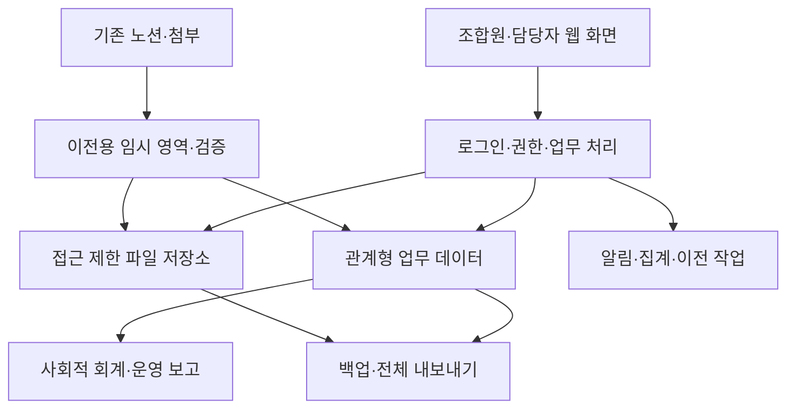

# 공동체IT 참여형 관리시스템 신규 설계 및 병행운영·이전 전략 v0.2

작성일: 2026-09-16  
목표: 2027년 상반기 핵심 운영 전환, 2027년 하반기 기록·자료 이전 마무리  
성격: 구축 의사결정과 개발 착수를 위한 설계안. 시스템 구현·노션 변경·이전 실행은 이번 작업에 포함하지 않음.

## 0. 이번에 바꾸는 방향

이전 검토는 기존 노션의 관계형 자료를 보존하며 점진적으로 보완하는 방향이었다. 사용자가 밝힌 핵심 제약은 ‘입력에 참여할 조합원을 사용자로 추가할 때 비용 부담이 늘어, 현재 혼자 입력하고 있다’는 것이다. 이 제약을 새 시스템의 최우선 요구사항으로 반영한다.

**권고 방향: 조합원이 직접 쓰는 독립 웹시스템을 새로 구축하고, 기존 노션은 영역별로 정본 권한을 넘기며 자료를 이전한다.**

조합원은 데이터베이스 편집자가 될 필요 없이 자기 정보, 활동, 기여, 제안, 자료를 간단한 화면에서 작성한다. 사무국은 모든 기록을 대신 입력하는 역할에서 중복·예외·민감한 사항을 확인하는 역할로 이동한다. 새 시스템은 노션 편집 계정 없이 사용할 수 있어야 하며, 핵심 업무는 노션 연결이 끊겨도 동작해야 한다.

### 설계 원칙

1. 조합원 1명 추가가 편집 좌석 1개 추가 구매로 이어지지 않는 구조를 선택한다.
2. 사람·단체·관계·활동·기여·결정·돈·성과는 하나의 관계형 데이터 기반으로 연결한다.
3. 동일한 업무 기록은 한 곳에서만 수정한다. 병행운영은 이중 입력을 뜻하지 않는다.
4. 참여를 위해 매번 사무국 승인을 기다리게 하지 않는다. 열람·실적확정·외부공개·지급승인을 분리한다.
5. 과거 자료의 연결과 출처를 보존하되 과거의 없는 시간·성과를 만들어내지 않는다.
6. 조합원이 늘어날 때 서버·저장·전송량 비용은 변할 수 있다. ‘사용자당 편집 좌석 비용 없음’은 ‘전체 운영 무료’와 다르다.
7. 데이터와 소스코드를 조합이 통제하며, 내보내기와 복원으로 다른 운영자로 이전할 수 있게 한다.

## 1. 근거와 설계 가정

### 확인된 사실

- 기존 노션은 사람·단체, 공급자, 사업, 조합활동, 자치기구, 비품·사용기록, 위키, 미션을 연결한다.
- 사업·조직활동·회의 본문·주간업무 등에 풍부한 기록이 있으나 기여시간·의사결정 이행·성과 측정이 표준화되어 있지 않다.
- 노션의 참여가이드는 공식 확정 규정이 아닌 예시임을 명시한다.
- 기여 통계의 기존 취지는 순위 경쟁이 아니라 보이지 않던 기여를 함께 인식하는 것이다.
- 현재 입력 참여의 비용 장벽과 2027년 전환 목표는 사용자가 이번 요청에서 명시했다.

이번 설계는 앞선 대화에서 확인한 자료와 사용자의 추가 요구를 바탕으로 한다. 최신 요금제·서비스 가격·노션 API 지원범위는 이번 단계에서 재조사하지 않았다. 특정 서비스의 무료 한도나 현재 권한 기능을 전제로 하지 않는다. 실제 구현 전에 공급자·인증·호스팅·이전 도구의 현재 조건을 검증한다.

### 제안된 운영 가정

| 항목 | 설계 가정 | 확정 방법 |
|---|---|---|
| 계정 범위 | 조합원·임원·위임받은 활동가부터 시작 | 대상 명부·초대 권한 확인 |
| 첫 시범 참여자 | 8~12명, 입력자·확인자 역할 혼합 | 참여 의사가 있는 사람 선정 |
| 시험 업무 | H/W 지원 1건, 교육 1개 기수, 조합 모임 1개 | 실제 진행 업무에서 선정 |
| 입력 기기 | 스마트폰 우선, PC 보조 | 실제 참여자 기기로 시험 |
| 업무 정본 | 영역·활동별 전환일을 지정 | 전환대장에 담당자·날짜 기록 |
| 재무 정본 | 기존 회계 시스템 유지 | 새 시스템은 청구·정산 진행과 전표 연결부터 |
| 개발 체계 | 개발 주담당 1명과 배포·복구 가능한 보조 1명 | 외주·조합원 참여 등 수행 방식 별도 결정 |
| 사용량 가정 | 시험 규모 100/500/1,000계정으로 부하·비용 비교 | 실제 활성계정·접속량으로 조정 |

기존 ‘사람들’ DB의 모든 레코드를 조합원 또는 로그인 사용자로 간주하지 않는다. 법인·고객·과거 관계자·휴면 기록을 포함할 수 있다.

---

# 2. 새 시스템의 서비스 설계

## 2.1 시스템의 중심: 내가 참여하는 조합

첫 화면은 DB 목록이 아니라 다음 다섯 가지 질문에 답한다.

- 지금 내가 할 일과 참여할 일이 무엇인가?
- 오늘 무엇을 했고 어떤 기여를 남길 것인가?
- 내가 낸 의견·자료·기록이 어떻게 반영되었는가?
- 우리 조합에서 어떤 결정과 변화가 있었는가?
- 함께 쓸 수 있는 사람·지식·장비가 무엇인가?

### 모바일 기본 메뉴

`홈 / 참여할 일 / 기록하기 / 우리 조합 / 내 정보`

사무국·사업 책임자·재무 담당에게만 해당 관리 기능을 추가한다. 임원이 아닌 조합원도 기본 입력 기능을 사용할 수 있다.

## 2.2 조합원 입력 경로

| 상황 | 입력 화면 | 최소 입력 | 저장 후 결과 |
|---|---|---|---|
| 내 정보 갱신 | 내 정보 | 관심·가능한 일·연락 선호 | 본인 정보 반영; 공식 자격은 별도 요청 |
| 일에 참여하고 싶음 | 참여 신청 | 역할·가능 시간·한마디 | 활동 책임자에게 신청 접수 |
| 활동을 마침 | 오늘 기록 | 활동·날짜·한 일·역할·시간 또는 모름·유무급 상태 | 제출 기록 생성, 본인 상태 확인 |
| 새 아이디어 | 제안하기 | 문제·대상·제안 내용 | 필요·기회 생성, 담당 지정 |
| 자료를 만들었음 | 자료 공유 | 제목·파일/링크·공개 범위 | 팀 공유 또는 검토 대기 |
| 장비를 나누고 싶음 | 자원 제안 | 품목·수량·상태·사진 선택 | 제공 제안; 실물 수령 전 재고 미반영 |
| 모임을 열었음 | 모임 기록 | 날짜·내용·참여자·결정 유무 | 실행 기록, 출석 확인 요청 |
| 기록에 오류가 있음 | 정정 요청 | 대상·바꿀 내용·이유 | 변경 요청 이력, 담당자 처리 |

로그인 상태와 활동 선택을 유지하고 자주 쓰는 역할을 미리 제시한다. 전문용어 ‘기여 원장·엔터티·관계형’은 일반 조합원 화면에 노출하지 않는다.

### 1분 기록 화면 구성

| 위치 | 내용 |
|---|---|
| 상단 | ‘오늘 한 일을 남겨주세요’, 최근 참여 활동 |
| 활동 | 배정·신청한 활동 먼저, 검색·활동 없음 선택 |
| 내용 | 한 일 짧은 문장, 역할 선택 |
| 날짜·시간 | 오늘 기본값, 실제 시간은 직접 입력 또는 모름 |
| 보상 | 유급/무급에 동의/미정; 혼합은 두 부분으로 나누어 입력 |
| 자료 | 파일·사진·링크 선택, 민감정보 안내 |
| 하단 | 임시저장 / 제출, 제출 후 수정·처리상태 보기 |

네트워크 오류 시 저장 실패와 재시도 여부를 명확히 표시한다. 서버가 발급·확인한 제출번호가 있어야 완료로 안내하며, 같은 제출번호로 재시도해도 한 건만 생성한다. 초기 버전은 온라인 입력을 기본으로 하고 완전한 오프라인 작성·동기화는 후순위로 둔다.

## 2.3 작성·확인·공개를 분리

| 기록 종류 | 작성 직후 | 추가 확인이 필요한 부분 | 확인 담당 |
|---|---|---|---|
| 자기 관심·소개 | 본인 설정 범위에 바로 반영 | 타인 정보·공식 자격 변경 | 관계 담당 |
| 활동 메모 | 담당팀에 ‘작성자 기록’으로 표시 | 실적 집계·공개용 성과 | 활동 책임자 |
| 참여·시간 | 본인·팀에 제출 상태 표시 | 확인된 실적 확정 | 분과·활동 책임자 |
| 의견·제안 | 접수 확인, 담당 배정 대기 | 사업화·예산 집행 | 해당 권한자 |
| 지식·자료 | 팀 내 초안 공유 가능 | 외부 공개·권리·개인정보 | 자료 담당 |
| 회의 결정 | 제안·기록 초안 | 의결·승인 확정 | 권한 있는 기구 |
| 비용·정산 | 본인 요청·팀 필요 범위 | 지급액·공제·송금 | 재무 권한자 |

모든 기록을 사무국 한 사람에게 보내는 승인 구조는 만들지 않는다. 활동마다 주 확인자·대체 확인자를 지정하고, 사람이 없으면 해당 활동의 실적은 미확인으로 남긴다. 일정 기간이 지났다는 이유로 자동 승인하지 않는다.

확인 기한 초안은 영업일 7일, 미처리 목록은 주 1회 담당자에게 모아서 표시한다. 대체 확인자에게 넘길 때도 현재 담당과 처리 이력을 보존한다. 자체 알림은 신청자에게 처리 상태를 알려주되 외부 메일 발송은 명시적 설정 후 적용한다.

## 2.4 권한 설계

사용자 수와 편집자 좌석 수를 연결하지 않고, 계정별 역할·담당 활동·본인 여부로 접근을 결정한다.

| 역할 | 기본 허용 | 기본 제한 |
|---|---|---|
| 조합원 | 자기 정보·기록 작성, 참여 신청, 공개된 조합 자료 열람 | 타인 연락처·개인 정산·민감 증거 |
| 활동가·외부 협력자 | 초대받은 활동의 입력·자료 열람 | 조합 전체 자료·다른 활동 |
| 활동 책임자 | 담당 활동의 배정·기여 확인·과업 관리 | 타 활동·개인 금융정보 |
| 분과 운영자 | 분과 활동·제안·확인 업무 | 다른 분과의 제한 자료 |
| 사무국 | 주체·관계 관리, 중복 정리, 운영 누락 처리 | 자동으로 모든 금융·민감정보 허용하지 않음 |
| 재무 담당 | 청구·정산·증빙·회계 연결 | 무관한 개인 평가·비공개 상담 |
| 이사회·위원회 | 권한기구 안건·결정·조직 집계 | 지위만으로 모든 개인 원본 접근 불가 |
| 시스템 운영자 | 계정·배포·백업 관리 | 업무자료 열람은 별도 권한·긴급접근 이력 |

계정과 조합원 자격은 별개다. 탈퇴 시 조합원 권한을 회수하되 본인 정산·개인정보 관련 처리 경로는 보존한다. 장기간 협력하는 비조합원은 필요한 활동 권한만 받는다. 권한 확인은 화면뿐 아니라 서버 조회·검색·파일 다운로드·내보내기에서 적용한다.

초기 로그인은 초대 기반으로 한다. 초대된 연락수단의 본인확인 후 기존 주체와 연결하며, 동명이인 자동 연결을 금지한다. 로그인 복구 경로를 마련하고 임원·재무·운영 관리자에는 추가 인증을 요구한다. 인증 방식의 최종 선택은 접근성과 현재 공급자 비용을 확인한 뒤 결정한다.

## 2.5 기능 출시 범위

| 단계 | 포함 | 이번 단계에서 미루는 것 |
|---|---|---|
| v0.1 참여 시범 | 계정·권한, 내 정보, 활동 목록·신청, 기여 작성·확인, 제안, 첨부, 감사기록, 내보내기·백업 | 정산 계산, 전체 지식 이전, 복잡한 보고서 |
| v0.2 운영 연결 | 주체·관계, 필요·사업 연결, 과업, 회의·결정, 교육 회차·출석, 결과물, 기본 사회적 회계 | 자동 송금, 급여·세무, 정교한 화폐환산 |
| v1.0 핵심 전환 | 활동 운영 전반, 후속활동, 자료 검색, 자원 이력, 청구·입출금·배부, 이전 도구·검증 | 법정 회계 대체, 고급 CRM 마케팅, 전면 자동화 |
| v1.1 안정화 | 지식 재사용·역량 변화·자산잔액, 역사 아카이브 통합, 개선된 대시보드 | 검증 없이 자동 산출한 사회적 가치 총액 |

신규 시스템의 참여 기능이 노션으로 데이터를 보내기만 하는 임시 폼으로 끝나지 않게 한다. 첫 시범부터 계정·활동·기여의 독립 저장소와 내 기록 조회·수정 경로를 갖춘다.

---

# 3. 데이터·기술·운영 구조

## 3.1 전체 구조

첫 구현은 업무 모듈을 구분한 단일 웹 애플리케이션을 기본으로 한다. 여러 개의 독립 서비스를 운영할 필요 없이 로그인·주체·활동·기여·집계가 같은 데이터 규칙을 사용하도록 한다. 소규모 운영자가 배포·복원할 수 있는 단순한 구조를 우선한다.

특정 프레임워크·호스팅 회사를 이번 문서에서 확정하지 않는다. 개발 담당자가 유지할 수 있는 기술, 관계형 DB의 제약·트랜잭션, 파일 접근 제어, 자동 백업, 전체 데이터 반출 가능성이 선택 기준이다. 구현 착수 시 기술 결정서에 후보·비용·라이선스·이전 가능성을 기록한다.

## 3.2 핵심 데이터 모델

이전 상세설계의 업무 개념을 이어받되, 신규 시스템에서는 공통 활동을 실제 마스터로 사용한다.

| 영역 | 주요 테이블 | 핵심 관계·제약 |
|---|---|---|
| 계정 | 계정, 초대, 권한 부여, 로그인 이력 | 계정과 사람 1:0..1; 권한은 기간·담당 범위 포함 |
| 주체 | 사람·단체 통합 주체, 관계 이력 | 개인·기관·팀·기구 유형 구분 |
| 수요 | 필요·기회, 필요-활동 연결 | 필요↔활동 N:M; 사업화 수 중복 제거 |
| 활동 | 공통 활동, 사업 상세, 조직활동 상세 | 상세는 공통 활동ID 참조; 상위 활동 순환 금지 |
| 실행 | 과업, 실행 기록, 역할 배정, 실제 기여 | 예정과 실제 구분; 기여는 사람·날짜·활동·역할 |
| 의사결정 | 안건·결정, 후속 과업 연결 | 확정문 변경은 새 버전·대체 결정 |
| 돈 | 계약, 청구·지급 예정, 입출금, 배부 | 계약·청구·입금 중복 합산 금지 |
| 자원 | 자원, 취득·이동·사용 기록 | 소유수량과 가용수량 분리 |
| 지식 | 결과물, 버전, 활동-결과물 연결 | 생성·개선·재사용 구분 |
| 성과 | 지표 정의·버전, 측정값, 증거 | 기준값·결과값·대상·기간·확신도 |
| 이전 | 원본-신규 ID 대응, 이전 실행, 충돌, 전환대장 | 출처·체크섬·정본·검증상태 추적 |
| 운영 | 변경 로그, 알림 발송대기, 백업 기록 | 변경·재시도·복원 가능성 |

자료 이름은 바뀔 수 있지만 ID는 바뀌지 않는다. 가져온 노션 페이지ID·DBID·원본 URL·추출시각·원본 수정시각을 보존한다. 새 시스템 ID는 원본 URL에서 추정 생성하지 않고 대응표로 연결한다.

## 3.3 실제 입력 예

다음은 설계 검증용 가상 예이며 실제 실적이 아니다.

1. 조합원이 ‘PC 정비 지원’ 활동에 보조 역할로 신청한다.
2. 활동 책임자가 배정을 수락한다. 이때 실적은 아직 0이다.
3. 활동 후 조합원이 90분·무급 동의·장비 점검 내용을 제출한다.
4. 확인자가 내용을 확인하면 무급기여 1.5시간이 확정된다.
5. 같은 활동에 유급 기술자 120분이 있으면 전체 3.5시간, 무급 1.5시간이다. 전문기여 항목을 다시 합산하지 않는다.
6. 정비 매뉴얼과 실제 문제 해결 증거가 활동에 연결된다.
7. 후속 사용 확인은 과업으로 남기고, 확인된 변화만 성과 지표로 반영한다.

이 흐름을 임원이 사무국에 메시지로 전달하고 사무국이 재입력하는 절차 없이 완료하는 것이 첫 버전의 성공 기준이다.

## 3.4 사회적 회계

보고 단위는 세 가지로 나눈다.

| 단위 | 예 | 계산 원칙 |
|---|---|---|
| 기간의 기여·활동 | 참여자·시간·교육회차·지원건수 | 확인된 실제 기록, 사람·사건 ID 중복 제거 |
| 기간말 자산 | 활성 협력관계·사용가능 지식·가용 장비·최근 확인된 역량 | 정의된 활성·유효 기준으로 잔액 계산 |
| 검증된 변화 | 교육 전후 변화·비용절감·독립 수행·협업 지속 | 대상·기준·기간·증거·한계 함께 표시 |

세 미션은 ‘소비자의 성장’, ‘생산자의 즐거움과 지속가능성’, ‘공유자원 확대’다. 미션이 여러 개인 활동의 시간을 조직 총계에 중복 합산하지 않는다. 화폐환산은 기준단가·버전·가정이 있을 때만 보조 지표로 사용하며 매출·현금과 더하지 않는다.

시범운영 기본 지표: 직접 입력 실인원, 확인된 유·무급 시간, 역할 분산, 활동별 기여, 종결 필요 유형, 결정 후속 이행, 결과물 생성·재사용. 교육 성장·장비 순환·관계 지속은 관련 업무가 넘어오는 단계에서 추가한다.

직접 입력 활성도는 실적 평가·개인 순위로 사용하지 않는다. 사용성 점검 지표다. 본인이 입력하기 어려운 경우 대리 입력을 허용하되 작성자·실제 기여자·대리 입력 사유를 분리한다.

## 3.5 비용과 소유권 기준

비용 모델은 다음과 같이 관리한다.

> 월 총운영부담 = 서버·DB + 파일·전송량 + 백업 + 인증·알림 + 도메인 등 공통비 + 유지보수 시간의 비용

편집 좌석 비용은 핵심 업무 애플리케이션의 비용 구조에서 제거한다. 외부 인증·메일·저장소가 계정·활성사용자·전송량별로 과금할 수 있으므로 최종 공급자 계약에서 확인한다. 단순히 앱을 직접 개발했다고 모든 외부 비용까지 사용자 수와 무관하다고 주장하지 않는다.

| 항목 | 설계상 관리 방법 | 착수 시 기록할 값 |
|---|---|---|
| 개발 | 단계별 범위·검수·인수인계 | 투입인일·단가·외주 범위 |
| 호스팅·DB | 작은 구성으로 시작, 부하 측정 후 증설 | 월 기본액·증설 기준 |
| 파일 | 첨부 용량 제한·중복 방지·대용량 자료 분리 | 저장량·전송량 가정 |
| 인증·알림 | 앱 내 알림 기본, 메일은 묶음 | 계정·발송량별 비용 |
| 백업·복구 | 자동 백업과 정기 복원 시험 | 보관량·복원 인력 |
| 유지보수 | 주담당·보조담당 지정 | 월 확보시간·장애 대응 범위 |
| 노션 병행 | 현재 필요한 운영 범위 유지, 확대 최소화 | 전환 전후 잔여 사용비 |

구체적 금액은 현재 요금·계정수·첨부량·개발 방식 미확인 상태에서 임의 제시하지 않는다. 후보 비교 시 100/500/1,000계정, 실제 활동률, 첨부량별 월 비용과 유지보수 인시를 함께 계산한다. 선택 조건은 조합이 합의한 운영비 상한 이내이며, 편집 기능을 이유로 임원 수만큼 추가 좌석을 구매하지 않아도 되는 것이다.

조합이 확보할 것: 소스코드 저장소 소유권, 도메인 관리권, 호스팅·DB·파일 저장소 접근권, 배포 문서, DB 구조·이전 스크립트, 백업 복구 문서, 전체 데이터 내보내기, 외부 의존 서비스 목록. 개발자의 개인 계정에만 운영 권한을 두지 않는다.

## 3.6 최소 운영·품질 요건

아래 수치는 계약상 보장값이 아니라 시범운영에서 검증할 목표다.

- 일반 목록·검색은 시험 데이터와 동시접속 20명 조건에서 95% 요청이 2초 이내; 파일 업로드 제외.
- 모바일 기본 기록을 설명 없이 2분 이내 제출; 일반적 반복 입력은 1분 안팎 목표.
- 키보드 사용, 읽기 순서, 명확한 레이블, 글자 확대, 색상 외 상태 표시를 기본 구현한다.
- 권한이 없는 자료는 검색·파일·내보내기에도 노출하지 않는다. 운영 환경의 개인정보를 시험 서버에 그대로 복사하지 않는다.
- 저장·승인·배부는 트랜잭션으로 처리하고 제출 재시도에 고유키를 사용한다.
- 파일은 접근 제한 저장, 다운로드 때마다 권한 확인; 파일 형식·용량·악성 업로드 검사 적용.
- 시범은 일 1회 암호화 백업으로 손실 허용 최대 24시간·복구 목표 1영업일을 시험한다.
- 핵심 전환 전에는 DB 변경 로그 등으로 손실 허용 최대 1시간·복구 목표 4시간을 검증한다. 충족하지 못하면 전환을 보류하거나 조합이 대체 운영 수준을 명시적으로 합의한다.
- 파일도 DB와 맞는 복원 기준시각을 확보한다. DB만 복구하고 첨부를 잃는 상태를 성공으로 보지 않는다.
- 백업은 운영 계정과 분리된 보관 위치에 두고, 월 1회 표본 복원·분기 1회 전체 복원을 시험한다. 보유기간·삭제 기준은 개인정보 운영정책 확정 후 적용한다.
- 알림·이전 작업 실패는 대기열·재시도·오류 목록으로 남기고 원본을 삭제하지 않는다.

---

# 4. 병행운영 전략

## 4.1 핵심 규칙: 기록마다 수정하는 곳은 한 곳

노션과 새 시스템의 같은 필드를 양쪽에서 수정하는 방식은 기본으로 채택하지 않는다. 새 시스템이 모든 변경을 노션에 다시 써주는 상시 양방향 동기화도 1차 범위에서 제외한다.

병행은 업무 묶음별로 전환한다. 예를 들어 시범 H/W 활동은 새 시스템에서 기록하고, 아직 전환하지 않은 다른 사업은 노션에서 계속 기록한다. 시범 활동을 노션에서 볼 필요가 있으면 원문을 다시 작성하지 않고 새 시스템 링크와 기준시각이 있는 요약만 제공한다.

### 전환대장 필수 항목

업무 영역, 활동/레코드 범위, 현재 정본, 전환 책임자, 전환 예정일·실제일, 마지막 반영 원본 버전, 편집 동결 여부, 검증 결과, 남은 오류, 복귀 책임자, 예외 사유.

정본은 편의를 위해 날짜만으로 자동 추정하지 않고 이 대장에서 명시한다. 페이지 제목에 ‘새 시스템’이 적혔다는 사실만으로 전환 완료로 간주하지 않는다.

## 4.2 단계별 정본 표

| 데이터 | 준비기 | 참여 시범 | 운영 확대 | 핵심 전환 이후 |
|---|---|---|---|---|
| 로그인·신규 계정 | 새 시스템 시험 | 새 시스템 | 새 시스템 | 새 시스템 |
| 공식 조합원 자격·기존 주체 정보 | 기존 확인된 명부·노션 | 기존 정본 유지; 새 시스템은 연결 사본 | 관계 관리 묶음 전환 후 새 시스템 | 새 시스템; 제한 명부 정본 확인 |
| 본인 소개·관심·연락 선호 | 없음/기존 자료 | 새 시스템 작성 필드의 정본은 새 시스템 | 새 시스템 | 새 시스템 |
| 시범 활동·기여·후속 | 노션에서 대상 선정 | 새 시스템 | 새 시스템 | 새 시스템 |
| 비시범 기존 사업 | 노션 | 노션 | 사업 묶음별 전환 | 새 시스템 |
| 회의·결정 | 노션 | 노션, 시범 모임만 새 시스템 | 회차/기구별 전환 | 새 시스템 |
| 과거 위키·사업 본문 | 노션 | 노션·링크 | 순차 복제·검증 | 이전 완료분은 새 시스템, 미완료는 원본 참조 |
| 신규 결과물 | 기존 작성처 | 전환 활동의 결과물 목록은 새 시스템 | 새 시스템에서 목록 관리 | 새 시스템; 외부 제작도구 파일 연결 가능 |
| 회계 전표·법정 장부 | 기존 회계 시스템 | 기존 회계 시스템 | 기존 회계 시스템 | 기존 회계 시스템 |
| 청구·정산 진행 | 기존 업무 기록 | 기존 업무 기록 | 선정 사업부터 새 시스템 | 새 시스템+회계 원장 대사 |

주체 정보가 병행되는 동안에도 필드 소유권을 고정한다. 공식 자격은 기존 정본, 새로 입력한 관심·소개는 새 시스템 정본으로 두고 가져오기 작업이 해당 필드를 덮어쓰지 못하게 한다. 완전 전환 시 이 규칙을 종료하고 새 시스템으로 일원화한다.

## 4.3 새 시스템에서 새 사람·단체를 발견했을 때

1. 기존 연결 주체를 검색한다.
2. 없으면 새 시스템에 ‘확인대기 주체’를 작성한다. 작성자는 이름·유형·필요한 최소 정보만 입력한다.
3. 관계 담당자가 기존 노션·명부와 대조하고 기존 주체에 연결하거나 신규 주체로 확정한다.
4. 계정과 주체 연결은 당사자 확인 후 수행한다.
5. 이전 작업에서 같은 원본을 다시 읽어도 대응표를 따라 같은 신규 ID로 갱신한다.

중복 후보는 자동 병합하지 않는다. 연결되지 않은 주체도 제안을 제출할 수 있게 하되 개인정보 열람 권한은 늘리지 않는다.

## 4.4 병행 중 변경을 가져오는 규칙

| 변경 상황 | 처리 |
|---|---|
| 노션 정본 영역의 수정 | 지원되는 추출 방식으로 증분 또는 재추출, 검증 후 사본 갱신 |
| 노션 정본 영역에서 삭제·보관 | 변경 후보로 표시, 새 시스템에 자동 영구삭제하지 않음 |
| 새 시스템 정본 영역의 수정 | 새 시스템에서만 확정; 노션은 참조 링크·보관 사본 |
| 전환 후 노션에서 뒤늦게 수정 | 충돌 목록에 올리고 담당자에게 차이 제시; 자동 덮어쓰기 금지 |
| 양쪽 수정으로 충돌 | 직전 공통 사본·현재 노션·현재 새 시스템의 세 버전 비교 |
| 권한 없어 원본을 못 읽음 | 접근제한 상태 기록; 빈 페이지·삭제로 간주하지 않음 |
| 첨부를 가져오지 못함 | 본문·첨부 상태 분리, 원본 링크와 누락 사유 유지 |

증분 감지 방식은 실제 API·내보내기 지원 범위를 확인해 결정한다. 지원되지 않는 변경 감지는 완전 재추출과 해시 비교로 보완할 수 있지만, 권한·호출량 제한을 우회하지 않는다. 이번 작업에서 자동 추출·동기화는 설정하지 않는다.

## 4.5 이중 입력 방지와 실적 경계

- 전환된 활동 화면에는 ‘여기에서 작성’과 정본 위치를 표시한다.
- 노션의 해당 페이지는 동결·보관 처리 또는 명확한 안내를 적용한다. 실제 편집 차단 가능 여부는 권한 점검 후 확정한다.
- 회의 출석 자동 생성은 기여 초안만 만들며, 참가자가 이미 제출한 같은 회차 기록과 합친다.
- 과거 참여횟수 합계는 ‘역사 참고값’으로 보존하고 새 기여 행과 더하지 않는다.
- 한 보고기간에 양쪽 실적이 있으면 원본 ID 대응과 전환 범위를 기준으로 중복 제거한다.
- 혼합 실적 보고에는 ‘노션 기록 포함 기간’, ‘새 시스템 확인기여 기간’, ‘시간 미확인 건수’를 표시한다.
- 새 시스템 정본 데이터가 노션에 없다는 이유로 노션을 완전 백업이라고 부르지 않는다.

---

# 5. 데이터 이전 설계

## 5.1 이전 순서

| 순서 | 대상 | 먼저 옮기는 이유 |
|---|---|---|
| 1 | ID 대응·분류·미션 | 이후 기록의 연결 기준 |
| 2 | 필요한 사람·단체·기구·팀 | 계정·활동 연결 기반 |
| 3 | 진행 중 활동·관계·배정 | 실제 운영에 바로 필요 |
| 4 | 해당 활동의 과업·회의·결정·결과물 | 맥락·책임·후속 보존 |
| 5 | 자원·청구·정산 진행 | 실물·회계와 대사 필요 |
| 6 | 최근 완료 활동·교육자료 | 재사용·성과 비교 |
| 7 | 오래된 사업·위키·첨부 아카이브 | 원본 보존 중심, 복잡한 본문은 후순위 |

순서는 테이블의 의존관계에 따른다. 관계 대상이 아직 이전되지 않았으면 미해결 링크로 보존하고 임의의 다른 사람·활동에 연결하지 않는다.

## 5.2 이전용 임시 영역

자료를 읽자마자 운영 DB에 넣지 않는다. 원본 사본 → 변환 후보 → 검증 → 승인된 반영의 네 단계를 둔다.

필수 관리정보: 원본 워크스페이스/DB/페이지ID, 신규 ID, 원본 URL, 추출시각, 원본 수정시각, 원본 내용 해시, 변환 규칙 버전, 첨부 목록, 관계 대상 목록, 이전 실행ID, 성공/누락/충돌 상태, 검토자.

동일한 원본을 여러 번 가져와도 한 건으로 유지하는 재실행 가능한 방식으로 구현한다. 이름을 고유키로 사용하지 않는다. 새 시스템에서 편집된 필드는 정본 규칙 없이 가져오기로 덮어쓰지 않는다.

## 5.3 본문·첨부·관계 처리

| 항목 | 보존 방식 | 실패·제한 대응 |
|---|---|---|
| 제목·속성 | 원본 값과 변환값 구분 | 모르는 분류는 미분류·원문 보존 |
| 날짜 | 실제일·작성일·수정일 구분 | NULL을 오늘·0으로 치환하지 않음 |
| 본문 | 지원되는 블록 변환 + 원본 사본 | 지원 안 되는 블록은 원문·대체표시·검토표 |
| 관계 링크 | 원본ID→신규ID 대응 | 미해결 관계를 오류 목록에 유지 |
| 파일 | 권한 있는 파일을 독립 저장소로 복사·검증 | 임시 URL만 저장하지 않음; 미취득 목록 |
| 외부 링크 | 출처 URL과 접근 확인일 | 로그인·권한 필요한 자료는 누락 명시 |
| 댓글·변경 이력 | 확보 가능한 범위를 별도 보존 | 내보내기 제한 시 전체 보존이라고 주장하지 않음 |
| 계산·롤업 | 기존 결과 스냅샷 + 새 산식 | 숫자를 같게 맞추기 위해 원자료 조작 금지 |
| 보기·필터 | 필요한 업무 화면으로 재설계 | 노션 화면의 완벽한 복제는 목표에서 제외 |

콘텐츠에 삽입된 HTML·스크립트는 그대로 실행하지 않고 안전한 문서 표현으로 변환한다. 개인정보를 포함한 원본 사본은 기존 공개 여부와 무관하게 이전 검토 권한으로 제한한다.

### 공개 URL 보존

기존 노션 링크를 조합이 원하는 주소로 자동 리디렉션할 수 있다고 가정하지 않는다. 새 시스템에 원본URL↔신규URL 찾기를 두고, 수정 가능한 기존 안내 페이지에는 새 주소를 표시한다. 홈페이지·뉴스레터 템플릿 등 조합이 관리하는 링크부터 갱신한다. 오래된 외부 링크가 중요한 페이지는 노션 읽기용 잔존 대상에 포함할 수 있다.

## 5.4 이전 검증표

| 검증 | 통과 기준 |
|---|---|
| 범위 | 허용·선정한 원본 목록의 건수와 처리 결과 합계가 일치 |
| ID | 중복 원본ID·중복 신규 ID 없음, 재실행 결과 중복 0건 |
| 관계 | 전환 대상의 운영 필수 관계 미해결 0건 |
| 개인 연결 | 시범·전환 계정의 본인 주체 연결 100% 확인 |
| 상태 | 진행/종료/보류 등 원본과 새 상태의 변환 사유 추적 가능 |
| 재무 | 전환 사업의 확정 청구·입출금·잔액을 기존 장부와 전수 대사 |
| 첨부 | 필수 계약·증빙·진행 자료 전부 열림; 바이트·해시 검증 |
| 본문 | 긴 본문·표·링크·첨부 등 유형별 표본과 모든 핵심 결정·계약 본문 확인 |
| 권한 | 계정 없는 사용자·다른 조합원·타 활동 담당자의 제한 자료 접근 차단 |
| 집계 | 동일 기간·대상·정의에서 비교; 차이는 변환 차이표로 설명 |
| 복원 | 신규 DB·파일을 분리 환경에 복원해 기록 조회·입력 검증 |

역사 아카이브의 미취득·지원불가 항목은 목록과 원본 접근 경로가 있으면 후속 이전 대상으로 남길 수 있다. 진행 업무에 필요한 자료·정산 근거의 누락은 전환을 막는 조건이다.

---

# 6. 일정·담당·단계별 완료 기준

## 6.1 2026~2027년 권장 일정

일정은 2026년 9월에 설계를 시작하고 개발·운영 시간을 확보한다는 가정의 목표다. 배정된 인력이나 확정 예산을 뜻하지 않는다. 핵심 운영은 2027년 6월까지 옮기는 것을 목표로 하고, 역사 자료 정리는 하반기까지 분리한다.

| 기간 | 단계·결과물 | 통과 조건 |
|---|---|---|
| 2026.09~10 | 요구 확정, 정본·권한표, 대상 선정, 기술·비용 결정서 | 조합원 직접입력 동선·담당자·예산 범위 합의 |
| 2026.10~11 | v0.1 개발: 계정·활동·기여·제안·확인·백업 | 실제 권한 시험·복원 시험·시범 계정 확인 |
| 2026.12~2027.01 | 8~12명·3종 업무 시범 | 4주 이상 사용, 직접입력·확인 분산·중복 방지 검증 |
| 2027.02~03 | v0.2: 관계·과업·회의·교육·성과, 1차 이전 리허설 | 시범 기준 통과, 필수 관계·첨부 검증 |
| 2027.04~06 | v1.0 핵심 전환: 업무 묶음별 정본 이동, 재무 연결 | 묶음마다 동결·최종반영·대사·운영 확인 |
| 2027.07~09 | 아카이브 이전, 외부 링크 정비, 사회적 회계 개선 | 역사자료 누락 목록·복원·검색 검증 |
| 2027.10~12 | 잔존 노션 범위 결정, 불필요한 쓰기·연계 종료 | 업무 정본 일원화, 잔여 비용·보관 정책 확정 |

### 인력 확보와 일정의 관계

초기 계획 산정용으로 v0.1은 개발 25~40인일, 시범 보완 10~20인일, v0.2/v1.0 및 이전 도구·검증 35~60인일 범위를 가정한다. 이는 실견적이 아니며 첨부 복잡도·인증·회계 연계·기존 코드 재사용에 따라 크게 달라진다. 운영 검토·참여자 지원·자료 정리는 별도다.

한 명이 기존 업무와 병행해 주 1일만 투입하면 이 범위를 2027년 상반기에 끝내기 어렵다. 착수 시 주당 확보 인일을 정하고 `남은 인일 ÷ 주당 투입 인일 + 검토·의존작업 기간`으로 일정을 다시 산정한다. 조합원 직접입력 기능을 우선 보호하고 범위 조정으로 대응한다.

일정이 늦어지면 역사 전수 이전·고급 성과 대시보드·재무 자동화를 미룬다. 조합원 입력·확인 분산·권한·백업·핵심 활동 기록은 미루지 않는 우선 범위다. 예산·인력이 부족하면 핵심 전환 목표를 2027년 3분기로 재조정하되 연말까지 남길 업무와 제외할 업무를 명시한다.

## 6.2 운영 역할

| 역할 | 책임 | 병목 방지 |
|---|---|---|
| 업무 책임자 | 우선순위·정본 범위·최종 수용 | 모든 입력·승인을 맡지 않음 |
| 개발 주담당 | 기능·데이터·배포·오류 수정 | 코드·설계·운영 문서 공유 |
| 기술 보조담당 | 배포·백업·복원·계정 인수 | 주담당 부재 시 복구 실습 |
| 분야 확인자 | H/W·교육·조합활동의 기여 확인 | 분야마다 대체 담당 지정 |
| 관계·이전 담당 | 사람 연결·중복·관계 검수 | 자동 병합 대신 후보 검토 |
| 재무 담당 | 청구·정산·회계 대사 | 지급 권한과 개발 권한 분리 |
| 시범 참여자 | 실제 작성·조회·사용성 피드백 | 기술 숙련자만 선정하지 않음 |

역할 일부는 겸임할 수 있다. 다만 모든 운영·개발·확인·복구 지식을 한 사람에게 몰아주지 않는 것을 전환 조건으로 둔다.

## 6.3 시범 성공 기준

| 항목 | 제안 목표 | 해석 |
|---|---|---|
| 직접 입력 | 활동이 실제 있었던 시범 참여자의 70% 이상이 4주 중 직접 제출 | 참여 기회가 없었던 사람은 분모 제외 |
| 입력 완료 | 관찰한 기본 기록 작업의 80% 이상을 도움 없이 2분 내 제출 | 느린 이용자 의견도 개선에 반영 |
| 사무국 대리 입력 | 시범 활동 기록의 30% 이하 | 접근성 지원용 대리는 허용·표시 |
| 확인 분산 | 주 확인자 외 최소 1명이 실제 확인 처리 | 직함만 부여한 상태 제외 |
| 확인 적체 | 90% 이상 영업일 7일 이내 처리 | 내용 확인 없는 자동 승인 금지 |
| 중복·권한 | 중복 실적 0건, 중대한 무권한 노출 0건 | 시험과 운영 사건 함께 확인 |
| 운영부담 | 2주 기준선 대비 사무국 입력·전달 시간이 감소 | 승인·수정·문의 응대 시간도 포함 |
| 독립성 | 노션 읽기 연결을 끊어도 전환 활동의 작성·조회 가능 | 노션 장애가 신규 입력 중단으로 이어지지 않음 |

기준선은 시범 시작 전 2주간 대략적인 입력·수정·연락 시간을 기록해 측정한다. 성공 기준은 조합이 조정할 수 있지만 ‘조합원 직접입력’과 ‘운영 집중 감소’라는 목적을 약화시키지 않는다.

---

# 7. 실제 전환일 절차와 장애 복귀

## 7.1 업무 묶음별 전환 절차

| 시점 | 작업 | 책임·확인 |
|---|---|---|
| D-14 | 이전 리허설·누락·권한·복원 검증 | 개발·이전·업무 담당 |
| D-7 | 정본 범위·동결 시간·새 작성 위치 확정, 교육 | 업무 담당·분야 확인자 |
| D-1 | 양쪽 스냅샷, 미처리 과업·돈·충돌 목록 확정 | 이전·재무 담당 |
| D일 동결 | 대상 노션 편집 동결, 미처리 변경 수집 | 정본 담당 |
| D일 반영 | 최종 증분 추출·적용·관계·첨부·금액 대사 | 이전 담당 |
| D일 개방 | 표본 작성·조회·권한 시험 후 새 시스템 정본 표시 | 업무 책임자 승인 |
| D+1~7 | 오류·대리입력·누락 집중 점검, 일일 변경 보존 | 운영 담당 |
| D+30 | 유지·확대 결정, 노션 잔존 범위 조정 | 운영·이사회 등 정한 권한자 |

예상 동결시간은 리허설에서 측정해 공지한다. 실제 자료 크기를 모르는 상태에서 몇 분 이내 전환을 보장하지 않는다. 동결 중 필요한 긴급 업무는 최소 정보의 임시 사건기록에 시간·작성자를 남기고 개방 후 중복 없이 반영한다.

## 7.2 전환 중단 조건

- 다른 사람의 제한 자료가 보이는 중대한 권한 오류.
- 저장·조회 실패, 필수 관계·첨부 누락으로 진행 업무를 수행할 수 없음.
- 확정 청구·입출금·잔액의 설명되지 않는 차이.
- 이전 재실행에서 중복 생성 또는 새 입력 덮어쓰기 발생.
- 백업에서 DB와 파일을 복원하지 못함.
- 계정 본인 연결 오류로 타인 기록에 접근함.

경미한 화면 오류는 기록하고 우선순위에 따라 수정한다. 중단 조건을 충족하면 해당 업무 묶음만 전환을 멈추며, 이미 안정화된 다른 묶음까지 무조건 되돌리지 않는다.

## 7.3 복귀는 두 상황으로 구분

### A. 새 시스템에 운영 입력을 열기 전

이전 반영을 취소하고 새 시스템 사본을 전환 직전 스냅샷으로 복구한다. 노션의 대상 편집을 다시 연다. 새 운영 입력이 없으므로 정본 충돌 없이 복귀 가능하다. 실패 원인·대응표·추출 사본은 보존한다.

### B. 새 시스템에 운영 입력이 생긴 뒤

1. 해당 영역 새 쓰기를 잠시 멈추고 현재 DB·파일·변경 로그를 보존한다.
2. 전환 이후 생성·수정·확인·취소된 사건을 고유 ID와 함께 추출한다.
3. 우선 동일한 새 시스템의 정상 버전으로 복구해 이어서 운영할 수 있는지 판단한다.
4. 새 시스템 복구가 어려워 임시로 노션을 사용할 경우, 사무국이 사용할 임시 대장과 조합원이 제출할 통제된 대체 입력 경로를 마련한다. 기존 노션 계정이 없는 조합원에게 직접 편집을 요구하지 않는다.
5. 신규 사건을 임시 대장과 대사한 뒤 정본 전환대장에 복귀 범위·시각·담당을 기록한다.
6. 복구 후 임시 기록을 고유 ID로 반영하고 대사한다. ‘기존 노션 백업을 다시 여는 것’만으로 신규 입력이 복구되었다고 보지 않는다.

복구할 정상 버전으로 DB 구조를 되돌릴 때는 변경사항 호환성을 확인한다. 이전 버전 코드만 배포해 데이터를 잃는 복귀를 금지한다. 파괴적 스키마 변경은 백업·단계적 변환·복구 검증 후 수행한다.

---

# 8. 노션 종료·잔존 전략

완료를 세 단계로 구분한다.

1. **업무 전환 완료:** 조합원 입력, 진행 사업·조합활동, 기여·결정·후속의 정본이 새 시스템이다.
2. **자료 독립 완료:** 업무 필수 본문·첨부·관계·검색을 노션 없이 이용할 수 있다.
3. **노션 정리 완료:** 잔존 공개 링크·참고 아카이브만 남기거나 합의한 보관 방식으로 정리한다.

2027년 상반기 목표는 1단계와 진행 업무의 2단계다. 역사자료 전수 정리 때문에 업무 전환을 늦추지 않는다. 동시에 ‘노션 링크만 남긴 상태’를 완전 이전으로 표현하지 않는다.

### 노션을 읽기용으로 남길 수 있는 대상

- 외부에 널리 공유된 공개 안내·기록 페이지.
- 현재 도구로 가져오지 못한 과거 자료와 그 접근 경로.
- 법적·계약상 보존 필요성이 따로 검토되는 원본 자료.

잔존 페이지는 새 시스템에서 위치·보관 이유·책임자·검토일을 표시한다. 기존 계정·유료 구독·연계 종료는 실제 보존·접근·비용 조건 확인 후 결정하며 이번 설계에서 해지하지 않는다. 종료 전 DB·본문·파일·ID 대응·권한정보·지표 정의를 독립 저장소에서 복원할 수 있어야 한다.

---

# 9. 착수 백로그와 우선순위

| 우선 | 작업 | 완료 산출물 |
|---|---|---|
| P0 | 조합원이 휴대폰에서 로그인하고 자기 주체 연결 | 초대·복구·권한 시험 |
| P0 | 활동 선택·신청·직접 기록·수정·상태 조회 | 사무국 재입력 없는 시나리오 |
| P0 | 활동별 확인자·대체 확인자·묶음 검토 | 사무국 한 사람 승인 병목 제거 |
| P0 | 변경 로그·중복 방지·파일 보호 | 권한·재시도 테스트 |
| P0 | 이전 대응표·정본대장·백업·복원 | 첫 시범 활동 이전 리허설 |
| P1 | 필요→활동→과업→결정→후속 연결 | 기존 업무 흐름 3종 수용 시험 |
| P1 | 교육 회차·출결·결과물·기본 사회적 회계 | 참여·기여·산출 대시보드 |
| P1 | 주체·관계·자원 이전 | 중복·기간·실물 대사 |
| P2 | 청구·입출금·정산 상태 | 기존 회계와 전수 대사한 시범 사업 |
| P2 | 역사자료·첨부·검색·링크 갱신 | 원본 및 누락 목록 포함 아카이브 |
| P3 | 장기 성장·관계 변화·선택적 환산 | 지표 버전·측정 근거·공개 검토 |

## 최종 수용 질문

- 임원이 아닌 조합원이 추가 편집 좌석 구매 없이 기록을 작성할 수 있는가?
- 작성자가 본인 기록과 처리 상태를 직접 확인하고 고칠 수 있는가?
- 사무국 외의 담당자가 실제 확인·조정을 수행하는가?
- 노션 연결이 없어도 전환된 업무가 멈추지 않는가?
- 기존 관계·출처·본문·첨부가 추적되며, 빠진 자료를 알 수 있는가?
- 사무국의 입력 부담과 전체 운영 부담이 함께 줄었는가?
- 다른 담당자가 운영·복구할 수 있으며 데이터 전체를 반출할 수 있는가?

이 질문에 답할 수 있는 시범을 2026년 말부터 시작하고, 검증된 업무부터 2027년에 정본을 넘기는 것이 이번 설계의 실행 방향이다.

## 근거 문서

새 설계의 절차·일정·목표 수치는 제안이며 아래 원본의 공식 결정으로 해석하지 않는다.

- [공동체IT 조합원 팀스페이스 홈](https://app.notion.com/p/3f5249368ffc45c79e189ae584722ff5)
- [네트워크·사람·공급자·기구](https://app.notion.com/p/b97afa8f8e0049fca0d0ff63b110433c)
- [사업 구조](https://app.notion.com/p/c4937067adfa4710a847f4b13677a3c8)
- [조직 활동](https://app.notion.com/p/572b6e488ba84d2693a519ab9a4e3425)
- [참여가이드: 직접 수정 제한과 참여 절차 예시](https://app.notion.com/p/bd622b530b1741de8b397837492effa1)
- [기여 통계의 취지](https://app.notion.com/p/3b0cb2bca7d24a998e6a689f6a16936c)
- [미션·비전](https://app.notion.com/p/1b19b99c27e28082b698d4cae467c9c2)
- [사업비 배분·정산 기록](https://app.notion.com/p/3109b99c27e280b4a211d5cc8ea11766)

관련 선행 문서: 「공동체IT 전체 업무지도 + 사회적 회계·사회적 자산 체계」, 「공동체IT 관리시스템 상세설계 v0.1」. 이번 v0.2는 신규 구축·조합원 참여·정본 전환에 관한 우선 방향을 갱신하며, 선행 문서의 필드 정의·업무 모델은 충돌하지 않는 범위에서 유지한다.
